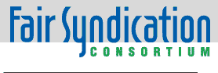
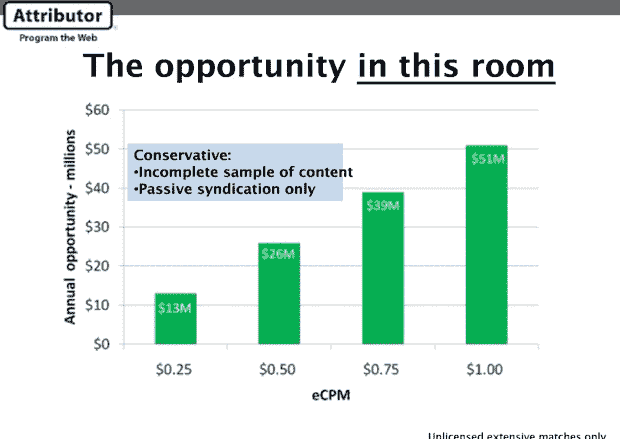
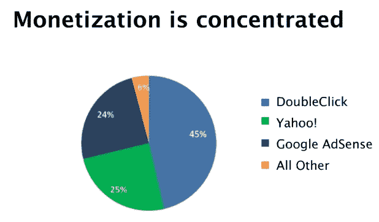

# 广告网络应该为被盗内容向出版商付费吗？公平财团认为是这样的。

> 原文：<https://web.archive.org/web/https://techcrunch.com/2009/04/21/should-ad-networks-pay-publishers-for-stolen-content-the-fair-syndication-consortium-thinks-so/>

随着报纸和其他出版商眼看着他们的收入减少，他们中一个常见的说法是，也许他们应该以某种方式起诉谷歌或雅虎，因为他们帮助和教唆破坏他们的业务，有时甚至大规模窃取他们的内容。我们已经看到了美联社想要如何处理这件事:对任何借用标题的人穷追不舍。如今，包括路透社、美国杂志出版商和政治在内的其他出版商组成的联盟正采取一种更有分寸的方法，但这无疑仍会引起争议。他们正在组建[Fair Syndication Consortium](https://web.archive.org/web/20221005200048/http://www.fairsyndication.org/)，这是 Attributor 的创意，Attributor 是一家初创公司，为许多相同的出版商跟踪网络上文本和图像的重复使用。

公平辛迪加联盟最初试图解决网络上的一个合法问题:垃圾博客和其他网站的激增，这些网站只是重新发布新闻网站和博客的全部内容，通常没有署名或链接。这样的网站有成千上万个，也许更多。公平辛迪加联盟不是一次一个地追踪这些网站，而是希望直接与在这些网站上提供广告的广告网络谈判:DoubleClick、Google 的 AdSense 和 Yahoo primarily。对于任何抄袭出版商作品的帖子或页面，公平联合财团认为广告网络应该支付这些网站产生的广告收入的一部分。

我对此略知一二，因为今年 1 月，我应邀在美联社总部与其他 20 多家出版商开会，讨论组建联盟的事宜，这些出版商大多来自印刷界。TechCrunch 目前尚未加入。具有讽刺意味的是，美联社也没有，它显然决定走自己的路，更积极地对抗网络的侵犯(尽管据我所知，它仍然使用 Attributor 的技术)。但是在那次由 Attributor 组织的会议上，展示了几张幻灯片，让房间里的每个人都明白了这一点。其中一个展示了一系列的条形图，估计了垃圾博客仅仅从房间里每个人的反馈中获得了多少广告收入。(注意，这只是针对大量复制文章的网站，而不是简单的引用)。这些数字从 1300 万美元(假设每分钟有效成本为 0.25 美元)到 5100 万美元(假设每分钟有效成本为 1 美元)不等。

然后，他们放了一张带有饼状图的幻灯片，显示哪些广告网络在所有滥用网站上提供广告。结果显示，有问题的网站中有整整 94%在提供来自三个广告网络的广告:double click(45%)、Google AdSense(24%)和 Yahoo(24%)。

追踪这三个广告网络，大部分问题就可以解决了。这种方法肯定是有先例的。看看 YouTube 的内容 ID 计划，该计划在 YouTube 和其视频被在线重复使用的媒体公司之间划分收入。除此之外，这一提议将把原本会分配给 splog 站点本身的钱拿出来，并在未经站点所有者同意的情况下，将其中一部分作为自动联合费用给予发布者。

广告网络如何知道有问题的内容属于出版商？Attributor 将保持跟踪这一切，并管理付款请求。该联盟对任何出版商开放，包括博客作者。(Attributor 运行其服务[的一个免费版本，名为 FairShare](https://web.archive.org/web/20221005200048/http://www.beta.techcrunch.com/2009/02/02/fairshare-helps-bloggers-track-their-content-across-the-web-grab-an-invite-here/) ，让出版商了解他们的作品有多少是在没有注明出处的情况下被抄袭的)。这当然比发出数以千计的下架通知要好，但许多问题仍有待解决。

我看到了 TechCrunch 的一些数据，毫无疑问，Attributor 受到了很多滥用，而不是合理使用。但是一些属于 Attributors 网的网站可能仍然属于合理使用。例如，我可以想象，一篇两三段长的短文被全文复制，并被评论包围。(尽管，至少 125 字的字数限制和在引号中明确排除内容是为了解决这种情况)。此外，我不确定要求付款是否可行。在很大程度上，一个链接和归属对我们来说就足够了。但是，如果公平辛迪加联盟让广告网络参与进来，并且他们采取保守的方法来主张版权，我们可能会再看一眼。你觉得我们应该加入吗？