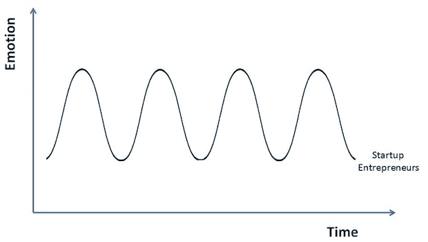
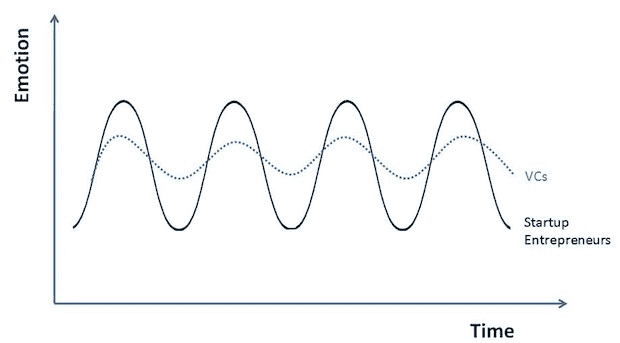

# 真的应该做一个创业的创业者吗？

> 原文：<https://web.archive.org/web/http://techcrunch.com/2011/01/30/should-you-really-be-a-startup-entrepreneur/>

***编者按:**这是马克·苏斯特(Mark Suster)的客座博文，这位 2x 创业者已经走到了 VC 的黑暗面。他于 1999 年创办了自己的第一家公司，总部设在伦敦，2005 年离职，并出售给一家上市的法国服务公司。2005 年，他在帕洛阿尔托成立了第二家公司，并将这家公司卖给了 Salesforce.com，成为产品管理副总裁。他于 2007 年加入 GRP Partners，成为专注于早期技术公司的普通合伙人。在* *[的桌子两侧](https://web.archive.org/web/20230202235250/http://www.bothsidesofthetable.com/)和 Twitter 上* *[@msuster 阅读更多关于 Suster 的信息。](https://web.archive.org/web/20230202235250/http://twitter.com/msuster)*

第一次见我的创业者最喜欢问的一个问题就是“你怀念做创业者的日子吗？你就没有想过回去再做一次吗？”

显而易见的答案是肯定的。当它在你的血液里，它就在你的血液里。我猜这有点像裂缝(不是我从经验中知道的)。令人上瘾。我知道这听起来很肤浅。如果你经历过创业的过山车，你应该知道我在说什么。

但是我现在很开心。我喜欢做风投。我想我应该从“桌子的两边”来谈谈我所经历的企业家和风投之间的区别。

**成为企业家**

最近有人在 Quora 上的一条私信中问我，个人是否应该放弃舒适的工作成为一名企业家。你可能会认为我会告诉别人的最明显的事情是，“是的，这当然是个好主意。”你会惊讶的。我经常建议不要这样做。我真的必须了解某人的个人故事和情况，才能知道它是否适合那个人。

在这种特殊情况下，根据我掌握的有限信息，我不认为这是个好主意。以下是我所说的一小段摘录，

“…成为一名企业家是非常不性感的。长时间工作。远离家人的时间。工资低。高风险。压力大。只有看 TechCrunch 的时候才显得性感。“在一家公司或其他地方做高管并不丢人。”

我是认真的。我相信每个人对企业家的特质都有自己的定义。我认为其中一些是:

*   不太注重地位
*   不太遵守规则并质疑权威
*   能够处理高度的模糊或不确定性
*   能处理拒绝，经常被说“不”,但仍然对你的想法有信心
*   非常果断。倾向于做出决策——即使只有 70%的正确率——向前迈进，纠正那些行不通的事情
*   对自己的想法和执行能力高度自信
*   不易受压力影响
*   有很高的风险承受能力
*   不害怕或者不为失败感到羞耻
*   能够应对长时间工作、旅行、睡眠不足，以及减少业余爱好和其他事情的时间

事实是，根据我的经验，非常非常少的人真正喜欢“纯粹的”创业环境:几个月没有薪水，几个月没有产品，还有大量的尝试、错误和拒绝。甚至许多成功的企业家告诉我，他们更愿意下次收购，而不是回到创业的起点。不容易。

当一个想法被证实并因此“去风险化”时，有更多的人喜欢参与进来，但我仍然认为这只是一小部分人。此外，理论上有很多人愿意创业，但成本很高(家庭、房地产、学校贷款等等)，这使得他们很难承担所需的风险。

在阅读脸书、Twitter、Zynga、Groupon 等公司的魅力时，我们忽略了一点，那就是大多数初创公司都失败了。对于那些确实经常被出售的公司，大多数员工并没有真正获得巨大的收益。你不会在网上读到这些普通的结果——只有高调的退出或破产。大多数时候，你会读到关于融资、产品发布、大估值和并购的报道，所以科技期刊的读者会对成功的可能性产生偏见。

我不是想消极。但是我在和“希望成为企业家”的人交谈时，通常会说:

“确保它符合你的性格类型，确保你有风险偏好，确保在你的生活状况下你能够承担风险，确保你知道你的创业很有可能不会有巨大的经济回报。如果你知道这一切和你将忍受的一切，仍然想去追求它——太棒了！这是我一生中最美好的经历。但不适合胆小的人。”

**你已经准备好了**

没有什么比发布你的产品 1.0 版更好的了。你经历了一个完整的周期，从愿景，到雇佣一些人，筹集一些现金，争论方向，设定发布日期，错过发布日期，感觉你已经把一切都搞砸了，重新组合，重新思考，回到正轨，然后把你的孩子放回野外。然后。咻。坐下来观察使用情况。让你的媒体报道。你要么情绪高涨，要么情绪低落。没有很多平线。

啪。TechCrunch 上的精彩报道！来自合作伙伴的呼入电话，想要加入的人，*“Atta boys”*来自好友。你一直都知道。你的预见是对的。风投们打电话要求会面。生活和美丽。哦哦。福克。脸书不只是宣布！斯考伯说你最好的时光已经过去了？不，我觉得我们还是可以做大的。我们只是需要稍微改变一下我们的关注点。周末。晚上。重组。团队对你失去了一点信心。风投把你的会议推迟了几周。WTF？就在一个月前，他们都在给你发邮件！

你还有 6 个月的走秀时间。如果我们稍微旋转一下呢？不是完全的改变——只是不同的赚钱方式。如果我们放弃与脸书竞争的代码，转而追求其他领域，会怎么样？重新启动。哦，伙计。我们的用户数量增加了。厉害！喜欢这个新方向。一切都很好。

但是…只剩下两个月的现金了。让我们几个月不要给自己发工资。初级开发人员需要它。它们是逐月的。我认为我们可以像[马加比](https://web.archive.org/web/20230202235250/http://en.wikipedia.org/wiki/Maccabees)一样充分利用这些现金。我们要告诉我们的团队吗？他们知道我们只有 3 到 4 个月的现金，能接受吗？或者，如果我们这么说，他们会不会都向他们的朋友放出话去寻找他们的下一个演出？

伟大的新产品发布。又一篇好文章。风投会议进展顺利。神圣的嘘！！！我们刚刚找到了合作了 9 个月的商业开发合作伙伴。他们爱我们！厉害！200 万美元风投。生活再好不过了。你所有的伙伴都想加入。不。谷歌不只是收购了我们的主要商业开发合作伙伴。什么？谷歌不知道他们是否会履行我们的合同？我们现在要重新说服每个人？但是我们有条款清单！！！

你不能相信。那晚喝了八瓶啤酒。甚至是龙舌兰酒。第二天早上——鸭子背上的水。我们会找到办法的。创业本来就不容易。回去工作。

任何在创业公司工作过的人都会知道，这种叙述并不夸张。如果有的话，这是驯服的版本。这些事件中的每一个(名字有所改变)都发生在我工作过或密切合作过的公司。大多数是在过去 12 个月里。我亲身经历过更糟糕的。想象一下当史蒂夫·乔布斯叫出他们的名字时，他们是多么紧张。它们似乎已经很好地反弹了。

我记得在我婚礼前的几个月，我在想我是否会失业地走上红毯。那是 2002 年——互联网的“三伏天”,我们的现金快用完了。我记得一名员工问我，当我们银行里只有 3 个月的现金时，我是否愿意填写他们的文件来获得房屋贷款。在这种情况下你会怎么跟别人说？我记得有一次合并在最后一分钟被取消了，还有一次在酒吧开计划会议，讨论如何进行破产程序(幸运的是，我们从来没有这样做过)。

我让所有的风投和我玩头脑游戏。一位投资者威胁说，除非我给他更多的股权，否则他不会批准我的下一轮融资。他不愿意投入更多资金，但他有“阻止权”我有 10 天的现金。他要去度假 2 周，并告诉我，“太糟糕了，我回来后会处理这件事。”我真的让他走开，去告我。这是一个真实的故事，我有证人。我挂了。他回电说:“好，成交。”

真的吗？我不得不去那里？我很久以前就学到了这个教训——许多投资者会等到你站在悬崖边时，才决定是否对你再投资。就是风险最小化+杠杆最大化。作为一名风投，我发誓永远不会这么做。许多风投没有意识到这对团队精神和信心有多大的破坏性。小事精明，大事糊涂。

但是，没有什么可以取代站在创业情绪曲线顶端的冲动。赢得了我的第一份百万合同。登上了欧洲最著名的风投杂志的封面(被称为《龙卷风内幕》)。收购一个我们一直想击败的竞争对手。走进伦敦地铁的一间办公室，看到每个工作站都开着门，使用我们的产品。

今天早上我在看《会见新闻界》，他们在嘉宾身后放了一个大屏幕，开着 TweetDeck，显示关于埃及的源源不断的信息。在 Betaworks 的办公室里，那一定是一个值得骄傲的时刻。

在情感启动曲线的底部，没有什么比在一天内解雇 60 名员工更糟糕的了。去过那里。让亲密的朋友离开这个行业是对你灵魂的考验。在被告知你赢了之后，失去一笔你努力了几个月的交易，让它从你身边被夺走，会破坏一些夜晚的睡眠。有这样的时刻，当你的演示崩溃时在舞台上，读到你的竞争对手筹集了一吨现金，或者让你的一个顶级团队成员辞职，这些都考验着你的意志。

我的营销 SVP 在一次重要的董事会议前 30 分钟辞职了。迪克。

这就是它的样子——所有的最高级。你的高潮非常高。裂纹。你的低落是无法解释的低落和孤独。这是创业过山车的世界。我很怀念。

**做 VC 有什么体会？**

对于风险投资，我仍然是一个愤世嫉俗的企业家。以我的经验来看，业内许多人仍然认为“我的首席执行官”或“我的公司”是棋盘上的棋子。我听过很多 a VC 的评论，“是啊，我告诉公司做 A，B，C，他们不听。管理团队不够强大。这就是我们没有成功的原因。”这就是失败的原因。

当我成功时，我经常听到，“是的，我积极地参与了这件事。我们的建议帮助他们瞄准了正确的市场，雇佣了正确的团队，制造了正确的产品。”而且还有一些妄想的人真的信以为真。我非常清楚地记得在咨询行业工作时的这种态度，在那里，人们对“创造新战略”给予了太多的信任，并否认对失败的计划负有任何责任。

事实是，大多数的成功和失败都是由企业家创造和经历的。风险投资的成就感或失败感会因为被轻微剔除和投资组合效应而变得迟钝。我认为它看起来有点像下图。

但也有许多伟大的风投将企业家视为他们的客户，因为他们应该这样做，并对我们顾问和金融家的实际影响持现实态度。

我们喜欢我们的工作。我们喜欢和企业家一起工作。[我们必须是大孩子才会抱怨我们所做的事情。我们拿着高薪与那些想要改变世界的聪明人在一起。我们控制自己的时间、旅行和投资领域。我们也可以坐你的车。但如上所述，高点并没有那么高，我们也不必为低点担心那么多。](https://web.archive.org/web/20230202235250/http://www.bothsidesofthetable.com/2010/03/06/whats-it-like-being-a-vc/)

**为什么很多风投暗暗羡慕创业者**

当我第一次考虑离开 Salesforce.com 成为一名风投时，我显然给我所有的风投朋友打过电话，询问他们的意见。离开我认为是互联网时代最成功的科技公司之一的高级职位是一个非常艰难的决定。几乎所有人都会说，“你疯了吗？如果你要离开，去做另一个创业？不要进 VC。”

啊？他们在我看来是最抢手的工作之一，他们几乎都告诉我不要这样做。我很困惑。那是 2007 年。那是在互联网热潮过去很久，Web 2.0 进入很久之后，在社交网络真正盈利的几年之前，这个行业的许多人都很沮丧。真的。

我得到的是，许多风险投资人暗地里都想成为企业家。他们很羡慕。让我解释一下。假设你在 1995 年成为一家风险投资基金的合伙人，并在 1997-99 年开始大举投资。你觉得自己不可战胜。正如凯鹏华盈受人尊敬的合伙人约翰·杜尔登所说，这是“历史上最大的合法财富创造”

你被铸造了。金色的。创建银行。国王制造者。互联网先锋。我记得《纽约时报》就此写了一篇有趣的文章。他们谈到哈佛 MBA 的梦想工作曾经是投资银行业，你戴着劳力士手表，在纽约高档餐厅喝着 200 美元一瓶的葡萄酒，在汉普顿度假。

突然间，风投和互联网先驱们开始购买百达翡丽手表，订购 1000 美元的葡萄酒，预订所有最好的餐厅，乘坐私人飞机。当时，所有的投资银行家都暗暗希望成为风险投资家，许多人就是这么做的。

但是“镀金时代”很快结束了。快速翻转、快速首次公开募股和天文数字回报的时代已经结束。如果你在 2000/2001 年成为一名负责人或新合伙人，你会有一份不错的薪水，但事实证明，在相当长的一段时间内，你不太可能看到大幅上升的“套利”回报。没人真正谈论这个。

所以事情是这样的。自 2000 年以来，有许多创投资本家成为合伙人，而他们自己以前从未退出过。他们可能已经看到比他们年轻的聪明团队拿着一张纸巾走进来，获得资金，建立一个规模不大的公司，并在 3-4 年内以 2000-3000 万美元的价格出售，每个创始人获得 800 万美元。看起来很简单。它看起来如此诱人。这就是嫉妒的来源。

但是他们没有好主意。他们有风投的身份。还有舒适的薪水。以及多样化回报的机会。所以很难冒险去尝试。但对他们中的许多人来说，这些回报在 7-10 年内不会到来。有些，永远不会。

这就是为什么当我见到[马克·皮特·戴维斯](https://web.archive.org/web/20230202235250/http://www.markpeterdavis.com/getventure/2006/01/about.html)并听说他要放弃自己的风险投资生涯去创办一家新公司时，我被深深打动了。这需要向他脱帽致敬。

因此，当你在努力接触风投，而那些你遇到的人似乎不愿意做出承诺的时候——至少知道他们中的许多人暗地里渴望坐在你的椅子上，你会感到安慰，尽管你可能会觉得这很难相信。我向你保证。他们羡慕你的勇气、自由和向上的可能性。当然，并不是所有的风投都想成为企业家。但我从很多很多风投那里听说，他们觉得有必要尝试一下。大多数不会。

我吗？我致力于我所在的的[。我有三个合作伙伴，我和他们一起工作得很好，我也尊重他们。我们有一个更广泛的团队，已经成为我们亲密的同事&朋友。我喜欢在战略问题上定期与 6-7 个组合团队合作的多样性。我喜欢看着他们从一无所有成长为有意义的企业。我会从启动管道中再吸一口吗？不会很快。但我绝不会说“绝不会”太匆忙了。](https://web.archive.org/web/20230202235250/http://www.grppartners.com/)

当你在那里的时候，请确保享受乘坐(上下)的乐趣。当你最终下车时，这是一条很长的线，你必须真正致力于想要回来。

通过 Flickr
上的[富人晚报](https://web.archive.org/web/20230202235250/http://www.flickr.com/people/richevenhouse/)的过山车图片