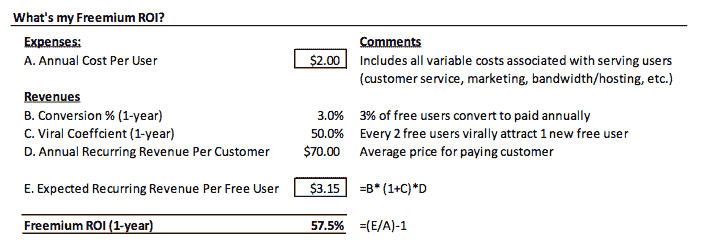

# 你的创业公司应该走向免费增值吗？

> 原文：<https://web.archive.org/web/https://techcrunch.com/2012/11/04/should-your-startup-go-freemium/>

**编者按:** *[朱尔斯·马尔茨](https://web.archive.org/web/20230405041936/http://www.ivp.com/team/general-partners/jules-maltz)是 [IVP](https://web.archive.org/web/20230405041936/http://www.ivp.com/) 的普通合伙人，专注于快速增长的互联网和软件公司的后期风险投资。* *在[推特](https://web.archive.org/web/20230405041936/https://twitter.com/JulesMaltz)上关注他。丹尼尔·巴尼是 IVP 的高级合伙人，专注于数字媒体和信息技术领域的后期风险投资。*在[推特](https://web.archive.org/web/20230405041936/https://twitter.com/danieljbarney)上关注他。

在过去的几个月里，有一场关于免费增值商业模式可行性的激烈辩论。对一些人来说，免费增值是一个昂贵的陷阱，这种商业模式牺牲收入，迫使初创公司支持那些永远不会成为付费客户的免费用户。对其他人来说，免费增值是商业的[未来，是带宽、存储和信息处理成本接近于零的世界的逻辑结论。双方都认为这个模型非常强大。正如 HitTail 的 Rob Walling 在最近的《华尔街日报》文章](https://web.archive.org/web/20230405041936/http://www.wired.com/techbiz/it/magazine/16-03/ff_free)[中指出的，免费增值就像一把武士刀:“除非你是使用它的大师，否则你可以砍掉你的胳膊。”](https://web.archive.org/web/20230405041936/http://online.wsj.com/article/SB10000872396390443713704577603782317318996.html)

虽然我们不是 IVP 的武士刀战士，但我们相信免费增值具有巨大的破坏性，需要被理解。在过去的几个月里，我们采访了免费增值软件的领导者，包括 37signals、Dropbox(一家 IVP 投资公司)、Evernote、GitHub、HootSuite、New Relic、SurveyMonkey、Weebly 和 Zendesk(为了简单起见，我们把重点放在了那些寻求将免费用户转化为付费用户的软件公司，而不是那些靠广告支持模式补贴的公司。)在这些公司的帮助下，我们为免费增值软件企业总结了以下六条经验。明智地使用它们！

##### 1)从产品开始

在我们的采访过程中，有一点反复出现:确保你的第一要务是你的产品。虽然设计一个高质量的产品对每个初创公司都很重要，但在建立一家免费增值公司时，这是至关重要的，也是特别具有挑战性的。完美的免费增值产品将自我营销，获得新用户(免费和付费)，搭载用户，并自动化客户服务，所有这些都很少或没有人工干预，费用最低。只有用户真正喜欢的设计良好的产品才有可能做到这一点。

典型的免费增值公司将 1%到 10%的用户转化为最终的付费用户。因此，免费增值产品同时具备(a)低边际成本和(b)最低销售和营销费用是很重要的。因为绝大多数用户不付费，如果一家免费增值公司的产品营销、交付或支持成本高昂，它将会陷入困境。你的产品需要纯粹基于自身的优点，在没有大量营销预算的情况下，推销自己，吸引忠实用户。对于用户来说，产品必须简单并且“好用”这并不意味着它在幕后不应该在技术上复杂或具有挑战性——只是用户感觉不到。

此外，免费和付费产品的简单性和质量必须保持一致。许多免费增值公司失败了，因为他们提供了一个免费的“噱头”产品，提供了很少的价值，希望用户会转换到付费版本。事实上，为用户提供次等产品会降低(而不是增加)他们成为付费用户的可能性，这违背了免费增值模式的初衷。最好的免费增值公司为免费用户和付费用户提供真正的价值，并花大部分时间让他们的免费产品变得更好。

除非你创造了一个伟大的产品，否则你无法吸引免费用户或付费客户。一旦你设计并制造了一个世界级的产品，是时候去了解你的客户，了解免费增值是否适合他们。

##### 2)了解你的客户:免费增值适合他们吗？

免费增值，就像订阅、永久许可或基于服务的定价模式一样，只是帮助你的客户购买你的产品的众多工具之一。你的首要工作是了解你的客户的痛苦，并建立一个产品来解决它。一旦你做到了这一点，你就可以开始询问他们想如何购买你的产品，并弄清楚免费增值是否是正确的选择。

在决定免费增值是否对您的客户有吸引力时，需要回答以下几个问题:

你的产品有多复杂？如果你所在的市场中，你的客户需要 pilots、RFP、RFI 或其他奇怪的首字母缩写词，那么很有可能你的产品对于免费增值来说太复杂了。要让免费增值模式发挥作用，你的客户需要能够快速理解并使用你的产品，而不需要长时间的整合。如果你的客户希望从一开始就获得实践培训或支持，免费增值可能不是合适的模式。

**你的顾客被免费吸引了吗？如果一个陌生人给你免费看孩子，你会说什么？如果你在街角免费看到一个脏沙发呢？你有可能每天都对许多免费的东西说不，因为你已经知道免费永远不会是真正的免费。有时事情非常关键(例如，临时保姆、Lasik 手术等。)你实际上更愿意为它们付钱。其他时候，使用免费产品的时间和/或精力成本太高，超过了收益。**

一旦你确信免费增值对你的客户有意义，是时候了解免费用户的价值，并决定免费增值对你的业务是否有意义了。

##### 3)了解免费用户的价值:免费增值适合你吗？

免费用户只有为你的业务提供价值才是有价值的。免费增值最吸引人(但也最危险)的一面往往是相对容易获得免费用户。哪个企业家不想看到全世界 10 万、100 万或 1 亿人使用她的产品？但是，如果这些用户没有带来付费客户(直接或间接)，他们可能会成为一个昂贵的负担，让一个公司慢慢破产。为了让你的免费增值模式发挥作用，免费用户必须符合以下两个类别之一:

**1。转化为付费客户的免费用户**
这些用户今天不会向你支付任何费用，但基于对你的[群组](https://web.archive.org/web/20230405041936/http://en.wikipedia.org/wiki/Cohort_(statistics))数据的良好理解(见第 5 课)，你可以预测他们中的很大一部分会转化为付费客户。

*关键产品属性:*随着时间的推移，用户从你的产品中获得越来越多的价值。

*举例公司:* Evernote。第一天，一个新的 Evernote 用户没有存储内容。她在使用产品时唯一能做的就是创造新的内容。但是随着这个用户慢慢地建立笔记、网络剪报等的库。，她就有更多的理由回到产品，用不同的方式与这个历史数据进行交互。三年过去了，Evernote 的普通用户从该产品中获得的价值比第一天要多得多，而且她更有可能会回来。虽然大多数企业显示使用量随着时间的推移而下降，但 Evernote 实际上有[负流失率](https://web.archive.org/web/20230405041936/http://www.forentrepreneurs.com/why-churn-is-critical-in-saas/)，使用量在第一年后增加(见下面的“微笑图”)。随着用户从免费产品中获得越来越多的价值，一些人最终转化为付费用户，并为 Evernote 带来可观的收入。

**2。吸引付费客户的免费用户**
这些用户今天不付给你任何东西，可能永远也不会付给你。然而，通过他们对你产品的忠诚和积极使用，他们吸引了其他付费客户。在许多方面，这种类型的用户可以被视为另一个营销渠道，具有相关的费用和可衡量的投资回报率。

*关键产品属性:*病毒式

*示例公司:* SurveyMonkey。在线调查是病毒产品的一个很好的例子。一个发出几十份调查的免费用户正在向数百名潜在客户推销 SurveyMonkey。有了正确的转化率，这个营销计划可以成为一个非常高效的付费客户获取渠道(即使原始用户永远不会成为付费客户)。

作为一家免费增值公司，要取得成功，你的产品要么需要随着时间的推移提供增值(导致直接转化)，要么需要病毒式传播(吸引新客户)。少数公司很幸运两者兼得。以 Dropbox 和 GitHub 为例，免费用户既可以通过文件共享(或公共存储库共享)招募新用户，也可以随着存储(或私人共享)需求的增长而转化为客户。这些动态造就了理想的免费增值产品。

一旦你确定你的免费用户为你的业务增加了价值，是时候确认一下数学运算是否有效了。

##### 4)确保数学是可行的

免费增值从根本上破坏了你的商业经济，这可能是好的也可能是坏的。即使你确信你是出于正确的原因添加免费用户，理解经济学并确保它们对你有利也是确保该模式有助于你的业务繁荣的基础。您需要查看的两个最重要的分析如下:

市场规模:免费增值只有在你追求一个巨大的市场时才会奏效，这就是为什么像 Dropbox 和 Evernote 这样最成功的免费增值公司会提供针对大型横向市场的解决方案。通过将有价值的东西定价为零，你已经将你支付的产品价格锚定在一个较低的数字上，使得很难收取大量的费用。你还通过向潜在客户提供免费的替代品来蚕食他们。因为很大一部分用户是免费的，所以通常需要数百万用户来建立相当数量的付费用户。大多数免费增值公司的客户转换率在 1%到 10%之间(平均在 2%到 4%左右)。典型的客户每年支付的费用也很少超过几百美元。因此，如果你想建立一个年收入 1 亿美元的公司，这意味着你可能需要接触数百万用户(见下面的例子)。如果你的市场没有那么大，你就不应该建立一个免费增值公司。

这个模型假设没有客户流失。流失增加了所需的免费用户，或者需要更高的生命周期转换百分比。

**2。免费增值投资回报率:**除了追求一个大市场，将用户转化为付费用户的回报超过服务所有用户的成本也很重要。如上所述，免费增值只有当你有一个边际成本低的产品时才起作用，这意味着服务下一个增量用户相对便宜(这就是为什么软件企业是免费增值的理想选择)。边际成本高的产品，如硬件设备或涉及大量客户服务或客户获取成本的产品，通常不会成为免费增值业务。通过比较服务免费用户的成本和你从客户转化中获得的收入，你可以计算出你的免费增值投资回报率(见下面的假设例子)。

正如第三课所讨论的，如果免费用户(a)转化为付费用户(转化率%)，或者(b)吸引其他用户(病毒系数)，你就可以从免费用户那里获得收入。如果免费增值适合你，你的 1 年投资回报率应该是有意义的正数——对大多数初创公司来说，理想情况下超过 50%。(在某些情况下，假设多年期投资回报仍基本为正，您可能会有负的 1 年期投资回报以增加市场份额。然而，这可能是一个昂贵的策略，最好由具有稳定和可预测指标的更成熟的企业采用。)

优化这些关键的经济驱动因素是建立一个成功的免费增值业务最困难的方面之一。确定产品定价以及在何处设定免费和付费产品之间的界限，是对转化率、病毒式传播、收入以及最终的投资回报率产生最大影响的决策。最初，这些决策必须基于猜测和大量的试错。然而，通过对免费增值数学的扎实理解和对你的同伴的详尽衡量(在第 5 课中讨论)，有可能得出最大化 ROI 和总盈利能力的价格点和功能或使用限制。

##### 衡量标准:爱你的同伴

作为投资者，我们喜欢能为我们提供大量用户群数据的企业。为什么？因为群组数据揭示了公司当前的健康状况和未来的潜力。通过将用户分组(基于一个月或一周的标准注册期)，免费增值业务可以衡量用户获取、参与、转化和保留的趋势。

群组分析对于免费增值业务尤其重要，因为注册和最终转化之间的时间可能很长。在传统的软件许可模式中，客户付款后可以立即获得软件——交易(大部分)就结束了。但是在免费增值业务中，一个免费用户可以在支付一分钱之前加入几年。免费增值公司评估转化是否按计划进行的唯一方法是跟踪沿途的群组事件。就像酿酒师品尝桶中的葡萄酒以确保每个年份都进展顺利一样，免费增值高管应该仔细跟踪她的团队以确保她的业务正在成熟。

一个密切监控和了解其同类的公司会获得两个重要的好处:

**1。对转化率和保留率的洞察:**群组指标提供了在制定产品和定价决策时非常有价值的商业洞察。最常见的免费增值群组分析之一是跟踪一段时间内的累积转化率(见下图)。理想情况下，免费增值业务应该随着时间的推移看到累积转化率的上升(更少的流失)，以及每个连续群组的转化率指标的改善。

【T2

基于时间的群组数据也有助于跟踪其他关键指标，包括:

*   用户在注册三个月后表现出哪些典型行为？一年？三年？
*   什么是免费/付费用户的终身价值？
*   用户是通过不同的渠道以不同的速度转化而来的吗？
*   产品修订如何改变群体行为？
*   价格变化如何影响使用或转换？

**2。可见性:**有了强大的群组数据，免费增值业务随着成熟变得非常可预测。(没有什么比可预测性更受首席执行官、风险资本家以及公众市场投资者的欢迎了)。在特定时期，免费增值业务从三个来源获得收入:

*   在前期转换并继续付款的优质客户
*   前几期获得的首次转换的免费用户
*   当期获得的新用户，他们会立即转化

有了历史群组数据，免费增值业务在进入一个季度时，会很好地了解有多少优质客户将继续付费，有多少免费用户将转化为客户，从而让新客户成为唯一不确定的收入来源。这使得免费增值比 SaaS 企业更容易预测。关于免费增值的可预测性的更多细节，请参见朱尔斯的博客文章:[“如果你喜欢 SaaS，试试免费增值！”](https://web.archive.org/web/20230405041936/http://www.julesmaltz.com/post/3376586698/if-you-like-saas-try-freemium)

##### 6)超越免费增值

尽管免费增值具有极大的可扩展性和盈利性，但它不应该是一成不变的模式。许多最成功的软件公司已经超越了免费增值模式，调整业务以满足客户需求，通常同时利用多种策略。他们信奉以下一条或两条原则:

**1。销售不是敌人:**虽然许多免费增值公司成功地开发了易于使用的产品，自动将用户转化为客户，但他们经常为销售在其组织中的角色而挣扎。随着 Dropbox、New Relic 和 HootSuite 等公司获得显著的企业渗透率，他们发现客户希望签署企业范围的交易，并与销售人员交谈。别担心，这是好事。

虽然许多免费增值公司的销售机构相对较小，但聪明的公司会记住第二课:了解你的客户。如果客户想以不同的方式购买你的产品，调整你的销售模式是没问题的。免费增值公司可以在以产品为中心的文化中建立强大的销售组织。与非免费增值的同行相比，他们也有巨大的优势，因为他们拥有数千甚至数百万已经喜欢该产品的高质量线索(用户)。例如，Dropbox 的免费增值用户群为其团队(企业)产品提供了大量潜在客户，而团队(企业)产品本身并不是免费增值服务。

**2。免费试用也是免费的:**此外，还有一系列公司，包括 37signals 和 Zendesk，利用免费增值的好处，但不提供永久免费的产品。这些公司认为，所有从产品中获得价值的用户最终都应该付费。然而，通过提供免费试用、直观的产品和简单的定价，他们获得了自行销售产品的好处。像免费增值公司一样，这些企业采用了一种需要以产品为中心的文化的[高速销售](https://web.archive.org/web/20230405041936/http://larsleckie.blogspot.com/2010/02/upcoming-freemium-summit.html)模式。他们可能会牺牲市场份额(因为他们接触到的用户比 freemium 的竞争对手少)，但他们仍然建立了盈利的、快速增长的公司。

##### 结论

虽然 freemium 肯定不是每家公司的正确模式，但如果使用得当，它可能是一个非常强大的工具。我们已经看到许多公司，包括我们采访的九家初创公司，从免费增值或高速销售中获得大量收入和利润。我们相信，正如 [Salesforce](https://web.archive.org/web/20230405041936/http://www.salesforce.com/company/news-press/press-releases/2012/08/120823.jsp) 通过开创 SaaS 模式成长为一家收入数十亿美元的公司一样，我们将会看到一代成功的免费增值公司建立持久的、实质性的业务。

但是在你创建下一个伟大的 freemium 公司之前，请记住，所有的初创公司都应该从创建一个世界级的产品开始，这个产品能够解决用户的一个重要难题。如果您认为 freemium 模式适合您的业务，IVP 的团队希望前面的课程能有所帮助。好运！

*感谢 37signals、Dropbox、Evernote、GitHub、HootSuite、New 遗迹、SurveyMonkey、Weebly 和 Zendesk 的高管们，感谢他们花大量时间向我们介绍免费增值服务。如果您有任何想法/建议/评论/意见，请直接写信给我们。本文的 PDF 版本可在[或](https://web.archive.org/web/20230405041936/http://www.ivp.com/assets/pdf/ivp_freemium_paper.pdf)处找到。*