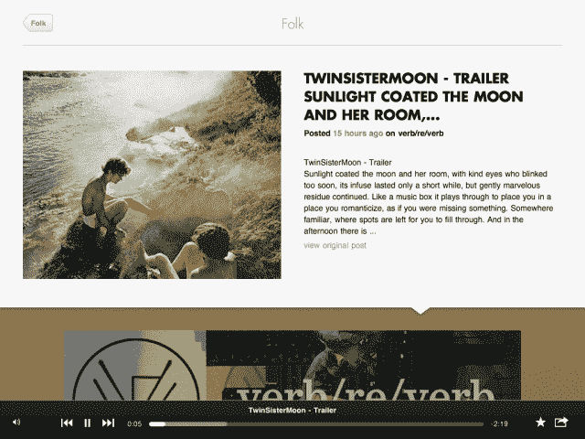

# Shuffler.fm 推出其漂亮的“Flipboard For Music”iPad 应用程序(有天使基金支持)

> 原文：<https://web.archive.org/web/http://techcrunch.com/2011/11/10/shuffler-fm-launches-its-nifty-flipboard-for-music-ipad-app-with-angel-funding-to-boot/>

去年，Twones 和 Tone.fm 的 Tim Heineke、Marcel Corso 和 Diedrik Martens 在阿姆斯特丹创办了一家新的音乐初创公司，名为 [Shuffler.fm](https://web.archive.org/web/20230204115537/http://shuffler.fm/) ，让用户在阅读时可以听到音乐博客中的歌曲和艺术家。

这家初创公司就这样开始了它的音乐发现的酷酷的网络应用程序生涯，它的目标是从互联网上的博客中聚合音乐——基于流派。在过去的一年里，Shuffler.fm 已经发展成为一项服务，现在允许用户播放他们最喜欢的音乐博客的连续混合，通过一个漂亮的搜索功能浏览流行歌曲和艺术家，以及根据“最喜欢的”歌曲和博客创建个性化频道。音乐博客也可以创建自己的页面，包括一个“播放这个博客”按钮，启动博客自己的频道。([点击这里查看莎拉八月份的报道。](https://web.archive.org/web/20230204115537/https://techcrunch.com/2011/08/16/audio-magazine-shuffler-fm-gets-big-update-gives-us-sneak-peek-at-ipad-app/))

就其最初的功能而言，Shuffler.fm 实际上是 Pandora 和 ex.fm 的混合体，用于音乐博客策划的音乐。然而，在周二，这家初创公司扩大了这种影响，包括 Flipboard，[推出了一款 iPad 应用程序](https://web.archive.org/web/20230204115537/http://itunes.apple.com/us/app/shuffler.fm/id456966147?mt=8)，它可以将音乐博客和网站转化为广播电台，以 Flipboard 风格的文字、图片和流媒体音频布局来管理它们。

Shuffler.fm iPad essentially 应用程序创建了一个聚合的音乐杂志，实时提供来自各种音乐博客和专家的内容(内容按分钟更新)，提供即时消费的过滤音乐流，优化可发现性，同时提供精心策划的体验，以便用户不必解析音乐内容制作者发出的大量噪音。换句话说，这是带有编辑过滤器的音乐聆听。

当然，Shuffler 的音频不是像许多其他音乐服务(Last.fm、Pandora)那样，基于你现有的品味来提供内容，而是通过基于流派的渠道提供给你，这些渠道由(只有最酷的)博客组成，如 Pitchfork、TheMusic。FM 和 Stereogum 等等。

用户可以从应用程序底部的这些可视化 RSS 博客订阅源中创建歌曲播放列表，然后他们可以通过应用程序的播放器收听，同时阅读他们正在收听的歌曲。该应用程序还支持 AirPlay，因此用户不仅仅局限于从 iPad 的扬声器中听音乐。

对于那些已经在使用 Shuffler 的 web 应用程序的人来说，使用 iPad 应用程序的体验会很熟悉。这两种体验是可比较的，也许在新的 iPad 应用程序中，在设计和 UX 方面更简单一些。当然，这种体验也非常类似于 Flipboard，因为内容显示在视觉上很有吸引力的基于磁贴的布局中，这种布局在平衡视觉糖果方面做得很好，而不会分散对音乐和可发现性功能的注意力。

收听博客支持的广播流，同时能够查看相关视频内容或浏览乐队或博客的主页，这立刻成为一种熟悉的体验，听起来可能不是特别翻天覆地，但这种方式仍然感觉很新鲜。这是一个伟大的人类策划的替代物，取代了今天为我们最喜爱的音乐应用提供动力的大量机器算法。这也有助于应用程序内置书签和共享功能，让你回到你最喜欢的歌曲或博客帖子，同时与朋友分享你发现的音乐。

为了帮助它完成成为 iPad 的新潘多拉/Flipboard 的使命，创始人 Tim Heineke 告诉我们，这家初创公司刚刚完成了一轮 70 万美元的天使投资。尽管喜力啤酒还不能透露投资者的名字，但他表示 Shuffler.fm 迄今已获得近 50 万用户。将随着我们了解的更多而更新。

[点击这里](https://web.archive.org/web/20230204115537/http://itunes.apple.com/us/app/shuffler.fm/id456966147?mt=8)查看 App Store 上的 Shuffler.fm。

【T2