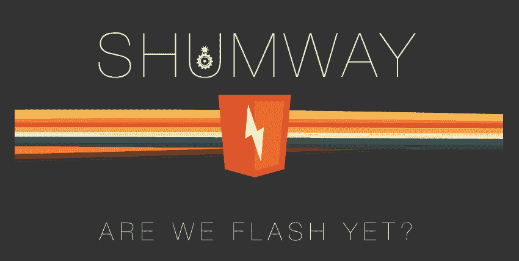

# Shumway，Mozilla 基于 HTML5 的 Flash 播放器替代品，登陆 Firefox Nightly 

> 原文：<https://web.archive.org/web/https://techcrunch.com/2013/10/03/shumway-mozillas-html5-based-flash-player-replacement-lands-in-firefox-nightly/>

# Shumway 是 Mozilla 基于 HTML5 的 Flash 播放器的替代品，每夜登陆 Firefox

Mozilla 的技术实验——Shumway(“T4 ”),为 Flash 文件构建了一个高效的网络原生渲染器，现在已经在最新的 Firefox Nightly builds 中[登陆](https://web.archive.org/web/20221207114219/http://gemal.dk/blog/2013/10/02/html5_flash_player_shumway_landed/)。这个项目背后的想法是通过使用 HTML5 和 JavaScript 来完全取代 Flash Player 来显示 SWF 文件，这离生产就绪还很远。

早在 90 年代末，Macromedia 的 Flash Player 帮助将声音、视频和动画带到了主流网络，但今天，Flash 可能是最令人讨厌的浏览器插件之一。然而，它仍然被大量使用，虽然大多数移动浏览器不再支持它，但它仍然是桌面上的主要内容。

Mozilla 在 2012 年初开始致力于这个项目，正如它在 2012 年 11 月最后一次详细谈论这个项目[时指出的，Shumway 的主要目标是“在没有运行时实现的平台上为 SWF 和其他富媒体格式提供运行时处理器。”它还想通过改进在浏览器中显示富媒体格式的方式来推动开放网络的发展，而不需要专有的解决方案。](https://web.archive.org/web/20221207114219/https://blog.mozilla.org/research/2012/11/12/introducing-the-shumway-open-swf-runtime-project/)

到目前为止，Shumway 只能作为一个[浏览器扩展](https://web.archive.org/web/20221207114219/http://mozilla.github.io/shumway/extension/firefox/shumway.xpi)使用。在最新的 Firefox Nightly builds(版本 27)中，它仍然没有被默认激活，但是你可以进入 about:config 并激活它(尽管你仍然需要安装 Flash Player)。

 即使没有安装最新的 Firefox Nightly，你也可以看看它的功能，这要感谢 Mozilla 的在线 [Shumway 检查员](https://web.archive.org/web/20221207114219/http://mozilla.github.io/shumway/)。虽然 Shumway 还不能运行那么多商业可用的 Flash 应用程序，但像这个[赛车游戏](https://web.archive.org/web/20221207114219/http://mozilla.github.io/shumway/examples/inspector/inspector.html?rfile=../racing/race3.swf)或这个基本的 [2D 物理引擎演示](https://web.archive.org/web/20221207114219/http://mozilla.github.io/shumway/examples/inspector/inspector.html?rfile=../Box2DFlashAS3/demo.swf)这样的演示展示了这项技术的潜力。然而，它是否能够完全复制 Flash 的所有功能还有待观察。

对于 Mozilla 来说，这是取代 Adobe 技术的第二个重大项目。凭借 [PDF.js](https://web.archive.org/web/20221207114219/https://mozillalabs.com/en-US/pdfjs/) ，该组织已经取代 Adobe Reader 成为在浏览器中呈现 PDF 文件的默认技术。

同样值得注意的是，其他项目过去也尝试过类似的方法。例如，谷歌的 Swiffy 在 2011 年作为一个 SWF 到 HTML5 的转换器推出，虽然我们从那以后没有听到太多关于它的消息，但看起来这个项目仍然是 T2 的强项。

Adobe 本身也已经放弃了 Flash，事实上，它最近为网络开发者做的所有项目都是关于支持网络标准和创建基于 HTML5 的网站。