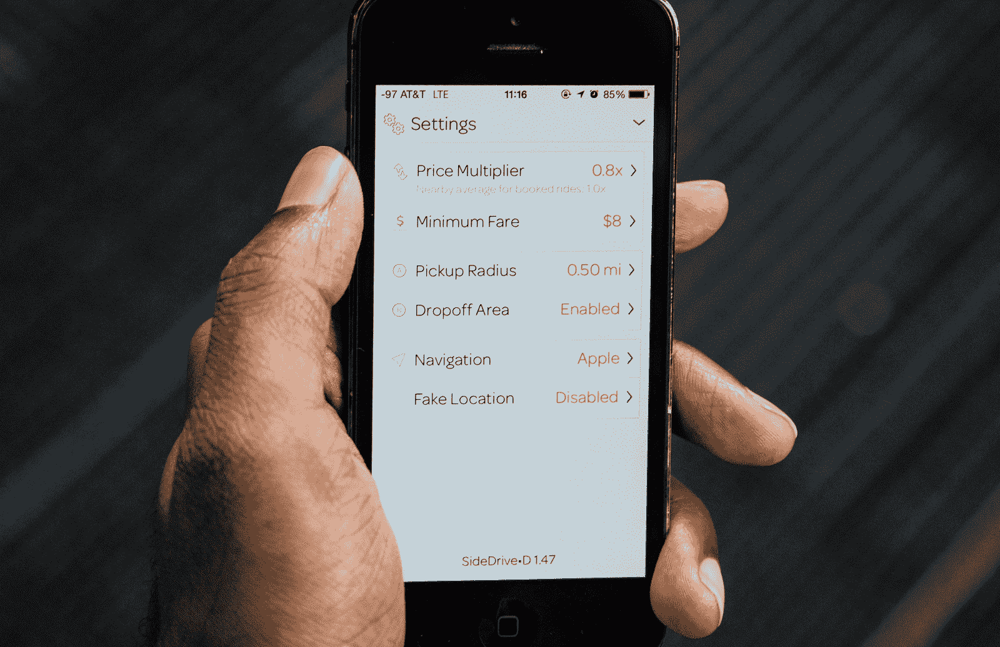
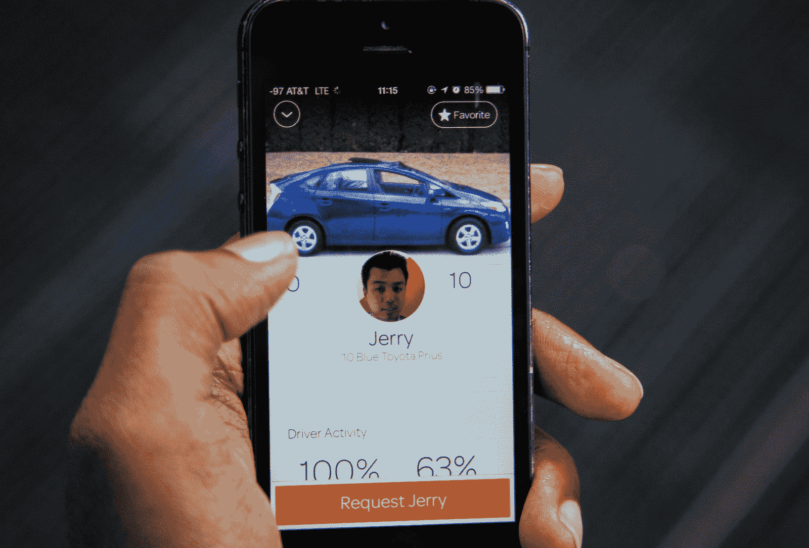

# 从 USV 融资 1000 万美元后，SideCar 转向提供拼车市场 

> 原文：<https://web.archive.org/web/https://techcrunch.com/2014/02/19/sidecar-usv-app-update/>

点对点拼车初创公司 [SideCar](https://web.archive.org/web/20221006074419/http://side.cr/) 正在为乘客和司机发布全新版本的应用程序，这将为司机提供更多灵活性，为乘客提供更多选择。新版本是与联合广场风险投资公司的投资和弗雷德·威尔逊被任命为董事会成员一起宣布的。

对于 SideCar 来说，其应用程序的新版本旨在将其与世界上的 Ubers 和 Lyfts 区分开来。这两个竞争对手都专注于试图为他们的乘客创建一个可预测的价格结构，Lyft 从“捐赠”的想法转向统一的票价结构。

最终，这些公司努力简化租车流程，对预计到达时间、票价结构和乘车总成本有具体的预期。输入你的位置，点击你的手机屏幕，就会有一辆车来接你。

### 更多驾驶员灵活性，更多乘客选择

随着应用程序的最新更新，SideCar 采取了相反的方法，为司机创造了更大的定价灵活性，并相信最终将为乘客提供更多选择。优步和 Lyft 走了弯路，SideCar 走了弯路，试图与其他按需乘车应用区分开来。

司机现在可以对他们收取的费用以及他们愿意多远接送乘客设置更多限制。例如，那些拥有更多座位的大型车辆的人可以比那些只有五座轿车的人多收费一点。

但是创造更多的驾驶灵活性也意味着让一些人能够指定他们想在哪里上下车。这在理论上可以创建一个通勤或拼车用例，在这种情况下，从家附近前往工作地点的司机可能能够将费用折扣给大致相同行程的乘客。

在乘客方面，用户现在可以选择他们希望乘坐的司机或汽车。在输入他们的最终目的地(SideCar 通过 GPS 自动检测您的起始位置)后，他们会得到一个可用司机的列表，其中包括汽车的照片、司机提供更多信息的“保险杠贴纸”以及乘坐费用。用户还可以“收藏”他们喜欢乘坐的司机，当他们想搭车时，这些司机会出现在他们列表的顶部。

首席执行官苏尼尔·保罗告诉我:“我们非常努力地让它变得简单，没有太多额外的思考，也没有额外的按钮点击。“我认为我们以一种两全其美的方式分割了它。”

虽然有些人可能会认为用户选择太多是一件坏事，大多数乘客并不真正关心谁来接他们或将他们从一个地方带到另一个地方，但保罗表示，方向的转变实际上提供了更多确定性，包括他们支付了多少钱，以及谁来接他们以及何时接他们。

他指出，在相互竞争的应用程序中，用户经常被告知最近的司机只有几分钟的路程——结果却是另一个司机真的搭了车。他说，由于价格飙升，“你完全是在猜测”最终票价会是多少。

### 弗雷德·威尔逊的新投资

随着新应用的推出，SideCar 宣布从 Union Square Ventures 获得了 B 轮融资，我们听说金额约为 1000 万美元。该公司实际上在去年夏天获得了资金，但保罗告诉我，SideCar 希望在应用程序更新和商业计划转变准备就绪之前，不要宣布融资。

“这笔资金的一个重要原因是执行这一重大的方向转变，”保罗说。“我们获得了执行和交付这一战略的资金，在我们完成之前，我们并不认为有什么可谈的。”

关于资金，还有一些其他有趣的事情需要指出。首先，SideCar 将弗雷德威尔逊(Fred Wilson)纳入董事会，这可能有助于在寻求拓展更多市场时提供一点运营帮助。

但联合广场风险投资公司(Union Square Ventures)在向按需打车应用 Hailo 投资 3000 万美元后获得了这笔资金。由于这些投资可以被视为具有竞争力，我问保罗，为什么这家投资公司对投资两家公司感到放心，这两家公司都在寻求通过移动应用程序将乘客与游乐设施连接起来。

“我们没有看到冲突，USV 或海洛的人也没有，”保罗告诉我。“我们关注的是这个面向社区的市场，而 Hailo 已经围绕出租车市场建立了核心业务。”

(可能还值得注意的是，SideCar 的 B 轮融资与优步的 2.58 亿美元融资相比相形见绌，后者大约在同一时间关闭。这可能是该公司直到现在才披露的另一个原因。)

虽然 SideCar 是第一家在美国推出的纯拼车初创公司，也是早期扩张最积极的公司，但它在服务的市场数量上落后于优步和 Lyft。有了新的应用程序和弗雷德·威尔逊的指导，我们将看看它是否能扭转局面。