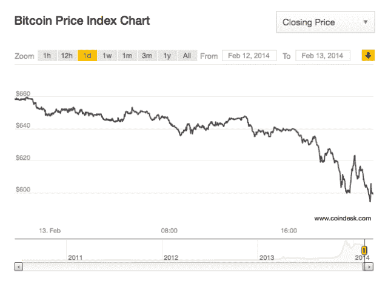

# 丝绸之路 2 被黑，4000 多个比特币据称被盗 

> 原文：<https://web.archive.org/web/https://techcrunch.com/2014/02/13/silk-road-2-hacked-88000-bitcoin-allegedly-stolen/>

# 丝绸之路 2 被黑，超过 4000 比特币据称被盗

丝绸之路 2 版主 Defcon 在一个论坛帖子中报告说，黑客已经使用了[交易延展性漏洞](https://web.archive.org/web/20221031083755/https://beta.techcrunch.com/2014/02/10/whats-going-on-with-bitcoin-exchange-mt-gox/)来入侵市场。黑客窃取了~~88000~~4474.26[价值 2747000 美元的比特币](https://web.archive.org/web/20221031083755/https://beta.techcrunch.com/tag/bitcoin)，清空了网站的托管账户。

更新-固定估计。

该网站使用中央托管服务将比特币从买家发送给卖家。黑客利用了交易可延展性的漏洞——本质上是一种用户可以掩盖转账并多次要求相同金额 BTC 的方法——来清理这个钱包。这与迫使 Mt. Gox 停止所有取款的错误相同，最近的更新使普通比特币钱包可以抵御这种攻击。据该网站称，黑客利用丝绸之路的自动交易验证系统相互订购，然后要求退还未发货的货物。黑客之所以能够利用交易延展性 bug，是因为丝绸之路只使用交易 ID 来确认比特币的转移。你可以在这里阅读更多关于问题[的内容。](https://web.archive.org/web/20221031083755/https://beta.techcrunch.com/2014/02/10/whats-going-on-with-bitcoin-exchange-mt-gox/)

他们应该为他们的供应商运行一个自动退款系统，该系统依赖于 TXID 来验证交易。他们声称，六家供应商相互勾结，通过相互订购，然后提交循环退款请求来利用该系统。

Defcon 呼吁黑客归还比特币。“鉴于我们社区的影响力，我们只能希望他会诚实地决定归还硬币，而不是像懦夫一样躲藏，”该版主写道。

该网站的用户目前正试图追踪小偷。写 Defcon:

#袭击者 1:(对 95%的盗窃案负责)
法国嫌犯，对绝大多数盗窃案负责。使用以下六个供应商帐户相互订购，以找到并积极利用漏洞。使用的用户名:
narco 93
ke tama
riccola
german coke
napolicoke
smoking life

失窃的消息使得 BTC 的价格下跌了大约 50 点，目前在 600 点上下徘徊。我们会发布更多关于黑客和漏洞的信息。就 Defcon 而言，他呼吁进一步分散在线市场和货币。

“没有一个市场是完美的。预计任何集中的市场在某个时候都会失败。这正是我们必须团结一致决定分权的原因，”他写道。

[via DeepDotWeb](https://web.archive.org/web/20221031083755/http://www.deepdotweb.com/2014/02/13/silk-road-2-hacked-bitcoins-stolen-unknown-amount/)