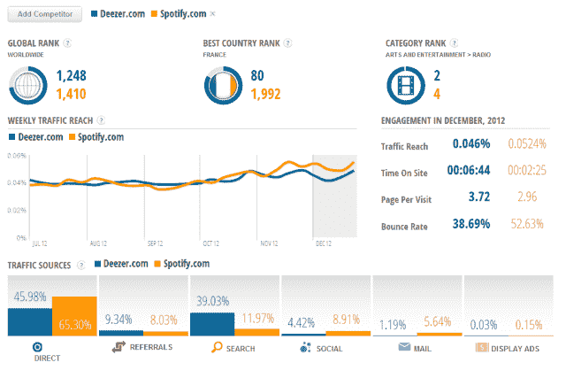

# SimilarGroup 筹集了 250 万美元，通过其新的 SimilarWeb 服务 来挑战 Alexa(通常很糟糕)的网络排名

> 原文：<https://web.archive.org/web/https://techcrunch.com/2013/01/29/similargroup-raises-2-5-million-to-take-on-alexas-often-terrible-web-rankings-with-its-new-similarweb-service/>

总部位于特拉维夫的 SimilarGroup 公司今天宣布获得 250 万美元的新资金，该公司最近推出的网络测量工具 [SimilarWeb](https://web.archive.org/web/20230326021404/http://www.similarweb.com/) 旨在颠覆 [Alexa 在网络排名中的堡垒。这轮融资由微软以色列研发中心前总裁 Moshe Lichtman 牵头，作为融资的一部分，Lichtman 也加入了公司董事会。](https://web.archive.org/web/20230326021404/http://www.alexa.com/)

该公司的其他投资者包括 ICQ 的原始投资者【Yossi Vardi 博士，以及私募股权公司 Naftali Investments 和[Docor International B . V .](https://web.archive.org/web/20230326021404/http://www.docor.co.il/index.html)。迄今为止，SimilarGroup 已经筹集了 350 万美元的外部资金。

该公司成立于 2009 年，直到最近，一直以其品牌浏览器插件套件(例如 SimilarWeb、SimilarSites)而闻名，这些插件为用户提供与他们当前正在访问的网站类似的其他网站的建议，以及其他有用的信息，例如网页排名、流量范围和流量来源。这些插件和其他插件有助于增强新推出的 [SimilarWeb 网络测量服务](https://web.archive.org/web/20230326021404/http://www.similarweb.com/)背后的算法。

但为了挑战 Alexa，SimilarGroup 有更多锦囊妙计，不仅仅是几个插件，其主要用户群可能是营销人员或 SEO 专业人士。该公司也有一些未公开的面向消费者的插件(实际上，他们私下告诉我的——数量很多。),从社交插件到游戏等等。这些插件的最终用户可能没有意识到他们在帮助 SimilarWeb 的排名贡献数据，因为他们没有被打上“相似”的标签。

总的来说，该公司的插件已经被下载了数千万次，其在线门户 SimilarSites.com，今天每月有超过 1000 万的访问者。需要处理大量数据——由于 SimilarGroups 的插件，该公司将能够提供比 Alexa 更好、更准确的见解。

SimilarGroup 首席执行官或 Offer 表示，Alexa 作为一个品牌，已经不再值得信任。工具栏是营销人员使用的，不是普通用户。“网站看起来很糟糕，有很多广告，”他补充道。“在过去的一年半时间里，我们非常努力地建设 similar web……我们希望成为下一个 Alexa，”他补充道。

在后端，SimilarWeb 使用其独特的技术和“海量数据”，提供比 Alexa 更准确的测量。这是该公司有信心说的话，因为他们定期对数据准确性进行内部比较。虽然 Offer 拒绝在这里公开数据，但他声称，与竞争对手相比，该公司的数据非常准确。他表示，自 10 天前发布以来，新平台的参与度和重复访问率都很高——超过一半的用户已经返回，有些人在平台上花费了 5 分钟以上。

Offer 还谈到了 SimilarGroup 的 25 人团队的质量，指出该公司的员工中有博士，他们有机器学习、大数据和统计等方面的背景。“我们是一家非常精明的技术公司，”Offer 说。“我们有一个巨大的服务器群，有 100 多台服务器……每个月，我们都会分析网络上超过 10 亿个页面。”

该公司不仅押注于其数据的质量，还吹捧一些独特的功能，这些功能允许用户更深入地研究流量来源、排名、有机搜索与付费搜索、社交流量、相关网站等等。(SimilarWeb 与 Alexa 的全面对比[详见该公司的博客](https://web.archive.org/web/20230326021404/http://blog.similarweb.com/similarweb-much-more-than-alexa/)。数据也以一种新的、更吸引人的方式呈现，它以一种干净、现代、几乎类似信息图表的界面提供。

展望未来，获得额外资金的计划是向公众推出[其“专业”(付费)服务](https://web.archive.org/web/20230326021404/http://www.similarweb.com/pro)，这将通过向用户提供基于订阅的竞争分析产品而成为收入来源。这将与公司现有的 [API 包一起提供](https://web.archive.org/web/20230326021404/https://developer.similarweb.com/)。Offer 还指出,“排名 API”将对那些想要的人保持免费。“我们想在互联网上发布我们的排名。他告诉我们:“我们希望取代 Alexa 排名，所以如果你给我们发电子邮件，你就可以免费获得排名 API。”

除了产品开发，该公司正计划在年底前在纽约开设办事处，在那里它将雇用销售和营销人员来销售其 Pro 产品和其他软件包。