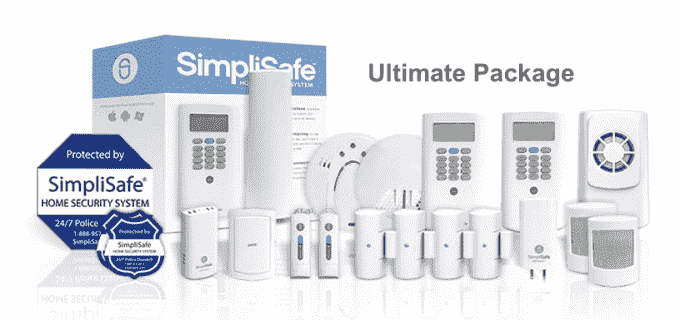

# Simplisafe 为他们的 DIY 家庭安全系统增加了新的传感器和服务 

> 原文：<https://web.archive.org/web/http://techcrunch.com/2014/03/13/simplisafe-adds-new-sensors-services-to-their-diy-home-security-system/>

# Simplisafe 为他们的 DIY 家庭安全系统增加了新的传感器和服务

随着竞争对手如[金丝雀](https://web.archive.org/web/20230131000248/https://techcrunch.com/tag/Canary)和[鸟巢](https://web.archive.org/web/20230131000248/https://techcrunch.com/tag/Nest)紧随其后，总部位于波士顿的小型安全公司 [Simplisafe](https://web.archive.org/web/20230131000248/http://simplisafe.com/) 正在全力以赴。在去年年底更新了他们的软件和移动界面后，他们更新了他们的硬件，并在他们的硬件库中添加了一个玻璃破碎传感器，这是业内最便宜的传感器之一。

这些传感器看起来像标准安全系统中常见的小型运动传感器，可以检测到 30 英尺外的碎片。它们通常会过滤掉其他外来的噪音，但如果你把它们放在厨房里，如果你容易掉杯子，你可能会得到一些假阳性。

除了新的传感器，该系统还通过一个简单的应用程序提供手机无线连接，如果警报响起，它会通知你和警察。该系统非常适合那些不想安装安全系统或在墙板上打洞的租户。相反，你只需将键盘和传感器贴在房子周围，将基站(看起来像一个白色的小圆锥体)放在一个偏僻的地方。

家庭自动化正在飞速发展，进军安防、暖通空调和环境传感等根深蒂固的市场变得越来越容易。虽然这可能会降低那些上门以每月 200 美元的价格向你出售 Brink 系统的人的底线，但它肯定会让你更容易以低廉的价格建立一个智能生活空间。