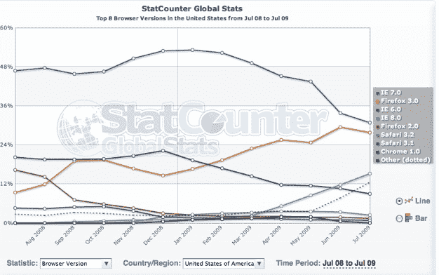

# 自 3 月以来，ie 浏览器的 11.4%份额被火狐、Safari 和 Chrome | TechCrunch 夺走

> 原文：<https://web.archive.org/web/https://techcrunch.com/2009/07/05/since-march-internet-explorer-lost-114-percent-share-to-firefox-safari-and-chrome/>

# 自 3 月以来，ie 浏览器的 11.4%份额被火狐、Safari 和 Chrome 夺走

新的浏览器大战还在继续。在微软用 ie 浏览器干掉网景十多年后，浏览器市场的竞争空前激烈。就在上周的[，Mozilla 发布了](https://web.archive.org/web/20230404195426/https://techcrunch.com/2009/06/30/firefox-35-soars-past-a-million-downloads-approaching-100-downloads-a-second/) [Firefox 3.5](https://web.archive.org/web/20230404195426/http://www.mozilla.com/en-US/firefox/upgrade.html) ，现在已经被下载了将近 1400 万次。更早的[6 月](https://web.archive.org/web/20230404195426/https://techcrunch.com/2009/06/12/browser-wars-continue-apple-claims-11-million-downloads-for-new-safari-in-3-days/)，苹果发布了 [Safari 4](https://web.archive.org/web/20230404195426/http://www.apple.com/safari/download/) 。三月份，微软推出了互联网浏览器 8，谷歌推出了速度更快的 Chrome 浏览器测试版。

一些早期数据显示了相对市场份额和人们升级的速度。如果你看一下上面来自 Statcounter 的图表，它表明自三月份以来，Internet Explorer 已经被其他浏览器夺走了 11.4%的市场份额。这是 IE8、IE7 和 IE6 市场份额的总和。当然，IE8(浅蓝色线)自去年 3 月发布以来一直增长强劲，截至 7 月 4 日，占据了 16.7%的市场份额。这些强劲的增长弥补了 IE7 市场份额从 3 月份的 49.1%到昨天的 30.1%的大部分下降，表明微软在让现有 IE7 用户稳步升级方面做得很好。6 月中旬，IE8 终于超过了 IE6，后者仍占据 7.6%的份额。然而，将这三者加起来，(IE6+IE7+IE8)，IE 总共只占有 54.4%的市场份额，而 2009 年 3 月的市场份额为 65.8%。

仅仅在三个多月的时间里，Internet Explorer 的整体市场份额就下降了 11.4%。那去哪了？它去了火狐、Safari 和 Chrome。其中近 5 %,或者说大约一半，是 Firefox 3.0，它目前拥有 27.6%的市场份额。这还不算上周的升级。看到浅蓝色 IE8 线正下方的虚线了吗？这是一组“其他”浏览器的组合，似乎包括 Firefox 3.5、Safari 4 和 Chrome 2.0。

如果你查看同一张图表的 30 天版本，它显示 Safari 4 的市场份额为 4 %, Chrome 的市场份额为 3%。它还没有推出 Firefox 3.5，但如果你假设它占了过去一周几乎超过 IE6 的剩余虚线的大部分，你就可以或多或少地看出哪些浏览器正在从微软那里抢走份额。(在这篇文章中，我使用了最近日线图中的数据，但在下面嵌入了月线图，其中有截至 6 月 30 日的数据)。

如我所说，这是一个来源的早期数据。[网络应用](https://web.archive.org/web/20230404195426/http://marketshare.hitslink.com/default.aspx)，另一个经常被引用的浏览器市场份额来源，目前正在审查其 6 月份的数据，但我感觉他们会显示类似的趋势。(这个[维基百科页面](https://web.archive.org/web/20230404195426/http://en.wikipedia.org/wiki/Browser_usage)显示了其他浏览器市场份额来源，其中大部分自 3 月份以来就没有更新过)。在这一点上很难做出任何确定的结论，因为市场份额变化如此之快，以至于每个主要(和次要)浏览器都试图说服用户升级。

但是我们正处于同时跨越 IE、FireFox 和 Safari 的重大升级周期中(Chrome 通配符被抛出)。当该说的都说了，该做的都做了，我们可能会看到市场份额的大变动，而且几乎肯定会看到领导权从 IE7 转移到另一个浏览器。问题是那会是 IE8 还是 Firefox？无论哪一方获胜，好消息是 IE6 终于要死了。

来源: [StatCounter 全球统计–浏览器版本市场份额](https://web.archive.org/web/20230404195426/http://gs.statcounter.com/#browser_version-US-monthly-200807-200907)