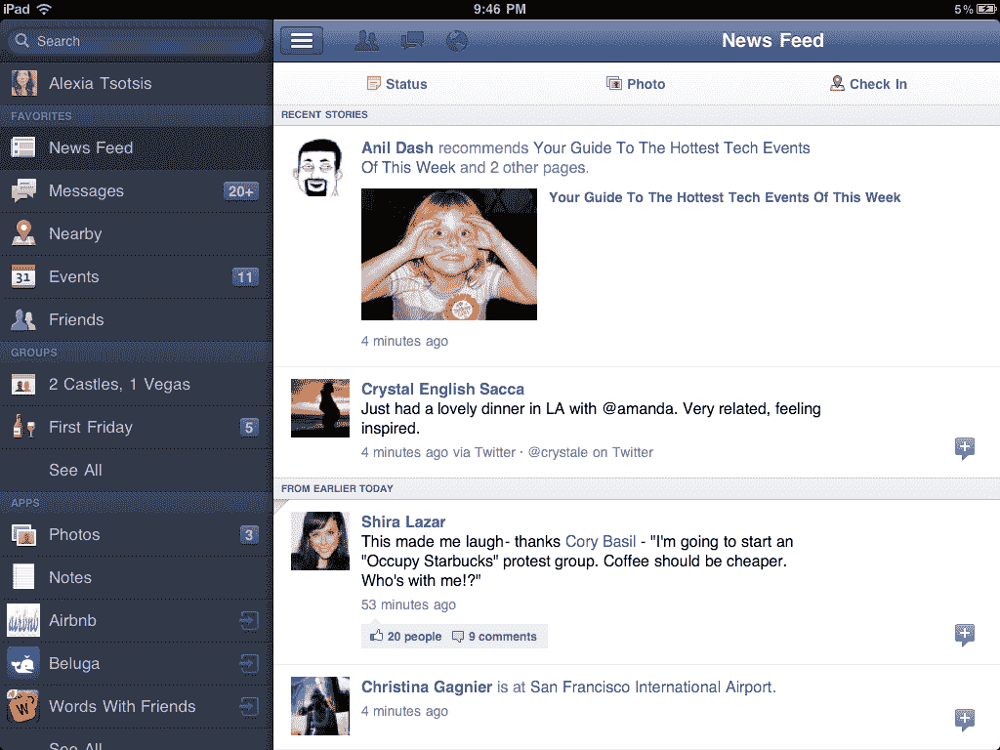
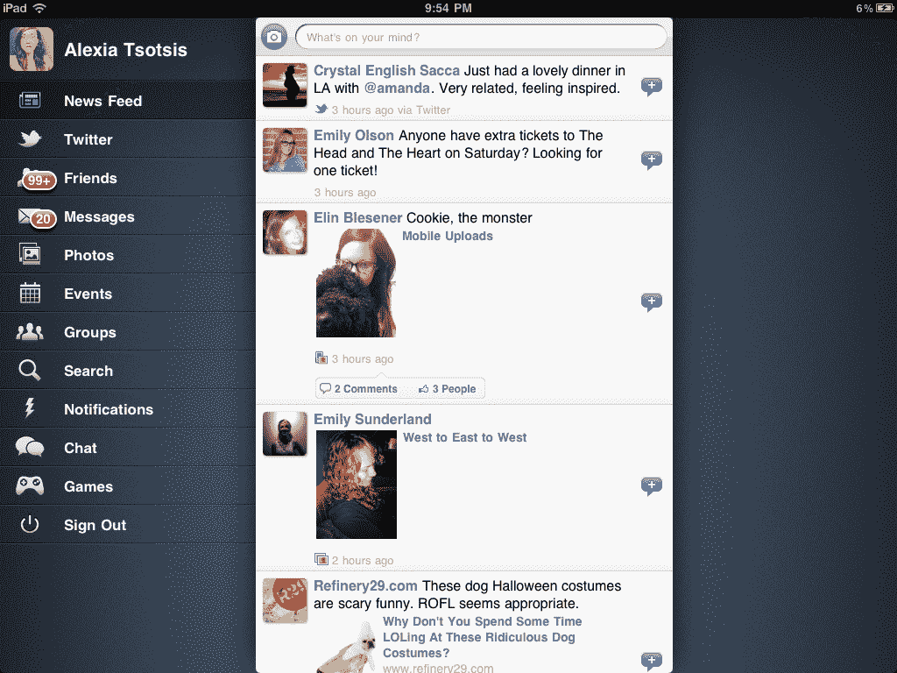

# 是脸书，你还能指望什么？

> 原文：<https://web.archive.org/web/http://techcrunch.com/2011/10/10/sincerity-is-the-sincerest-form-of-flattery/>

# 是脸书，你还能指望什么？

**上图:**来自脸书[新的、统一的](https://web.archive.org/web/20230203065932/https://techcrunch.com/2011/10/10/one-app-to-rule/) iOS 更新的风景模式截图。

**底部**:来自 [MyPad 的 iPhone 应用的风景模式截图。](https://web.archive.org/web/20230203065932/http://itunes.apple.com/app/mypad-for-facebook-twitter/id412133981?mt=8)

我向上帝脸书发誓，我们应该开始举办一场比赛，让那些能够发现这种设计“奉承”的人参加，比如让他们赢得扰乱北京的门票之类的。

**练习:**下面是他们各自的 iPad 应用程序的样子，猜猜哪个是脸书的，哪个是我的平板电脑的……

我的天。

*via:[dige rati](https://web.archive.org/web/20230203065932/https://twitter.com/#!/Digeratii)*