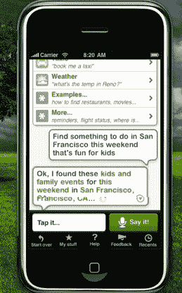
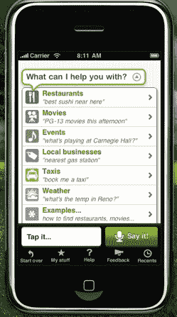

# Siri 的 IPhone 应用程序让你的口袋里有了一个私人助理

> 原文：<https://web.archive.org/web/https://techcrunch.com/2010/02/04/siri-iphone-personal-assistant/>

经过近一年的开发和 2400 万美元的风险投资， [Siri](https://web.archive.org/web/20230306050922/http://www.siri.com/) 终于准备好将其个人助理引入 iPhone。Siri 为 iPhone 带来了一个对话界面，允许你要求它为你执行任务，例如在附近找到一家法国餐馆并预订一张桌子，查找电影列表，订购出租车，或者查找当地企业的电话号码和地址。该应用程序现已在 App Store 上线( [iTunes 链接](https://web.archive.org/web/20230306050922/http://itunes.apple.com/us/app/siri-assistant/id351778157?mt=8)；目前只推荐给 iPhone 3Gs 机型，因为它需要更强的处理能力，但针对老款 iPhone 的版本将在本季度末推出)

你只需对着电话说这样的请求:“这个周末在旧金山找点事做。”它将你的语音转换成文本，并将你的请求发送给网络上的适当服务，比如 Eventful 或 Citysearch。它不仅试图根据上下文、时间和位置为您带回适当的信息，而且在您的允许下，还可以进行预订或购买门票。(阅读我们去年广泛的[抢先报道](https://web.archive.org/web/20230306050922/https://techcrunch.com/2009/05/27/siri-the-virtual-assistant-that-will-make-everyone-love-the-iphone-even-more/)或者观看这个[偷窥视频](https://web.archive.org/web/20230306050922/https://techcrunch.com/2009/05/27/sneak-peak-first-video-demo-of-siri-virtual-assistant/))

Siri 结合了一系列令人印象深刻的技术，并将它们融合在 iPhone 上。这些包括自然语言处理和语义分析。这项基础技术是由 SRI 利用价值 2 亿美元的 Darpa 资助开发的。Siri 被剥离出来是为了将其商业化并带给消费者。它的最后一轮融资由香港亿万富翁李嘉诚牵头(这个事实以前从未披露过)，他也是脸书的投资者。

在某种程度上，Siri 是“所有混搭之母”。iPhone 应用程序是一个与 Siri 服务器在网络上的对话界面，它在发布时绑定了近 30 个不同的 API，更多 API 正在开发中。其中包括 OpenTable、TaxiMagic、MovieTikets.com、烂番茄、WeatherBug、Yahoo Local、Yahoo Boss、StubHub、Bing、Eventful Freebase、Citysearch、AllMenus.com、Gayot 和 Wolfram Alpha。

这款应用是免费的，每次你通过这款应用购买音乐会门票或预订餐厅时，Siri 都会收取会员费。除了帮你做事，它还可以用来设置提醒。只要告诉它在周四早上用电子邮件提醒你打个电话，它就能想明白。该应用从另一个 SRI 衍生产品 Nuance 获得了语音转文本引擎的许可。Android 和黑莓版本也在开发中。

