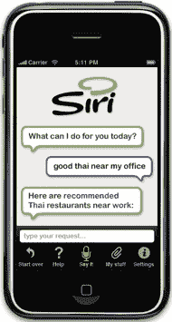

# Siri:iPhone | TechCrunch 的强大虚拟助手

> 原文：<https://web.archive.org/web/https://techcrunch.com/2009/05/27/siri-the-virtual-assistant-that-will-make-everyone-love-the-iphone-even-more/>

***编者按**:以下客座博文由[麻线](https://web.archive.org/web/20230328101203/http://www.twine.com/)* 背后的公司雷达网络(Radar Networks)首席执行官[诺瓦·斯皮瓦克](https://web.archive.org/web/20230328101203/http://twitter.com/novaspivack)撰写

使用互联网的新模式即将开始:虚拟助理(VA)将出现在你身边的移动设备上。

本周，一家秘密创业公司将展示他们的第一个公开版移动虚拟助手 [Siri](https://web.archive.org/web/20230328101203/http://www.siri.com/) 。这可能标志着网络消费级虚拟助手时代的开始。

Siri 专注于移动设备——尤其是 iPhone 和其他智能手机，它有着异常高效的界面和用户体验，而且非常有用——这是我每天都会用到的东西。因此，如果 Siri 在发布后几个月内成为 iPhone 的顶级应用之一，我不会感到惊讶。(披露:过去，我在 DARPA 资助的 CALO 项目中工作，Siri 就是从这个项目中诞生的)。

Siri 的团队给了我一个他们技术和产品的预览，在这里我将深入挖掘他们正在做的事情的真正意义和技术基础。此外，我将深入探讨虚拟助理(VA)趋势的含义以及它对我们未来的意义。

这是一篇由两部分组成的文章。在第一部分，在这里，我涵盖了 Siri 作为一个产品的基础知识，以及与搜索相比的虚拟助手范式。在第二部分[中，我将更深入地探讨技术基础和问题。](https://web.archive.org/web/20230328101203/http://www.twine.com/item/12vhy39k4-22m/interview-with-tom-gruber-of-siri)

**先看 Siri，产品**

Siri 是一个虚拟助手，专注于帮助消费者完成他们在线生活中的任务，特别是在移动环境中。我看到的版本可以在 iPhone 上运行。

典型的用例是预订晚餐、购买电影票、获取当地信息或在当地找事情做。

Siri 首席技术官汤姆格鲁伯(Tom Gruber)表示，Siri 与“几十个熟悉的大品牌”合作伙伴的 API 集成在一起，他们的部分核心技术包括能够为用户一次协调和完成多个服务的任务。

在 iPhone 上，你只需启动 Siri，然后使用熟悉的“聊天”界面进行互动。你向 Siri 提出请求或陈述目标，然后 Siri 会返回答案、问题或建议的操作。

你可以用自然语言向 Siri 输入，它可以很好地解析你的请求。但更令人印象深刻的是，你只需按下手机上的通话按钮，对 Siri 说话，它就能听懂你的话。不用打字。效果出奇的好。我也喜欢视觉界面——Siri 用精美的卡通语音气球展示了每次对话的进度。跟踪对话超级简单。

这里值得注意的是，如果司机使用手机虚拟助手的语音界面来代替发短信，它可能会挽救生命(最近的研究发现，四分之一的美国司机承认在开车时发短信)。

Siri 不是唯一一家在 iPhone 上提供一键通语音界面的公司，谷歌也提供了一个。但 Siri 的独特之处在于，这发生在对话中，即与你的虚拟助理的对话中。无论你从什么开始，Siri 通常都会给出一个答案或一个后续问题。

移动设备提供了许多挑战和有用的信息，这使它们成为虚拟助理的完美场所。移动平台的主要挑战是屏幕尺寸、输入限制和带宽。Siri 已经解决了这些问题。

Siri 通过不强迫用户键入大量文本或查看一页又一页的结果来解决屏幕尺寸问题。相反，所有的互动都发生在简洁和用户友好的聊天气球中。这很适合小尺寸的手机屏幕。

Siri 也让输入变得更容易。虽然你可以键入你想要的，Siri 允许你简单地说话，用你的声音，给它问题或后续信息。

至于带宽，Siri 通过减少上网次数来节省带宽。例如，如果你想预订晚餐，只需告诉 Siri，它就会通过 OpenTable 为你预订，而无需浏览整个 OpenTable 网站。这大大节省了时间。

Siri 还利用了来自移动设备的关于您的 GPS 位置的信息和关于您当前环境的时间信息。这些使 Siri 能够本地化信息。

例如，当您外出时，您可以使用 Siri 来发现一个很棒的吃饭的地方，获得演出的门票，计划您的周末，或者获得在镇上找路的帮助。只需问 Siri，正在上映什么电影，它就会给你显示你所在位置附近的电影，而且你仍然可以去。或者向它询问餐馆，它会向你推荐你可能喜欢的餐馆。

除了简单地建议要做的事情，Siri 还可以跨多个不同的服务进行预订和协调您的计划。

例如，假设你想预订晚餐和电影——Siri 可以为你做这件事，只需一次交易，确保晚餐离电影足够近，你可以合理地完成这两项，而不会匆忙或迟到。

Siri 知道您所在地区的活动、要做的事情以及正在发生的事情。它还知道您的个人背景(您的位置、您当前的时间)、您的偏好以及您与它共享的个人信息。

通过结合你对当地情况的了解和你的个人资料，Siri 能够帮助你完成任务——比如在周日下午找一件很酷的事情做——以独特的方式针对你的特殊兴趣和个性。

当然，要确定 Siri 在这方面做得有多好，以及它的个性化程度，还需要更多的测试。据我所知，目前的版本不是非常个性化，但是根据 Kittlaus 的说法，这是他们未来发展的重点。

根据格鲁伯的说法:

“Siri 解决了访问多个网站来探索选项、做出选择、预订和购买门票的麻烦。它保存您的收藏夹，跟踪您的预订，并帮助您记住您喜欢某个地方或事件的什么。它可以帮助您邀请您的朋友参加您使用 Siri 安排的活动。它可以做一些个人助理在互联网上为你做的事情。”

“Siri 就像一个能上网的助手，当你外出时，你可以打电话求助。例如，你可以说‘嘿，我在市场和多洛雷斯街交叉口。任务区现代艺术博物馆还开放吗，我该怎么去？那附近不是有一家很酷的亚洲融合餐厅吗？你能帮我订一张 8 点的桌子吗？你可以用自己的语言说出你想要的东西。不是其他产品上的语音识别贴面。它让你在一个全新的层面上想做什么就做什么。"

**受设计限制**

Siri 受到设计的限制——它不是完全的人工智能。但这其实是优点，不是缺点。Siri 没有试图解决通用人工智能的重大问题，而是专注于几个重要的垂直领域，例如:餐馆、电影、活动、当地商业、天气以及与它们相关的网络服务和数据。

这些限制意味着 Siri 不能处理其关注领域之外的一般知识或任务。那么它不能做什么呢？

Siri 不能进行一般的问题回答，像 [Wolfram Alpha](https://web.archive.org/web/20230328101203/http://www.wolframalpha.com/) 或 [True Knowledge](https://web.archive.org/web/20230328101203/http://www.trueknowledge.com/) ，尽管该团队表示，在某些情况下，它可以提供它知道的问题的答案，而且这一功能可能会在未来得到改进。

目前，Siri 的知识极其有限，仅限于它帮助完成的任务种类。它不是为知识助手而设计的。它不会帮你组织信息，也不会帮你做作业。

另外，Siri 没有太多个性；它不会试图成为你的聊天朋友或治疗师(还记得伊莱扎吗？)而且它也不是特别可爱或拟人化(微软命运多舛的 Bob 代理)——在我看来，这些都是优点。最后，在任务完成(它的核心焦点)方面，它仍然局限于相当简单的任务(比如为你预订晚餐和电影)。它不能做复杂的计划和购买决策，比如计划整个假期。

Siri 将何去何从？Siri 团队从非常常见、频繁的用例开始。但是这项技术是为了适应新的领域和更大的用户群而构建的。因此，随着 Siri 的成熟，我不会对助手做的许多其他事情感到惊讶(Siri 来自 CALO 项目，深入到“办公室助手”用例中，如日程安排、旅行规划、会议协助、组织和学习)。

重要的是要记住，Siri 才刚刚起步，所以不要指望它为你洗衣服或管理你的财务。它也不会通过图灵测试，也不是天网的开始(除非 Siri 以某种方式与 Wolfram Alpha 交配……)。这是一个简单、有用的工具，背后有着惊人的智能。我期待着公开发行。Siri 展示了让智能手机对消费者来说更具生产力和实用性的前景。

**不是谷歌黑仔——任务完成与搜索**

在我说得太远之前，我想明确声明 Siri 不是“谷歌杀手”。Siri 并没有试图解决一般的网络搜索问题(Wolfram Alpha 也没有解决这个问题)，而是试图做一些完全不同的事情。Siri 专注于为你完成任务，而不是寻找网页。

Siri 正在将网络的交互范式从搜索转变为协助。虽然搜索和帮助都依赖于理解用户意图，但是“助手范式”通过与用户的对话而不是仅仅一组关键词来推导用户意图。

此外，虽然搜索的目标只是提供一组相关的网页，但协助的目标是完成任务——实际上是为用户做一些事情，比如预订晚餐或购买音乐会的门票。

正如 Siri 首席技术官汤姆·格鲁伯(Tom Gruber)向我解释的那样:

*   当前互联网的交互范例是搜索引擎。搜索引擎与用户的契约是这样的:你以搜索关键词的形式陈述你的意图，它返回匹配信息源的链接。搜索引擎质量的衡量标准是相关性:也就是说，它返回的链接在多大程度上提供了用户所需的信息。
*   助手范式改变了契约。你在谈话中表达意图，作为一个请求或目标陈述(“我需要一个 X”或“我想做 Y”)。如果需要，助手会要求您澄清信息，并指导您探索选项并做出选择。衡量助理质量的标准是任务完成情况:即，它在多大程度上帮助你解决了你在对话中表达的问题。

这两种交互范式都很重要，但是它们服务于不同的目的。

当任务是查找信息并且问题可以通过到达网页来解决时，搜索引擎范例是最佳的。

当任务是解决涉及个人背景、偏好或选择的问题时，以及当将多个信息源应用于一项任务时，助手范式更适合。

Siri 不是在和谷歌竞争。Siri 专注于任务完成，而不是搜索。

然而，因为任务完成通常围绕商业活动——购买或出售东西——它可能比搜索更赚钱。这是因为任务完成比搜索更明确地揭示了消费者的意图。

在搜索中，用户意图必须通过关键词和点击量来猜测。但是在任务完成中，用户意图是由用户直接解释的——因为用户可以直接陈述他们的目标，并在对话中提炼他们的意图。搜索查询可以是任何内容，但是助手知道哪种信息与任务相关。这就是对话对任务有效的原因:用户可以陈述一个目标，也许是模糊的；助手可以提供改进；用户可以从中选择；对话很快就找到了解决方案。这种情况下的“转换”不是强迫，而是人类用户和试图帮助他们的软件助手之间的合作。

消费者即使没有购买或购物的心情，也会使用搜索引擎，但有了 Siri 这样的服务，更高比例的用户互动具有真正的商业意图。通过帮助消费者进行购买，Siri 和其他任务完成助手可能会分享他们帮助产生的下游收入。

总之，虽然 Siri 在谷歌的核心市场(搜索和广告)上不与谷歌竞争，但人们可以很容易地想象任务的完成，以及随之而来的商业交易，将成为一个巨大的机会——我预计谷歌、微软、雅虎和其他公司最终会想要参与竞争。

虚拟助手:范例

虚拟助手的想法不是 Siri 团队发明的。这是一个已经存在了几十年的想法。它源于苹果著名的“知识导航”视频，以及启发语义网发明的原始智能代理和 DARPA 工作。就连谷歌自己的彼得·诺维格(Peter Norvig)这样的名人过去也从事过代理工作。更重要的是，这一直是一个难以捉摸的愿景，回避了过去几家初创公司的最佳尝试，例如曾经超级热门的通用魔术(General Magic)及其 Magic Cap 操作系统。

虽然通用魔法公司的想法是正确的，但他们太超前了。最终，网络被证明更容易实现和采用。也许今天是时候了，或者至少是更好的时机，让这一切最终发生。特别是几个趋势使得今天构建智能代理产品变得更加容易，包括:

*   Web 上不断增长的结构化数据(XML，甚至 RDF)
*   提供信息和商业交易的服务的开放 API 的广泛可用性。
*   网络在全球的广泛应用，以及与此同时日益增长的对智能工具的需求
*   3G 智能手机和其他移动计算设备的日益普及

多年来，已经研究和测试了许多不同种类的智能软件代理。有些代理纯粹是为了与其他代理和其他软件交互而设计的。但另一些则是为了与人类互动，帮助他们完成任务。这些“虚拟助手”正是 Siri 所专注的。

消费者不得不自己承担手动搜索的负担，而不是一个网络，我们正在转向一个智能代理将通过对话帮助消费者达到他们的目标的网络。

虚拟助理范例的关键是对话。当我们与虚拟助手互动时，它不会像在搜索引擎上使用搜索框一样。搜索框不是对话式的。你输入一些关键词，你会得到一些结果。结束了。有了虚拟助手，用户交互被设计成用自然语言而不是关键字与助手的对话。

虚拟助理就像现实世界中的助手——他们是双向互动的；他们可能会提供建议，他们可能会问问题。这是非常重要的，因为它防止了我们的虚拟助手离开并做我们不希望他们做的事情的风险。简而言之，他们只做要求他们做的事情，而且在做之前，他们会通过请求许可来进行双重检查。因此，没有任何风险，例如，退伍军人事务部在未经你允许的情况下，代表你进行股票交易或为你买东西。

历史已经证明，率先进入一个新的市场机会并不总是最好的。然而，我相信 Siri 在创造强大的技术基础和令人信服的用户体验方面比大多数人做得更好，在竞争之前足以真正成为这一领域的领导者。

**第二部分:Siri 如何工作——技术层面的东西**

在 Siri 预览版的第二部分，我将提供我对 Siri 首席技术官汤姆·格鲁伯(Tom Gruber)的独家深度采访，讲述 Siri 背后的底层技术:[点击这里阅读第二部分](https://web.archive.org/web/20230328101203/http://www.twine.com/item/12vhy39k4-22m/interview-with-tom-gruber-of-siri)。