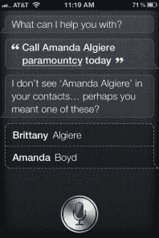
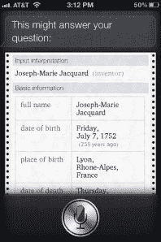

# Siri，你为什么这么无趣？TechCrunch

> 原文：<https://web.archive.org/web/https://techcrunch.com/2011/11/02/siri-why-are-you-so-underwhelming/>

当苹果公司第一次推出 iPhone 4S 时，有一个功能让房间里的每个人都惊讶不已。她的名字是 [Siri](https://web.archive.org/web/20230205025452/https://techcrunch.com/2011/10/05/siri-ous-mind-blowing-video-evidence-of-apples-prophetic-past-circa-1987/) 。斯科特·福斯特尔在苹果的媒体发布会上演示了这款个人助理，整个演示进行得非常顺利。然后，正如预期的那样，苹果发布了[他们的广告](https://web.archive.org/web/20230205025452/https://techcrunch.com/2011/10/24/conan-tweaks-the-siri-commercial/)，同样令人印象深刻。简而言之，每个人和他们的兄弟都渴望 Siri。

然后 iPhone 4S 发布了。除了一些电池寿命问题和我自己对 Siri 的性别和谦逊的小抱怨之外，真的没有太多抱怨。然而现在，我发现自己更为自己的期望所困扰，而不是其他任何事情。

为什么？因为 Siri 并不完美，完美才是我所期待的。

让我在这里停下来说几件事:首先，我意识到我对 Siri 局限性的抱怨完全是“第一世界”的问题。其次，这个帖子不应该被认为是对 Siri 的差评。当然，她有缺点，就像任何应用程序或软件功能一样，她也会犯错。但是我爱她，我可以有把握地说这不会改变。事实上，我尽可能多地使用 Siri，这是一个问题。

失望可以追溯到从苹果演示开始的大肆宣传。我不为此责怪苹果——我想这只是成功的产物——但随着每一项新功能的引入，希望也在增长。如果她能创建提醒，她就能编辑它们，对吗？不对。如果她可以访问天气应用程序、日历应用程序、时钟、文本、音乐等等，她应该可以毫不费力地在我的手机上添加联系人，对吗？不对。如果她可以告诉我天气，她应该可以在我的天气应用程序中添加一个新位置，对吗？不对。玩电视剧呢？她已经连上了 iTunes，所以她肯定会为我播放一集《老友记》对吧？不，还是错了。好吧，但是 Yelp……Yelp 是 Siri 的一部分，所以她至少要能在我的手机上启动这个应用程序……对吗？

不对，不对，不对。

但苹果从未说过她能做到这一点。*和*从技术上来说，Siri 仍处于测试阶段，所以在未来几个月，她很有可能能够做得更多。但这并不能改变我的失望。Siri 给了我希望——一种我们真的在向未来跳跃的感觉，在未来，移动电脑上的声音几乎可以以任何方式帮助我。这并不是 Siri 的错，但事实并非如此。

然后，广告播出了。看到[那个家伙](https://web.archive.org/web/20230205025452/http://www.apple.com/iphone/features/siri.html)边慢跑边收发短信，免提播放音乐……成交。我的意思是，如果他在外面(至少是在海滨附近)，在慢跑，戴着耳机，Siri 可以理解他说的一切，那么语音识别肯定是一流的，对吗？嗯，没错，但也不对。

Siri 一直误解我。也许我喃喃自语，或者可能是因为我在和她说话，就像和任何人类私人助理说话一样。(也就是说，如果我有能力拥有一个的话。)但那是苹果承诺的对吧？Forstall 在演示中说，这不是单词的问题，而是意思的问题。我应该可以用我喜欢的任何方式询问天气，但我越有创意，Siri 就变得越不直观。当被问及“雨伞应该是我今天服装的一部分吗？”Siri 回应说:“今天就给阿曼达·阿尔吉勒·帕拉蒙特打电话。”

 在某种程度上，这仍然是一种直观的反应。她听不懂我的话，所以她开始解决问题。我的手机里有一个布列塔尼·阿尔吉尔和一个阿曼达·博伊德，所以 Siri 在她的回答中没有提到。然后，她觉得她也听到我说“至高无上”。无论如何，我没有得到我想要的答案。你不是说“这很管用吗？”

然后，还有效率的问题。Siri 的一大功能是她能够阅读和转录文本和电子邮件。这听起来很简单，但发信息是任何手机的主要用途之一，所以免提完成这些事情是一件大事。但我注意到她的文字转录有两点。

首先，在几乎任何情况下，我打字的速度都比 Siri 转录的速度快。我的阅读速度也比别人快——不管是 Siri 还是人类，都没什么区别。也许我只是太棒了，太沉迷于文字，但我认为这对大多数人来说都是正确的。我注意到的第二件事是错误的沟通和误解。使用 Siri 发送文本的全部意义在于，要么我忙得不可开交，要么我赶时间，需要马上把文本发送出去。如果 Siri 第一次误解了我的意思——即使她第二次尝试就理解对了——也比我自己输入信息要慢。我不止一次在迟到的时候站在火车站外面，等待 Siri 纠正错误。至少可以说，这是一个彻底的失败。

除此之外，我们还必须考虑 Siri 对网络的使用。Siri 在没有连接的情况下无法工作，简单明了。但是我什么时候最需要她呢？当我出门在外，四处走动，需要我的手来做我正在做的事情。总的来说，在移动中你的网络连接是最差的。换句话说，Siri 在你最需要她的时候最失败。这很糟糕。

这些都是 Siri 的缺点，但我能接受。其实我欢迎他们，只要 Siri 一直给我设置提醒。正如我在整篇文章中多次试图声明的那样，我爱 Siri，她只会越来越好。如果你真的仔细想想，Siri 的可能性是无穷无尽的。GigaOm 的约翰·威尔逊就此写了一篇很棒的文章，概述了 Siri 可能对 911 系统和医疗保健带来的进步。

 毫无疑问，苹果会将 Siri 推向她可能达到的极限，开发大量流行的应用程序，最终能够做任何事情。但我们目前的 Siri 只是其中的一部分——还不完整。

这就是 Siri 带给她的失望——归根结底是我的错。她是通向未来的直接一步，而通向未来的任何一步都会带来一千步。看看约瑟夫·玛丽·雅卡尔的穿孔卡片动力织布机就知道了。1801 年，在任何形式的计算机出现之前，他的读取穿孔卡片以执行某些动作的系统为二进制代码奠定了部分基础，这是我们今天所知道的计算的基础。但是没人想到织布机会为他们抄写文本。

Siri 是迈向未来的一大步，因此我们对她的希望和梦想同样大于生命。也就是说，失望肯定会随之而来。她就像一个生日聚会——不完全是你所希望的。

想哭就尽情哭吧。