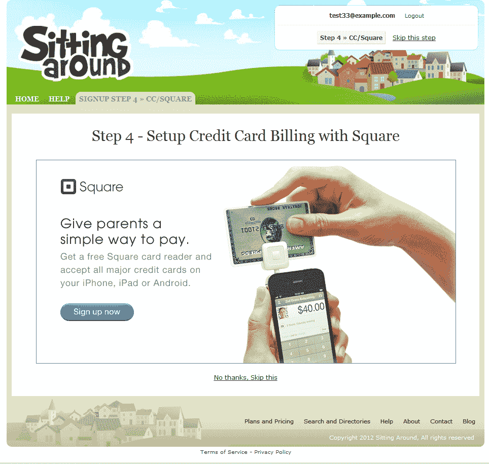

# “坐在附近”为保姆提供免费的广场阅读器，帮助他们找到工作 TechCrunch

> 原文：<https://web.archive.org/web/https://techcrunch.com/2012/05/25/sittingaround-is-giving-babysitters-free-square-readers-helps-them-find-jobs/>

# “坐在附近”给保姆们提供免费的广场阅读器，帮助他们找到工作

让父母能够快速方便地在网上找到并安排保姆的新服务——sitting around,现在正在给保姆的客户配备 Square 信用卡读卡器。首席执行官 Erica Zidel 告诉我们，从现在开始，作为网站注册过程的一部分，所有的 sitters 都将获得一个免费的方形加密狗，然后可以在他们的在线个人资料中表明他们是否接受信用卡。与此同时，父母现在可以根据他们接受的支付方式来寻找和雇佣保姆。

诚然，这可能不是什么大新闻，但它是 Square 的势头和颠覆行业潜力的完美例子。在这种情况下，Square 不是直接向保姆进行营销的公司，而是保姆服务公司。(坦白地说，作为一个从不携带现金的家长，如果所有的座位都携带一个正方形，那就太好了。约会之夜不得不在自动取款机前停下来有点扫兴。)

【T2

Zidel 还表示，SittingAround 正在努力在未来增加其他支付选项，并计划将这些整合到该公司即将推出的移动应用程序中。

自今年年初推出以来，总部位于波士顿的 SittingAround 的用户基础已经翻了一番，现在已经有超过 7000 个家庭和 1500 个注册的 sitters。自那以后，该网站还协调了 3000 多次约会预订。

虽然在在线儿童看护领域比更成熟的玩家更新(如 UrbanSitter、Care.com 等)。)SittingAround 不是利用脸书寻找社会推荐，而是帮助你将现有的“信任网络”上线——包括父母和坐席。它还提供了一些独特的功能，比如对保姆合作社的支持，对父母和保姆的免费背景调查，以及“约会之夜交易”部分，这样父母就可以充分规划他们的夜晚。

该网站是免费使用的，因为它目前是广告支持的，不像付费墙的 Care.com。齐德尔说:“我们希望保姆把他们的情景喜剧看做是他们的在线保姆简历。”。“因为我们有一个开放的平台，这个档案可以在任何情景喜剧对父母做出回应的地方使用——在脸书，通过当地报纸，从 Craigslist 等等。”