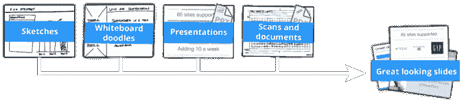

# SketchDeck 在短短一天内将糟糕的幻灯片变成精美的演示文稿 TechCrunch

> 原文：<https://web.archive.org/web/https://techcrunch.com/2014/03/12/sketchdeck-turns-terrible-slide-decks-into-beautiful-presentations-in-just-a-day/>

多年来，许多初创公司都试图通过服务来重塑 PowerPoint，让创建幻灯片演示变得更容易或更快捷。新推出的 [SketchDeck](https://web.archive.org/web/20221206203340/http://sketchdeck.com/) 正在采取一种不同的方法:它不是提供 PowerPoint 或类似软件应用程序的替代品，而是提供一种服务，使个人或企业能够通过一个可以在 24 小时内完成任务的设计师团队来制作他们的幻灯片。

SketchDeck 联合创始人兼首席执行官 Chris Finneral 解释说，这种服务实际上已经存在，但只存在于较大的组织中，如银行或咨询公司。他应该知道，因为 Finneral 自己曾在伦敦麦肯锡公司担任商业分析师，在那里他自己制作了数千张幻灯片。

麦肯锡[使用了一项名为视觉图形印度(VGI)](https://web.archive.org/web/20221206203340/http://articles.economictimes.indiatimes.com/2004-09-20/news/27389529_1_consultants-offshoring-presentations) 的服务，该服务允许员工将他们粗略绘制的幻灯片发送给海外团队，该团队将在一夜之间将这些幻灯片转换成高质量、精心设计的演示文稿，然后通过电子邮件发送给你。

“它在那里非常有价值，但除了大组织之外，它并没有真正以任何好的形式存在，”Finneral 说。“然而，所有企业都会做演示——董事会、推销、营销演示——每个人都在做，”他补充道。“很多人没有太多时间，所以价值主张仍然有效。”

目前的服务设计得非常简单易用。客户上传或通过电子邮件将他们的草稿幻灯片发送到 go@sketchdeck.com，24 小时内，他们就会收到专业设计的版本。

在 SketchDeck 这边，演示文稿首先被传递给海外设计师的初级团队，他们进行更基本的改进，比如调整格式或对齐方式，应用模板等等。然后，它被发送给一个高级团队，通常是一个美国团队，该团队添加自定义装饰来完成项目。(SketchDeck 按小时支付设计师，一般初级团队 10 美元/小时左右，高级团队 50 美元/小时。)

个人和企业都可以购买这款产品，价格为每张幻灯片 5 美元或 20 美元，这取决于你是想要更基本的模板化幻灯片，还是定制设计的幻灯片。企业也可以选择为 SketchDeck 作为服务付费，计划从每月 100 美元到每月 1，400 美元不等，具体取决于他们公司的规模、他们需要的演示数量以及涉及的定制。

自从 SketchDeck 在 11 月份试运行以来，他们已经为各种各样的客户制作了大约 250 个演示文稿——有些多达 300 张幻灯片——其中包括几家 YC 的初创公司(风险投资推介平台多得很！)，以及芬纳尔在麦肯锡工作期间的其他联系人。

他说，从长远来看，这个想法不仅仅是幻灯片，而是为企业需要的其他材料提供类似的设计服务，包括小册子、手册、传单等。事实上，团队已经悄悄地处理了一些这种类型的事情，但是现在，它的主要焦点是获得正确的演示。

Y Combinator 支持的公司目前在山景城工作，由两个全职团队组成(不包括按小时计酬的设计师):Finneral 和他的联合创始人 David Mack。