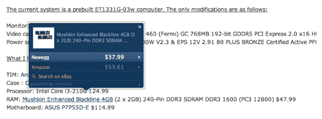

# SkimLinks 利用 Atma Links 收购来增强 SkimWords 2.0 

> 原文：<https://web.archive.org/web/http://techcrunch.com/2011/10/26/skimlinks-harnesses-atma-links-acquisition-to-power-skimwords-2-0/>

# SkimLinks 利用 Atma 链接采集到 Power SkimWords 2.0

除了基本的横幅广告和 AdSense 广告之外，出版商最流行的内容盈利方式之一是通过联盟计划。这些对用户来说通常是透明的:你点击一个在线商店的链接，如果你买了什么东西，出版商会得到购买价格的一定比例(每个程序都有一点不同，但这是他们的标准操作方式)。

当然，注册这些项目需要花费时间。SkimLinks 是一家总部位于英国的公司，通过自动插入这些附属链接来帮助出版商将内容货币化，今天它正在利用最近的一次收购，这将使其产品更加高效(并对更广泛的链接有用)。

这家初创公司生产两种主要产品。第一个是它的同名 SkimLinks，它将识别出版商内容中包含的任何链接，并尽可能自动将其转换为联盟链接(这为出版商节省了与每个商家注册联盟计划的麻烦)。第二个产品是 SkimWords，它会自动*在内容中插入*附属链接，即使这些词一开始并没有链接。因此，举例来说，如果我在这篇文章中提到 32 GB 的 iPad，单词“32 GB iPad”将自动转换为一个指向比如说亚马逊的链接。

公司[在 2010 年 6 月推出了后者的产品](https://web.archive.org/web/20230203154241/http://eu.beta.techcrunch.com/2010/06/28/skimlinks-launches-skimwords-to-turn-more-links-into-an-affiliate-revenue-opportunity/)。但据创始人艾丽西娅·纳瓦罗(Alicia Navarro)称，它有一个主要问题:最初的实现需要 SkimLinks 人员手动批准流程的某些部分(换句话说，他们会验证正在生成的链接在上下文中是否有意义)。由于该公司寻求探索更多的垂直市场，最终没有扩大规模。

为了解决这个问题，SkimLinks 收购了一家名为 Atma Links 的竞争公司，该公司以不同的方式解决了这个问题。Atma Links 没有依赖人类来批准这些自动创建的链接，而是寻求自动化整个过程，使用语义分析和各种在线零售商提供的 2000 万种产品的列表来确定哪些可以链接。这一功能是 SkimWords 2.0 的驱动力，纳瓦罗表示，其提高的效率将使公司能够扩展到其他垂直领域，包括时装、消费电子产品、汽车和生活方式链接。

新产品也有所改变，你可以在下面看到——将鼠标放在链接上，会显示链接产品的完整标题，以及多个不同商店的链接，在那里可以购买到该产品。

