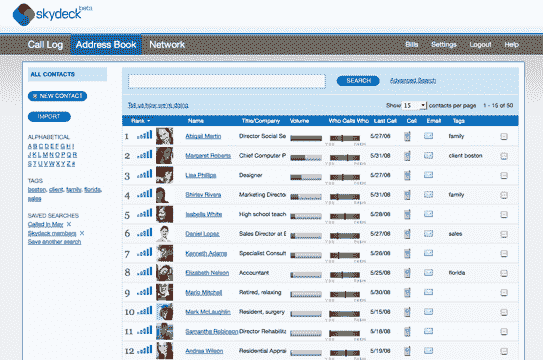
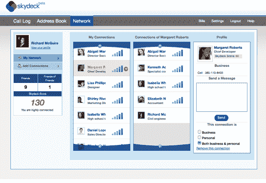

# Skydeck 走向社交并发布 API(700 个邀请)

> 原文：<https://web.archive.org/web/https://techcrunch.com/2008/06/02/skydeck-goes-social-and-releases-apis-700-invites/>

在去年 12 月《纽约时报》的专栏中，[蒂姆·奥赖利幻想:](https://web.archive.org/web/20230320003321/http://www.nytimes.com/2007/12/15/opinion/15oreilly.html)

> 想象一下，威瑞森会像谷歌或亚马逊那样思考。它可以让你访问你的整个通话记录，你发出或收到的每一个电话，而不仅仅是你最近的 10 个电话。它可能会根据你曾经交谈过的每个人，为你建立一个地址簿，上面有你最常打电话的号码的搜索结果。
> 
> 如果这家电话公司向软件应用程序的开发者开放其数据库会怎么样？我们很快就能看到你的通话记录与你个人电脑、电话和社交网络中的通讯录的混搭。现在想象一个松散的用户社区来注释这些数据。

当奥莱利写这篇文章时，他并不知道一家名为 [Skydeck](https://web.archive.org/web/20230320003321/http://skydeck.com/) 的秘密初创公司正在想办法做到这一点。Skydeck 于去年 3 月推出了一项非常基本的服务，将你的通讯录与手机账单绑定，这样你就可以根据你打电话最多的人来查看你的真实社交网络。到目前为止，私人测试版的用户可以看到他们的手机社交网络，但仅此而已。他们无法与使用该服务的任何人联系。

但从今天开始，会员可以选择将其社交网络与其他使用 Skydeck 的朋友连接。有趣的是，他们可以看到他们与每个朋友的联系强度，以及他们的朋友与其他人的联系有多紧密。Skydeck 根据两个人之间通话的频率和数量、通话的最近时间以及通话是相互的还是单方面的来衡量关系的强度。Skydeck 汇总了所有这些数据，并用上升的信号柱来表示关系的整体强度。

现在，还没有多少人使用 Skydeck，因为它仍处于封闭测试阶段。(我们还有 700 多个邀请读者在这里申请并提及“TechCrunch”)但这并没有阻止 Skydeck 首席执行官 Jason Devitt 向 Skydeck 服务开放[API，以便其他网络开发者可以利用这一新的社交数据来源。](https://web.archive.org/web/20230320003321/http://skydeck.com/developer/)

Skydeck 的 API 到底能让什么样的应用成为可能？我问了 Devitt，他想出了以下这些，还算不错(都是假设，但技术上是可能的):

> ***可以用 Skydeck APIs 构建的十大应用**(我的头衔)*
> 
> 1.你可以为 Outlook 编写一个插件，或者使用 Gmail 的 API 来显示你最后一次和某人(在电话上)通话的时间，当你调出他们的电子邮件时。
> 
> 2.或者你可以更进一步，创建一个应用程序，在一个地方显示你与所有联系人的电子邮件、即时消息、Skype 和手机通话的历史记录(手机是缺失的一部分，所有其他数据都已经可以访问)。
> 
> 3.您可以编写一个应用程序，在 iCal 中显示每一个超过一分钟的电话，显示其发生的日期和时间，这样所有电话的[记录]就与您的面对面会议出现在同一个地方。
> 
> 4.37Signals 可以为你打给 Skydeck 上标记为“商务”的联系人的每一个电话在高层网页上添加一个注释。
> 
> 5.RescueTime 可以显示你花在手机上的所有时间，以及你使用的应用程序和你访问的网站。
> 
> 6.FreshBooks 可以在客户的发票上打出客户的电话。
> 
> 7.LinkedIn 可以使用排名数据来显示我们都知道的五个人中谁最适合把你介绍给我。
> 
> 8.你可以编写一个应用程序，将所有这些数据带回你的智能手机。我们将自己瞄准一些手机，但我们不能解决每个平台，我们不会阻止任何人尝试。
> 
> 9.你可以写一个应用程序，显示你给哪个脸书朋友发短信(或打电话)最频繁。(你必须匹配姓名，因为脸书不公开电子邮件地址等。，但这并不困难。)或者用我们的互惠措施去戳那些从不回你电话的朋友。
> 
> 10.你可以根据你的计划中还剩下多少短信来限制你手机上的推文。(我们会跟踪您每天剩余的通话时间和短信数量)。

与 Salesforce 的集成是另一个明显的例子。你会开发或想使用哪些与你的手机社交网络相关的应用程序？

