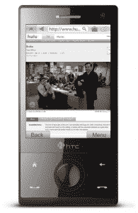

# 天火燃烧通过测试标签，即将为黑莓 

> 原文：<https://web.archive.org/web/https://techcrunch.com/2009/05/27/skyfire-burns-through-the-beta-tag-coming-soon-for-blackberry/>

# 天火燃烧通过测试标签，即将为黑莓

经过 473 天的 beta 测试和多次 T2、T4 的初步发布，丰富的多媒体移动浏览器 Skyfire 刚刚发布了 1.0 版本。虽然 Skyfire 最大的特性(即它处理 Flash 和 Silverlight 等格式的能力)在早期就已经存在，但这次发布的版本有足够的修饰和完善来证明它的品牌价值。

在我们深入探讨之前，先看看天火今天早上向我们透露的几个数字:在测试期间，天火的用户超过了 100 万。在这些用户中，三分之一的人每天至少使用天火 3 次。人们似乎转向天火主要是为了浏览功能齐全的网站，其中脸书、Hulu、Gmail、Myspace 和 Youtube 都是最受欢迎的。

我们一直在玩天火，因为获得测试版密钥需要你爬上一座山，背诵一个秘密咒语(倒着念)，只用一个火鸡涂油器和一些橘子皮就能制造出猪流感疫苗。也就是说，这是我们看到的第一个真正感觉*完成*的版本。

**这次有什么新消息:** 

*   **改进的缩放:**当用户双击鼠标时，不再直接从缩小跳到放大，而是平滑地从一个过渡到另一个。这纯粹是视觉上的，但确实改善了流程。
*   **改进的启动时间:**在以前的版本中，你必须等到你的起始页被加载后，天火才会响应。现在你可以通过“超级栏”改变网址或搜索，只要它们一出现。
*   **上次状态重连:**如果你最小化了天火，它现在会加载回你所在的页面，而不是你的起始页。如果您完全退出应用程序，它将在重新启动时转到您的起始页。
*   **AJAX 性能增强**
*   当返回上一页时，Skyfire 会将您放在您离开时的准确位置和缩放级别。
*   **缩略图交互:**在以前的版本中，点击链接需要你先放大。在 1.0 版中，您可以单击任何缩放级别下可见的任何链接。
*   **iFrame 处理改进**

这个版本非常接近完美，尽管也有缺陷。在我们的测试中，至少有三次(在 Sprint HTC Touch Pro 上),加载栏会达到大约 95%,然后就停止了。一旦发生这种情况，如果不完全退出并重新打开应用程序，我们就无法加载任何页面。此外，我们希望在 1.0 中看到的一个特性仍然不见踪影:Flash 和 Silverlight 的本地文件存储。一些较大的流媒体网站(如网飞)依靠它来正常运行，所以它的缺席是不幸的。即便如此，就其能够加载的网站数量而言，Skyfire 仍然处于领先地位。

此外，天火还证实，他们正在研究一个黑莓端口，正如上个月[泄露的](https://web.archive.org/web/20221203093849/http://www.mobilecrunch.com/2009/04/23/skyfire-for-blackberry-alpha-gets-exhaustively-leaked/)。没有给出 ETA，尽管他们说将会有一个公开的测试版。最后，一款值得使用的黑莓浏览器。

既然 Skyfire 已经到了 1.0 版本，我们将在接下来的几天内发布结果，与其他几款移动浏览器展开一场正面交锋。如果我们在手机上看 Hulu 上的东西时不太分心的话。

点击这里查看 Windows Mobile 或 Symbian S60 [上的 Skyfire。](https://web.archive.org/web/20221203093849/http://get.skyfire.com/)