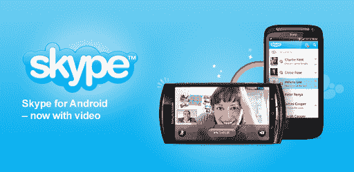

# Skype For Android 现在支持视频通话，通过 WiFi 和 3G 工作 TechCrunch

> 原文：<https://web.archive.org/web/http://techcrunch.com/2011/06/30/skype-for-android-now-support-video-calls-works-over-wifi-and-3g/>

# Skype For Android 现在支持视频通话，支持 WiFi 和 3G

由于 Skype Android 应用程序的更新，你现在可以通过 WiFi 和 3G 连接进行一对一视频通话。您可以从 Android Market 下载 [Skype 应用程序](https://web.archive.org/web/20230203101237/https://techcrunch.com/2010/10/05/skype-for-android-is-here-its-free-and-works-over-wifi-and-3g/),或者在手机上将浏览器指向[Skype.com/m](https://web.archive.org/web/20230203101237/http://skype.com/m)。

请注意，您的智能手机需要运行 Android 版(或更高版本)，并具有前置摄像头。支持的手机包括 HTC Desire S、索尼爱立信 Xperia neo、索尼爱立信 Xperia pro 和谷歌 Nexus S。

Skype 表示，这只是第一阶段，因此预计很快会支持更多的设备。

一旦安装完毕，你就可以通过 Android 手机与 iPhone、Mac、Windows 电脑甚至许多电视上的 Skype 联系人进行视频通话。

Skype for Android 应用程序也被赋予了新的色彩。

现在有了一个新的主菜单，您可以更方便地浏览您的联系人，访问您的 Skype 档案以更改个人信息，使用拨号键盘拨打电话以及查看您的 Skype 点数余额。

Skype 应用程序菜单顶部的新心情消息框也能让您与您的联系人分享您想分享的任何内容。

最后，你现在可以从 Android 应用程序发送短信。

Skype 副总裁兼产品和营销总经理 Neil Stevens 表示，在任何给定的时间，大约有 3000 万并发用户登录 Skype，并发视频通话多达 50 万次(截至 2011 年 6 月的高峰期)。

相关帖子:

[Skype 的移动视频消费产品总经理；云和货币化](https://web.archive.org/web/20230203101237/https://techcrunch.com/2011/02/06/skypes-vp-of-consumer-products-on-mobile-video-the-cloud-and-monetization/)

[Skype 将群组视频通话加入企业服务](https://web.archive.org/web/20230203101237/https://techcrunch.com/2011/01/06/skype-adds-group-video-calling-to-enterprise-offering/)

[Skype 收购移动视频初创公司 Qik](https://web.archive.org/web/20230203101237/https://techcrunch.com/2011/01/06/confirmed-skype-buys-mobile-video-startup-qik/)

[YouTube http://www.youtube.com/watch?v=1o6TBezfSpU]