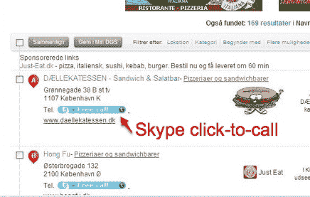

# Skype 开始推出点击呼叫广告

> 原文：<https://web.archive.org/web/https://techcrunch.com/2009/10/05/skype-starts-to-roll-out-those-click-to-call-ads/>

在过去的几个月里， [Skype](https://web.archive.org/web/20230320164534/http://www.skype.com/) 一直在测试网络点击呼叫广告，与当地付费的商业名录合作。明天，Skype 将宣布其点击呼叫广告服务与欧洲最大的本地商业目录服务之一的[欧洲目录](https://web.archive.org/web/20230320164534/http://www.europeandirectories.com/)正式推出。

Skype 最新 Windows 版本(Skype 4.1)的一部分带有一个浏览器插件，可以在网页上显示电话号码。用户可以点击这些号码自动发起 Skype 通话，但他们需要为 SkypeOut 通话时间付费。Skype 正在利用同样的功能，通过与付费的目录列表服务合作，让消费者免费拨打这些电话。

最初，欧洲目录将把电话免费传递给商业客户。最终，它希望证明通话的价值，并在每次通话点击的基础上收费。正如我在四月份[解释的那样:](https://web.archive.org/web/20230320164534/https://techcrunch.com/2009/04/17/a-new-business-model-for-skype-turning-phone-numbers-on-the-web-into-paid-ads/)

> 点击呼叫广告以前也尝试过，但这是把实际的电话号码变成了广告。点击它，你打电话给你要找的公司，电话费用由公司或黄页合作伙伴支付。价值 320 亿美元的黄页行业正迅速转向网络，Skype 有能力点亮网络上的任何商业电话号码。
> 
> 据推测，黄页合作伙伴只会为他们目录中的号码付费，因此 Skype 必须想出一种方法来显示哪些电话是免费的，哪些不是。

这正是它所做的。由合作伙伴付费的免费通话在网页上以蓝色突出显示，而普通 SkypeOut 通话则以灰色突出显示。

将网络上的电话号码转化为广告可以帮助 Skype 开辟一条重要的新收入渠道。但是 Skype 已经在追赶年轻的竞争对手。Yext 是今年 TechCrunch50 的成员之一，它刚刚筹集了 2500 万美元的新资金，多年来一直将在线目录清单转化为点击呼叫线索。

现在，Yext 正在超越简单的点击呼叫广告，转向基于人们在电话中实际所说的话并由复杂的语音转文本软件监控的按行为付费广告。Skype 广告副总裁 Don Albert 说，Skype“不打算根据电话中的谈话内容做任何事情”。它可能不需要。如果它能让全球 4.8 亿用户中的一小部分开始点击这些免费电话，它的广告业务就会做得很好。

当然，这是假设它解决了与 Skype 创始人的那些令人讨厌的诉讼，这些诉讼是关于 Skype 继续使用基础技术的 T2。