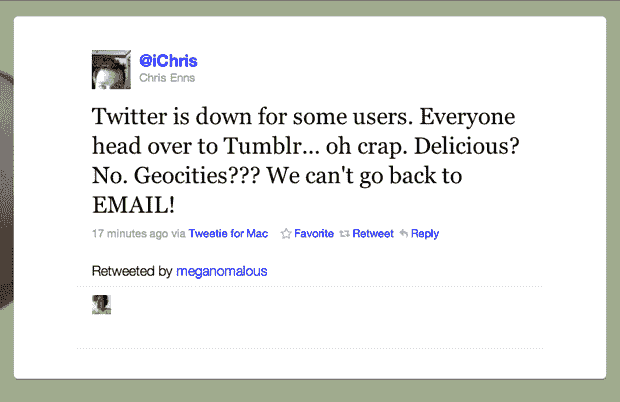
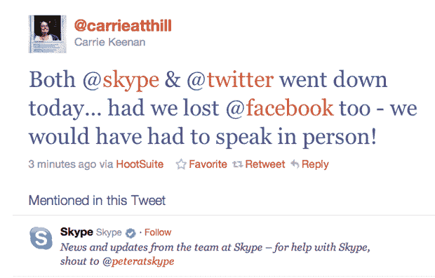

# 当互联网服务出现故障时，我们为什么会恐慌

> 原文：<https://web.archive.org/web/https://techcrunch.com/2010/12/22/skype-twitter-facebook-tumblr-is-down/>

# 为什么互联网服务失败时我们会恐慌

推特关闭了。 [Skype 关闭](https://web.archive.org/web/20221206212403/https://beta.techcrunch.com/2010/12/22/skype-goes-down-and-the-buzz-on-twitter-goes-insane/)。 [Tumblr 宕机。](https://web.archive.org/web/20221206212403/https://beta.techcrunch.com/2010/12/06/tumblr-downtime/) [脸书被打倒。](https://web.archive.org/web/20221206212403/https://beta.techcrunch.com/2010/09/23/facebook-down/) [推特又宕机了](https://web.archive.org/web/20221206212403/https://beta.techcrunch.com/2009/02/11/and-twitter-goes-down-again/)。你可以把整个科技报道生涯建立在撰写这类文章的基础上。因为如果你像我和数百万其他用户一样，由于网络连接故障，你无法访问你的 Skype 帐户。就像电力或互联网一样，我需要 Skype 来做好我的工作。

在这些情况下通常会发生的是，用户会迁移到另一个通信系统，这可能会也可能不会导致进一步的问题。Twitter 告诉我们，今天的中断与 Skype 的故障(或下雨的事实，或周三)无关，尽管 Twitter 上关于[“…宕机”](https://web.archive.org/web/20221206212403/http://search.twitter.com/search?q=%22is+down%22)的抱怨经常是高频的。以至于学者们用推特来衡量 Gmail 和 Pay Pal 等其他服务的停机时间。

我把我没有 Skype 引发的焦虑带到 Quora，在那里我问这些服务的最终用户“[当事情变糟时，我们为什么会恐慌？”](https://web.archive.org/web/20221206212403/http://www.quora.com/Why-do-people-panic-when-web-services-fail)问题。谷歌 Chrome 的设计负责人格伦·默菲很快回答道，“因为感觉好像停电了；你突然与你认为有价值的东西隔绝了(即使它在客观上没有价值)。”

像固定电话和电视这样的老技术更可靠。美国的电信公司[坚持](https://web.archive.org/web/20221206212403/http://www.enterprisevoip.com/articles/fivenines.php)T2 的五个 9 或 99.999%可用性的高可用性标准。相比之下，像 Twitter 这样的互联网服务徘徊在[三个 9](https://web.archive.org/web/20221206212403/http://www.pingdom.com/reports/wx4vra365911/check_overview/?name=Twitter.com)的范围内。Tumblr 最近关闭了 [24 小时](https://web.archive.org/web/20221206212403/https://beta.techcrunch.com/2010/12/06/tumblr-downtime/)，想象一下如果整个美国失去传统电话服务一整天，Twitter 上会发生什么。

分布式办公室的日益流行也是集体恐慌的一个因素。在 TechCrunch，我们使用 Skype 和 Yammer 就帖子互相咨询——目前我很难通过 Skype 与我的同事或消息人士交流。我还不如休息一天(MG 刚刚发消息说他可以通过信鸽联系到)。

不仅仅是 TechCrunch，theLIFT 的 James Touhey 在 Quora 上说*“在当前 Skype 中断的情况下，我们的业务依赖于持续的沟通(我们在世界各地都有人才),当一家公司严重依赖于一个应用服务时，这可能会导致重大问题。当你不知道何时恢复时，恐慌就开始了。”*

从 tips@techcrunch 收件箱和 [Twitter 搜索](https://web.archive.org/web/20221206212403/http://search.twitter.com/search?q=skype+down)来看，我现在最想做的事情就是恢复 Skype，让 Twitter 一整天都开着。直到失去了，你才知道你拥有什么，真的。

