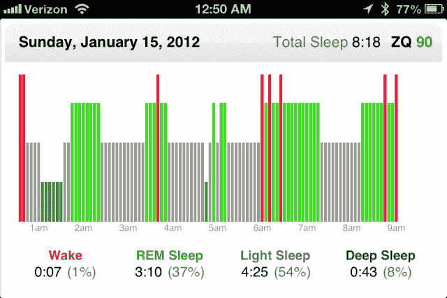
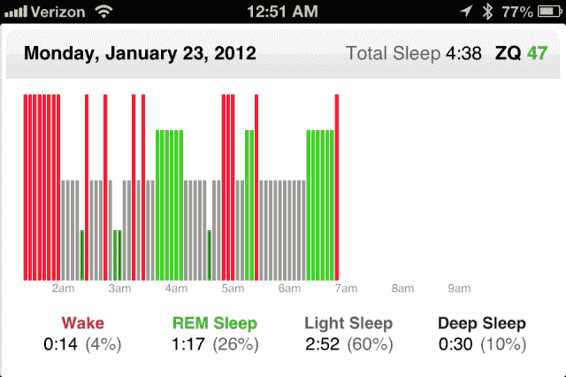

# 睡眠追踪初创公司杰欧说晚安 TechCrunch

> 原文：<https://web.archive.org/web/https://techcrunch.com/2013/05/22/sleep-tracking-startup-zeo-says-goodnight/>

量化自我运动的早期先驱之一已经悄悄地退出了商业。杰欧是一家领先的硬件和软件制造商，该公司为消费者提供跟踪睡眠和改善健康状况的服务，自去年年底以来，该公司一直没有运营。一位受托人几乎完成了所有公司资产的出售。[杰欧](https://web.archive.org/web/20221206195520/http://www.crunchbase.com/company/zeo)到目前为止对这个消息一直保持沉默。事实上，杰欧的[网站](https://web.archive.org/web/20221206195520/http://www.myzeo.com/sleep/)仍然没有关闭，也没有提到这个消息。

杰欧由布朗大学的三名学生创建，他们热衷于利用睡眠科学和技术来改善人们的生活。2009 年 6 月，该公司推出了其首款产品——杰欧个人睡眠蔻驰。

接下来的一周，第一篇提到“量化自我”的文章[发表在《连线》杂志上。虽然这篇文章没有提到杰欧，但它声称“一种新的个人数据文化正在形成。”生活的方方面面从睡眠到情绪到疼痛都变得可以追踪。“甚至连睡眠——显然是对自我追踪的挑战，因为你是无意识的——也屈服于小部件制造商的技能。”](https://web.archive.org/web/20221206195520/http://www.wired.com/medtech/health/magazine/17-07/lbnp_knowthyself)

2011 年，小工具制造商杰欧在其睡眠管理器产品线中引入了移动版本。通过戴上一个特殊的头带，加上测量电流的传感器，杰欧可以跟踪睡眠的不同阶段，如浅睡眠、深度睡眠和快速眼动睡眠，以及清醒时间。这些数据然后被发送到 iPhone、iPod 或 Android 手机，并可以自动上传到个人和私人在线睡眠数据库。这些数据和一些分析工具可以用来帮助改善你的睡眠和健康。

#### 哪里出了问题

前首席执行官戴夫·迪金森(Dave Dickinson)在过去 5 年中领导该公司，他告诉 TechCrunch，问题不在于品牌或产品。事实上，该公司在关闭前一直在增长。

迪金森说，问题在于商业模式。“商业模式比品牌更重要。消费者健康设备是一个非常资本密集型的行业。你必须找到足够的资金来满足消费者的需求，找到足够的资金来满足医生和零售商的需求，这还不算设备业务必须为库存提供资金。”

在收入方面，杰欧有两种商业模式可供选择。成为一个有订阅和经常性收入的 SAAS 式企业，或者从只购买一台设备的客户身上赚足够的钱。但当该公司开始将其移动产品定价为 99 美元，利润率“次优”时，这非常困难。

这家位于马萨诸塞州牛顿市的公司在八年时间里筹集了超过 3000 万美元。迪金森说筹集资金不是问题。

#### 睡眠跟踪作为一种商品

杰欧面临的另一个问题是睡眠追踪变成了一种商品。像 FitBit、lark 和 Jawbone Up 这样的设备使用加速度计来确定睡眠和清醒周期，使用腕动仪。这些产品的商标是睡眠追踪器，就像杰欧一样。

Dickinson 说，杰欧有同行评审的科学研究，包括发表在睡眠研究杂志上的一项研究，显示他的技术的准确性是睡眠实验室数据的八分之七，睡眠实验室被认为是测量睡眠的黄金标准。该研究还表示，通过腕动仪测量设备微小运动的数据不太准确。但对于足够多的消费者来说，这似乎并不重要。

#### 竞争

迪金森说，他钦佩 Fitbit 和其他类似产品所做的工作。这些设备不仅限于像睡眠这样的健康问题，睡眠是杰欧的另一个问题。这些其他产品适用于不同的健康和保健领域，如减肥和保持身体健康。消费者已经花费了数十亿美元来实现这些目标。他们已经接受了教育，并且有动力去改善他们的体重和健康状况。

杰欧的部分商业模式要求它教育消费者睡眠的重要性，以及睡眠意识和数据如何改善你的健康。阿里安娜·赫芬顿，我们美国在线的姐妹网站《赫芬顿邮报》的主编，一直是睡眠对健康重要性的[斗士。但是根据迪金森的说法，“睡眠仍然落后于对健康的重要性。所以在这方面，杰欧在它的使命方面走得很早。”](https://web.archive.org/web/20221206195520/http://www.huffingtonpost.com/arianna-huffington/sleep-challenge-2010-wome_b_409973.html)

#### 该产品

去年我用了这个设备几个月，觉得很神奇。虽然佩戴头带需要一些时间来适应，但对我和我的妻子来说，它揭示的数据令人瞠目结舌。除了知道我睡眠不足，这我已经知道了，我还知道了不同类型的睡眠。

大多数晚上，我会在上床后有半小时到一小时的“深度睡眠”(下图中的深绿色)。这是帮助你恢复和恢复精神的睡眠阶段。

我还会看到几个阶段的快速眼动睡眠，这对整体心理健康、情绪和保持知识的能力很重要。像大多数人一样，我睡觉的大部分时间都是在“浅睡眠”中度过的，这比不睡觉要好，但对健康的影响不如深度睡眠或快速眼动睡眠。

早上我能在我的 iPhone 上看到这样的图片。

这是一个睡眠得分为 90 分(满分为 100 分)且睡眠时间超过 8 小时的美好夜晚。

这是一个糟糕的夜晚，只睡了 4 个半小时，得分 47。

如果我在快速眼动睡眠期间醒来，就很难起床。如果我没有得到足够的深度睡眠，我觉得我没有睡个好觉。

杰欧声称这个项目的真正价值是我可以得到个性化的在线睡眠指导。但这需要登录网站，输入更多关于我的睡眠和其他我想跟踪的变量的信息。如果我能在我的 iPhone 上输入数据，我可能会用得更多。因为这需要登录网站，对我来说太麻烦了。

过了一段时间，我也不再戴发带了，因为它确实感觉有点尴尬。这位前首席执行官表示，公司意识到该设备对一些客户来说太具侵犯性。

但是如果有一种侵入性更小的传感器，并且更容易输入定制数据和获得可操作的信息，我会每天晚上都使用它。

#### 下一步是什么

在所有资产被出售后，狄金森无法准确评论杰欧的下一步。但他对该公司未来可能有机会重新崛起抱有希望。

一篇文章出现在三月份的 MobiHealthNews 上，报道称商业改善局已经将杰欧列为“停业”,但是由于该公司没有官方声明，这一消息并未广为人知。

你仍然可以登录杰欧的“我的睡眠”网站，里面有你的睡眠数据。今天，Quantified Self 网站上的一篇[文章](https://web.archive.org/web/20221206195520/http://quantifiedself.com/2013/05/how-to-download-your-zeo-data/)告诉用户，万一网站离线，他们可以如何下载他们的数据。

随着关于杰欧状况的消息传开，迪金森表示，他们已经收到了来自世界各地失望的顾客和睡眠研究人员的巨大支持和询问，他们计划使用这些设备进行研究。

他上周在 MobiHealthNews 网站上写了一篇[帖子](https://web.archive.org/web/20221206195520/http://mobihealthnews.com/22410/can-personal-health-data-motivate-behavioral-change-it-depends/)，其中包括了一些额外的经验教训。他总结道，“通过数据可视化来激励行为改变可能非常强大，但这更像是一门艺术而不是科学。我们将需要更多的艺术家、用户界面专家和心理学家来帮助我们的数据更好地促进健康。”