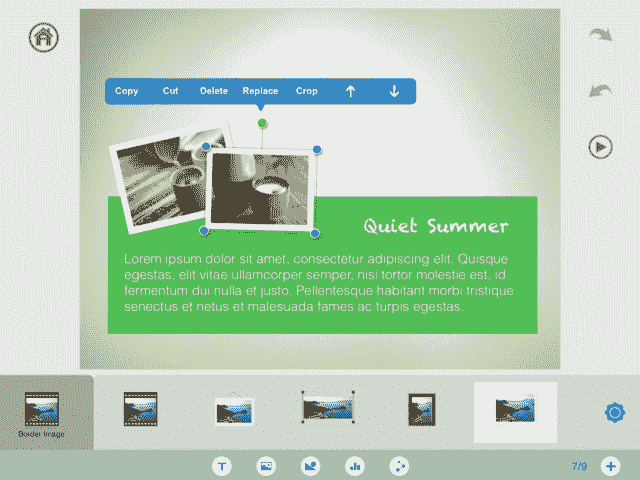
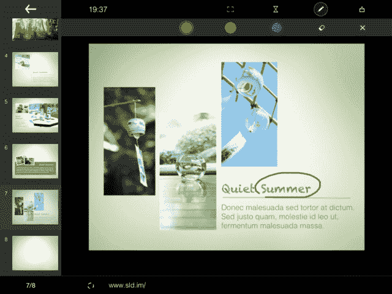
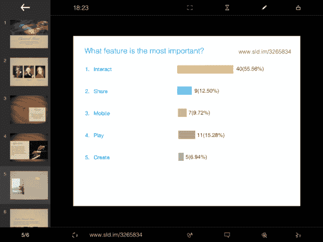

# SlideIdea 为枯燥的演示增加了交互性、投票和反馈 

> 原文：<https://web.archive.org/web/https://techcrunch.com/2013/09/16/slideidea-adds-interactivity-polls-feedback-to-boring-presentations/>

上周，一家名为 [SlideIdea](https://web.archive.org/web/20221208210346/http://slideidea.com/) 的上海小型初创公司在 TechCrunch Disrupt 的 Startup Alley 上正式亮相，首次展示了专为 iPad 打造的演示工具。虽然这个领域充满了竞争对手，不仅包括苹果自己的 Keynote 应用程序，还有 [Prezi](https://web.archive.org/web/20221208210346/https://itunes.apple.com/us/app/prezi-for-ipad/id407759942?mt=8) 、 [Haiku Deck](https://web.archive.org/web/20221208210346/https://itunes.apple.com/us/app/haiku-deck-presentation-slideshow/id536328724?mt=8) 、 [Flowboard](https://web.archive.org/web/20221208210346/https://itunes.apple.com/us/app/flowboard-touch-publishing/id630717527) 和其他应用程序，但 SlideIdea 有趣的是它的“智能小部件”平台，它让用户可以在演示中添加互动元素，以便更好地吸引观众并征求他们的反馈。

像许多现有的演示应用程序一样，SlideIdea 可以很容易地在 iPad 上直接创建幻灯片。在这种情况下，该应用程序所谓的智能小部件通过允许你快速添加文本、形状、图表和其他交互功能来加快幻灯片制作的过程，并在屏幕上拖动它们，用手势调整它们的大小，等等。

SlideIdea 的营销主管艾萨克·瓦赫(Isaac Wagh)代表创始人贾森·李(英语是他的第二语言)向 TechCrunch 解释说:“例如，你可以简单地滑动一个条形图，编辑数字，然后图表就会被创建出来。”。“然而，如果你使用一个普通的程序，你必须从一个电子表格开始，然后从那里开始，”他补充道。

SlideIdea 的智能小部件中更有趣的元素是可以添加到演示文稿中的一组交互元素。发布时包括通过投票部件对观众进行投票的工具，对消息传递的支持，涉及动画和游戏的反馈工具。这款名为“幸运”的游戏让演示者洗牌，并从登录用户的观众中选择一名获胜者——例如，非常适合在演讲结束时处理抽奖活动。

所有这些工作的方式是，对于创建的每个演示文稿，还会提供一个附带的短 URL(例如 sld.im/12345)。您可以选择与观众分享此链接，通过点击，观众可以从智能手机、平板电脑或 PC 在线访问演示文稿、留下评论、提交反馈、回答问题等。Wagh 说，计划是在未来将智能部件平台变成一个更大的市场，在那里其他人可以提供各种智能部件出售，比如那些特定行业的智能部件。

这将是创业公司货币化努力的一部分，而另一部分将是针对学校和企业的订阅服务。对于后者，将包括额外的安全和隐私工具，以及协作支持，更多的云存储，以及潜在的不同或扩展的小部件集。

SlideIdea 由李于 2012 年 3 月创立，他的信息技术背景和嘉宾演讲的历史促使他设计了这项服务，因为这是他自己想要的东西。从那时起，该公司已经发展到一个超过 12 人的团队，所有人都在上海工作。在对大约 100 名早期用户(主要是教师)进行测试后，该地区已经有一些学校在使用该平台。

如今，SlideIdea 是免费提供的，云存储也没有上限。然而，未来保费计划的引入可能会改变这种情况。该应用于 9 月份在 TechCrunch Disrupt 的 Startup Alley 公开亮相之前，于上月在 iTunes 应用商店悄然推出。

如上所述，SlideIdea 将面临许多挑战，包括苹果的 Keynote，更不用说行业巨头 PowerPoint 和其他办公应用程序了。但该公司计划覆盖所有主要平台，包括 Android、iPhone 和 Windows Phone 8，使其成为更多的跨平台工具。(位于世界上发展最快的智能手机市场也没有坏处。)

目前，SlideIdea 是完全自举的，可用于 iPad 和 T2 的 Windows 8。

【YouTube http://www.youtube.com/watch?v=bO8QnlT5ySw？feature=player_detailpage]