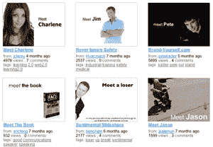

# SlideShare 为嵌入式演示赢得 300 万美元 

> 原文：<https://web.archive.org/web/https://techcrunch.com/2008/05/07/slideshare-secures-3m-for-embeddable-presentations/>

# SlideShare 获得 300 万美元的嵌入式演示

有时候最简单的想法是最好的。当[数量](https://web.archive.org/web/20230114103235/http://techcrunch.com/2008/03/19/sliderocket-presentation-web-app-enters-private-beta-get-your-invite-here-2/) [的](https://web.archive.org/web/20230114103235/http://www.crunchbase.com/company/280-north) [创业公司](https://web.archive.org/web/20230114103235/http://www.crunchbase.com/company/empressr)正致力于将创建演示文稿的整个过程带到网上的时候， [SlideShare](https://web.archive.org/web/20230114103235/http://www.slideshare.com/) 认识到许多人对 PowerPoint 或 Keynote 非常满意。他们只是想要一种简单的方式来与其他人共享他们的传统演示文件。

这家公司在 2006 年推出了，后来又增加了[音频同步](https://web.archive.org/web/20230114103235/http://techcrunch.com/2007/07/23/slideshare-adds-audio-synchronization/)，采取了 YouTube 的策略，创建了一个人们可以上传、分享和嵌入媒体的地方。现在，他们已经从 Venrock 和一些著名的天使投资者那里筹集了 300 万澳元，这将有助于他们进一步推行这一战略(即建立尽可能大的用户群)。哦，还要击退未来的拒绝服务[攻击](https://web.archive.org/web/20230114103235/http://techcrunch.com/2008/04/23/slideshare-slammed-with-ddos-attacks-from-china/)和增加[能力](https://web.archive.org/web/20230114103235/http://avc.blogs.com/a_vc/2008/04/slideshare.html)。

个人投资者包括[戴夫·麦克卢尔](https://web.archive.org/web/20230114103235/http://www.crunchbase.com/person/dave-mcclure)、[阿里尔·波勒](https://web.archive.org/web/20230114103235/http://www.crunchbase.com/person/ariel-poler)、[马克·库班](https://web.archive.org/web/20230114103235/http://www.crunchbase.com/person/mark-cuban)、[乔纳森·艾布拉姆斯](https://web.archive.org/web/20230114103235/http://www.crunchbase.com/person/jonathan-abrams)、[哈尔·瓦里安](https://web.archive.org/web/20230114103235/http://www.crunchbase.com/person/hal-varian)、[绮莉](https://web.archive.org/web/20230114103235/http://www.crunchbase.com/person/yee-lee)和[索尔·克莱恩](https://web.archive.org/web/20230114103235/http://www.crunchbase.com/person/saul-klein)。他们中的许多人实际上是作为普通客户知道 SlideShare 的，只是在意识到它有多么方便之后才决定投资。大卫·西米诺夫也将加入 SlideShare 的董事会。

SlideShare 正在用部分资金从山景城搬迁到旧金山，在那里他们将有一个更大的办公室。它还将把团队从大约 10 人扩大到 18 人，其中大部分是本地雇员，尽管其大部分开发工作都在印度进行。

当然，我们得到了一份嵌入幻灯片形式的新闻稿，插在下面。干得漂亮，戴夫。