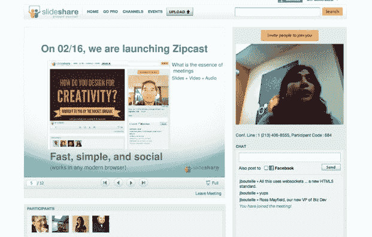

# SlideShare 通过 Zipcast TechCrunch 进入虚拟会议

> 原文：<https://web.archive.org/web/https://techcrunch.com/2011/02/16/slideshare-zipcast/>

当你可以和其他人一起做的时候，为什么要独自浏览在线幻灯片呢？如果你是每月去 [SlideShare](https://web.archive.org/web/20230203022854/http://www.slideshare.net/) 查看像[这种来自玛丽·米克尔的](https://web.archive.org/web/20230203022854/http://www.slideshare.net/kleinerperkins/kpcb-top-10-mobile-trends-feb-2011)关于移动互联网趋势的幻灯片演示的 4500 万人中的一员，你可能会喜欢上 [Zipcast](https://web.archive.org/web/20230203022854/http://www.slideshare.net/zipcast) 。Slideshare 今天推出了这项新服务，在每个公共幻灯片上使用 Zipcast 按钮，将幻灯片变成带有视频、音频和聊天的网络广播。

网络上有大量的虚拟会议服务——从思科的 [WebEx](https://web.archive.org/web/20230203022854/http://www.webex.com/) 和思杰的 [GoToMeeting](https://web.archive.org/web/20230203022854/https://www3.gotomeeting.com/) 到 Adobe 的[Acrobat.com](https://web.archive.org/web/20230203022854/https://acrobat.com/)，这些服务已经问世[多年](https://web.archive.org/web/20230203022854/https://techcrunch.com/2008/06/01/adobe-combines-online-word-processing-file-sharing-and-meetings-with-the-launch-of-acrobatcom/)。但是 Zipcast 更灵活。它不需要软件下载或插件，也不会占据你的整个屏幕。相反，它只是你浏览器中的一个标签页(谢谢， [HTML5 Websockets](https://web.archive.org/web/20230203022854/http://www.slideshare.net/ffdead/the-html5-websocket-api) )。

与其他现有的虚拟会议产品相比，Zipcast 也被精简了。有幻灯片、主持人的单向视频流、音频电话会议线路和文本聊天窗口。如果你在演示过程中不在场，你可以自己跳过幻灯片。就是这样，这也是大多数人进行推销、演示或远程谈话可能需要的全部内容。

为了分享幻灯片会议，你所要做的就是传递一个常规链接——每个 SlideShare 用户都会得到一个定制的链接，看起来有点像 www.slideshare.net/erick/meeting，可以在这个人主持的每个会议上重复使用。与会者可以登录脸书，并可以选择将他们的聊天评论发送到他们的脸书流，以及会议的链接，这是一个聚集现场活动观众的好方法。Zipcast 将有自己的页面，显示当前正在进行的会议，以及评论，这也将促使更多人参加公开会议。

参加会议的人数没有限制，会议可以是公开的也可以是秘密的，但是任何有链接的人都可以查看演示文稿。

如果你是 [SlideShare Pro](https://web.archive.org/web/20230203022854/http://www.slideshare.net/business/premium/plans?cmp_src=main_nav) 的会员，起价 19 美元/月，你可以参加有密码保护的会议，以及其他一些附加功能。Zipcast 将与其他 SlideShare Pro 功能捆绑在一起，如分析和删除广告。SlideShare 几个月前刚刚推出订阅服务，付费用户“每月都在翻倍”，首席执行官 Rashmi Sinha 说。她计划为 Zipcast 推出更多优质功能，如双向视频和嵌入 Zipcast 的能力。

通过 Zipcasts，你可以看到 SlideShare 将如何开始融入新产品，从根本上应对企业市场，利用其忠实的 SlideShare 用户群来传播新产品。Socialtext 创始人罗斯·梅菲尔德(Ross Mayfield)最近加入该公司，担任业务发展副总裁，以帮助推行这一战略。