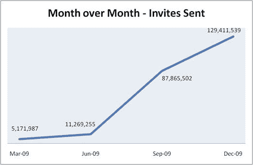

# 随着 SocialPlan 被 MySpace  收购，Slingshot Labs 的消亡被夸大了

> 原文：<https://web.archive.org/web/https://techcrunch.com/2010/01/13/slingshot-myspace-socialplan/>

# 随着 SocialPlan 被 MySpace 收购，Slingshot Labs 的消亡被夸大了

今天早些时候，Valleywag [报道](https://web.archive.org/web/20230406034223/http://valleywag.gawker.com/5447489/shutting-down-rupert-murdochs-social-experiments-lab)说[弹弓实验室](https://web.archive.org/web/20230406034223/http://www.slingshotlabs.com/)，新闻集团拥有的[孵化器](https://web.archive.org/web/20230406034223/https://techcrunch.com/2008/01/21/myspace-answers-facebooks-fbfund-with-slingshot-labs/)于 2008 年初启动，正处于关闭过程中。事实证明，关于它们消亡的报道可能被夸大了。我们联系了 Slingshot，看看他们是否能证实这份报告，Slingshot EVP Strategy &产品的 Diego Berdakin 给了我们以下声明:

> 在没有详细说明 Gawker 报道的不准确性的情况下，这位消息人士显然对今天的变化非常陌生。我们在包括 SocialPlan 在内的项目上取得了巨大的成功，social plan 现在正被 MySpace 收购，其中不仅包括网站，还包括其核心团队。来自 Slingshot 的大部分剩余团队将专注于一项令人兴奋的冒险。

换句话说，一些受今天的变化影响的人没有被解雇——他们正随着 SocialPlan 项目转移到 MySpace。SocialPlan 是由 Slingshot 创建的，作为 MySpace 表现不佳的事件功能的替代品，第一个[于 2009 年 3 月推出](https://web.archive.org/web/20230406034223/https://techcrunch.com/2009/03/12/myspaces-experimental-new-events-product-finally-taps-into-the-social-graph/)。很快[获得了动力](https://web.archive.org/web/20230406034223/https://techcrunch.com/2009/07/27/myspace-overtakes-evite-on-the-event-planning-totem-pole/)，在 2009 年 7 月发送的邀请数量上超过了 Evite。从那以后，它显然做得非常好——伯达金发来了一张显示其成长的图表，我们已经在下面列出了。计算一下，看起来 SocialPlan 现在每天被用来发送大约 430 万个邀请(Evite 报告每天发送 60 万个邀请)。鉴于它的成功，很明显为什么 MySpace 想要接管这个项目。

伯达金不愿对 Slingshot 目前正在进行的项目发表评论，但它很可能是我们去年 7 月首次报道的神秘的 WSJ Connect[“LinkedIn 黑仔】](https://web.archive.org/web/20230406034223/https://techcrunch.com/2009/07/30/wall-street-journal-creating-new-linkedin-killer-called-wsj-connect/)。