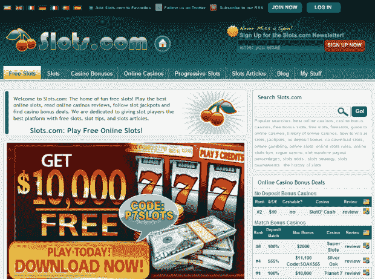

# Slots.com 以 550 万美元易手 

> 原文：<https://web.archive.org/web/https://techcrunch.com/2010/05/13/slots-com-changes-hands-for-5-5-million/>

# Slots.com 以 550 万美元的价格易手

大域名销售是我们以前在 T2 报道过的事情，这一次属于有史以来最大的一次:Slots.com 刚刚以 550 万美元被出售，行业博客[域名专线](https://web.archive.org/web/20230124071528/http://domainnamewire.com/2010/05/13/jackpot-slots-com-domain-name-sells-for-5-5-million/)已经能够证实。

想想看:每个角色超过 100 万美元。

据 DNW 称，该域名是在一次域名拍卖中挂牌出售的。拍卖结束，没有一个出价达到保留价，但是 [Moniker](https://web.archive.org/web/20230124071528/http://www.moniker.com/) (另一家监督公司)与双方合作完成了交易。

该域名最初于 1995 年注册，目前用于一个在线赌博门户网站。

目前还不清楚买家是谁，以及他们计划如何收回购买金额，卖家的身份也没有被公开。

不过，请放心，他或她现在有足够的零花钱玩老虎机很长一段时间。

