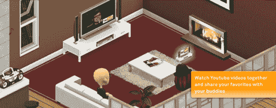

# SmallWorlds 为 Web 2.0 带来了第三维度 TechCrunch

> 原文：<https://web.archive.org/web/https://techcrunch.com/2008/05/21/smallworld-a-virtual-environment-that-takes-web-20-3d/>

# SmallWorlds 为 Web 2.0 带来了第三维度

认识一下 [SmallWorlds](https://web.archive.org/web/20221207214638/http://www.smallworlds.com/) ，这是一个基于浏览器的免费 3D 虚拟世界，集成了 YouTube、Flickr 和许多其他 Web 2.0 服务。该网站针对青少年和成人市场，设计得比“第二人生”更随意。SmallWorlds 将于 6 月 2 日进入公测，但在这里注册[的前 1000 名用户将于 5 月 26 日开始使用该网站。
**更新:**向](https://web.archive.org/web/20221207214638/http://www.smallworlds.com/)[techcrunch@smallworlds.com](https://web.archive.org/web/20221207214638/mailto:techcrunch@smallworlds.com)发送请求的前 1000 名 TechCrunch 读者将在接下来的 12 小时内收到邀请。

《小世界》围绕一个角色的房间展开，这个房间类似于《模拟人生》中的房子。用户可以在房间里安装电视机，播放 YouTube 视频、Flickr 照片海报、Twitter 留言板以及 Last.fm 和 SeeqPod 的立体声音乐。然后，他们可以邀请他们的朋友到他们的房间，在那里他们可以一起观看视频、照片和歌曲——这一功能可能会有很大的吸引力。该网站通过为每个房间分配一个唯一的 URL 来方便与朋友见面，该 URL 会立即将化身传送到他们的目的地。

这个网站有很大的潜力。虚拟世界看起来令人印象深刻，具有三维等距视角和高度可定制的化身。SmallWorlds 还发布了一个 API，允许开发者创建可以与朋友分享的小工具(如游戏或其他媒体产品)。该网站是用 Flex 设计的，该公司表示，它应该可以在任何支持 Flash 9 的浏览器中工作。

用户一直在呼吁一种服务，让他们能够同时观看和评论网络媒体，而 SmallWorlds 的方法可能是他们的目标受众的理想选择。我们已经看到了最近一波类似的服务，如用户平面和视频浏览器，但这些基本上只是坐在媒体浏览器旁边的聊天窗口，没有任何虚拟环境中的互动。

另一方面，已经有一些成熟的虚拟世界，包括 [IMVU](https://web.archive.org/web/20221207214638/http://www.imvu.com/) 和 [Habbo Hotel](https://web.archive.org/web/20221207214638/http://www.habbo.com/) ，这可能会使 SmallWorlds 很难获得牵引力。
