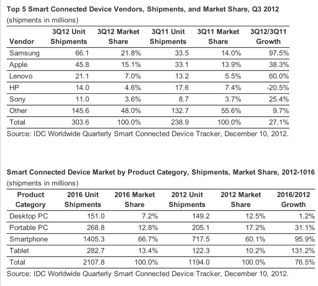

# 智能设备出货量在 2012 年第三季度打破纪录，达到 3.036 亿台；预计在假日季度增长至 3.62 亿 

> 原文：<https://web.archive.org/web/https://techcrunch.com/2012/12/10/smart-device-shipments-broke-records-in-q3-2012-reaching-303-6-million-devices-expected-to-grow-to-362-million-in-holiday-quarter/>

# 智能设备出货量在 2012 年第三季度打破纪录，达到 3.036 亿台；预计在假日季度将增长到 3.62 亿

根据 IDC 关于智能设备出货量的最新报告,我们将迎来一个破纪录的假期。该分析公司预计，2012 年第四季度，设备出货量将比第三季度增长 19.2%，同比增长 26.5%，达到 3.62 亿部，总市值为 1692 亿美元。第三季度，全球智能设备出货量同比增长 17.1%，也创下纪录，出货量为 3.036 亿部，价值 1404 亿美元。

当有报告声称某个供应商拥有最大的“市场份额”时，这总是争论的焦点，因为方法各不相同。有些报告着眼于出货量，有些着眼于销售额。IDC 这次两者兼而有之，称按出货量计算，三星以 21.8%的市场份额领先第三季度，而苹果的出货量排名第二，但价值排名第一。苹果第三季度所有设备类别的总销售额为 341 亿美元，平均售价为 744 美元。(意思是，个人电脑、平板电脑和智能手机 IDC 称之为“智能设备”的统称)

IDC 全球移动设备追踪器项目经理 Ryan Reith 补充道。“两家厂商都在平板电脑和智能手机市场的顶端竞争。然而，它们的集体 ASP 的差异是不同市场方法的明显标志。苹果的平均销售价格比三星高 310 美元，而该季度的出货量仅比三星低 2000 万部，这一事实充分说明了苹果销售的高端产品线。

出货量排在三星和苹果(15.1%)之后的是联想(7.0%)、惠普(4.6%)和索尼(3.6%)。在过去的一年里，除了惠普之外，所有公司的份额都有所增长，IDC 认为惠普“在移动领域几乎不存在”其份额从 2011 年 3 季度的 7.4%下降到 2012 年 3 季度的 4.6%，同期出货量下降了 20.5%。

IDC 表示，智能设备出货量有望在 2016 年达到 21 亿部，全球市场价值为 7967 亿美元。它还预测个人电脑的市场份额将持续下降，从 2011 年智能互联设备市场的 39.1%下降到 2016 年的 19.9%。智能手机和平板电脑将相应增长，前者将从 2011 年的 53.1%增长到 2016 年的 66.7%，平板电脑也将从 2011 年的 7.7%增长到 2016 年的 13.4%。随着越来越多的用户采用多种设备，对个人电脑的需求下降，“智能设备”市场的平均售价也将下降，从 2011 年的 534 美元降至 2016 年的 378 美元。

