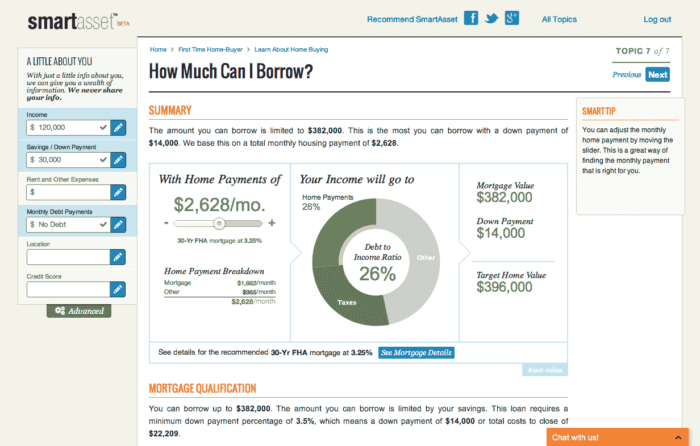

# Y Combinator 支持的财务决策初创公司 SmartAsset 融资 90 万美元 

> 原文：<https://web.archive.org/web/https://techcrunch.com/2012/08/15/smartasset-seed-funding/>

# Y Combinator 支持的财务决策初创公司 SmartAsset 融资 90 万美元

提供互动工具帮助购房过程的初创公司 SmartAsset (计划扩展到其他大型金融决策)已经筹集了 90 万美元的种子资金。

该公司是 Y Combinator 正在孵化的创业公司的一部分。它[于上个月](https://web.archive.org/web/20221006144034/https://beta.techcrunch.com/2012/07/24/smartasset/)推出，联合创始人兼首席执行官 Michael Carvin 表示，已经有超过 14000 人开始使用该网站。他补充称，SmartAsset 已经从广告和线索挖掘中获得了“可观的收入”。

至于资金，它来自 YC，日常风险投资，纽约和硅谷的天使。

当用户来到 SmartAsset 时，他们输入自己的基本财务信息，然后与一些计算器和图表进行交互，帮助他们了解他们的购房选择的财务影响。该网站将推荐一个他们能负担得起的房价，提供一个模拟租房和买房决策的图表，并向用户推荐可能省钱的东西。重点是帮助用户进行自己的分析，这样他们就不必盲目遵循 SmartAsset 的建议——例如，如果你想以高于网站建议的价格购买一套房子，你可以输入这个价格，公司会向你展示这可能会对你的财务产生什么影响。

除了用户数量和融资，SmartAsset 今天还宣布了其购房产品的两项新增功能——计算“我可以借多少钱”的功能以及“我能放下多少？”与该公司的所有工具一样，答案会根据你所在的位置而变化(因为税收影响等因素会发生变化)，你可以随时调整数字，看看借得更多或存得更多会对大局产生什么影响。卡文说，这些增加是对用户需求的回应。

“我们有一个相当深的产品管道，但一切都是根据我们用户的实际需求进行优先排序的，”他说。