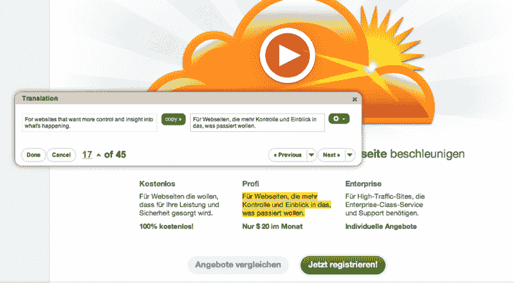

# Smartling 与 CloudFlare 合作，为用户打包安全性和语言翻译 TechCrunch

> 原文：<https://web.archive.org/web/https://techcrunch.com/2011/08/05/smartling-partners-with-cloudflare-to-package-security-and-language-translation-for-users/>

# Smartling 与 CloudFlare 合作，为用户打包安全性和语言翻译

TechCrunch Disrupt 决赛入围者 [CloudFlare](https://web.archive.org/web/20230203123529/https://www.cloudflare.com/) 与实时网站翻译服务 [Smartling](https://web.archive.org/web/20230203123529/http://www.smartling.com/) 合作，允许用户将其网站翻译成任何语言。您可能知道，CloudFlare 提供了一项服务，可以保护网站免受在线威胁、承诺和页面加载速度增加等威胁。

Smartling 为网站提供大规模的搜索引擎优化友好的实时翻译服务。该公司有一个混合模式，允许你在专业翻译、机器翻译和众包翻译之间进行选择。

现在，Smartling 将向所有 Cloudflare 用户提供一个应用程序,支持这些翻译以及保护和稳定他们的网站。这是 Smartling 的首次合作，Smartling 帮助 Foursquare、Survey Monkey 和 Scribd 翻译了他们的网站。事实上，Smartling 基于云的平台现在正被 CloudFlare 用来将其网站和应用程序翻译成 27 种语言。德国、印度尼西亚、葡萄牙和挪威的网站进展顺利。

Smartling 刚刚筹集了 1000 万美元的新资金。CloudFare 最近掀起了轩然大波，因为[披露了安全服务](https://web.archive.org/web/20230203123529/https://techcrunch.com/2011/06/27/cloudflare-ceo-our-marketing-strategy-is-sign-up-all-of-the-worlds-international-criminals-tctv/)正被臭名昭著的黑客 LulzSec 使用。而 CloudFare 刚刚宣布了一轮[2000 万美元](https://web.archive.org/web/20230203123529/https://techcrunch.com/2011/07/12/oh-by-the-way-cloudflare-raised-20-million-last-november/)的融资。

