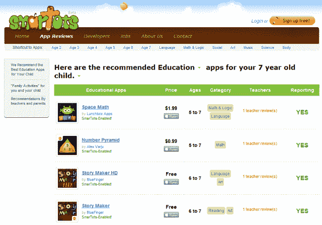

# SmarTots 筹集了 75 万美元，为孩子们提供移动应用平台 

> 原文：<https://web.archive.org/web/http://techcrunch.com/2011/10/24/smartots-raises-750000-offers-mobile-apps-platform-for-kids/>

# SmarTots 筹集了 75 万美元，为孩子们提供移动应用平台

像 iPad 甚至 iPhone 这样的设备能成为小孩子有用的学习工具吗？

毫无疑问，SmarTots 已经开发了一个移动应用推荐和分析平台，专门针对 2-7 岁的孩子(以及他们的父母、教育者和来自世界各地的移动应用开发者)。

投资者也在押注这家移动教育初创公司会掀起波澜:SmarTots 刚刚从领投该轮融资的真格基金(Zhen Fund)以及 ChinaRock Capital、SOSventures 和 Angelvest 等国际投资者那里获得了 75 万美元的种子资金。

小平是新东方教育科技集团(又名[新东方](https://web.archive.org/web/20230204231837/http://english.neworiental.org/publish/portal59/))的联合创始人，新东方是一家在中国上市的私立教育服务提供商。

SmarTots 的移动平台面向儿童，旨在为父母提供一个了解孩子“应用世界”的窗口。家长可以通过各种 SmarTots 应用程序接收跟踪孩子学习活动的报告，包括科目能力、在特定应用程序上花费的时间以及对其他应用程序的建议。

此外，SmarTots 为兴趣匹配和社会家庭活动提供教师建议和教育者开发的建议，以加强学习。

自 2010 年 12 月推出以来，该公司的下载量已超过 60 万次。

有兴趣获得 SmarTots 的 SDK、交叉推广工具和报告功能的开发者可以在这里注册。

附带说明:Smartots 的首席执行官 Jesper Lodahl 在诺基亚工作了七年多，在那里他开发了四款手机，并创造了两项专利，已在全球 10 亿多部手机中实施。

