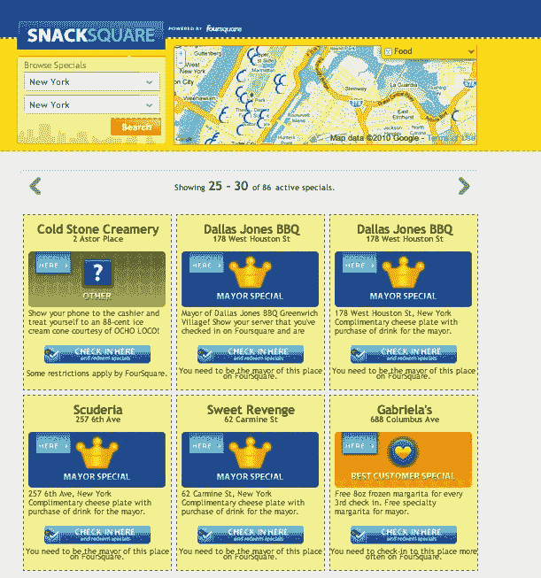
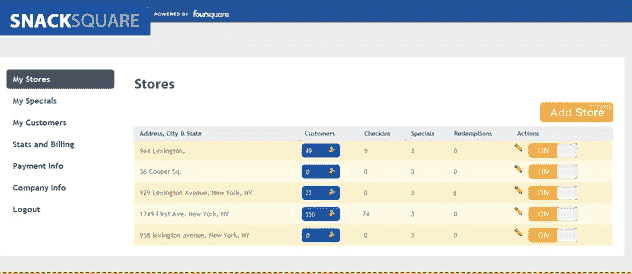

# Snacksquare:交易和场所的四方目录 

> 原文：<https://web.archive.org/web/https://techcrunch.com/2010/04/15/snacksquare-foursquare-directory/>

# Snacksquare:交易和地点的四方目录

Foursquare 正在萌芽的商业模式是通过地理定位优惠的本地广告。当你在酒吧或餐馆登记入住时，你可能会得到 10%的餐费，或者如果你是市长的话，可能会得到一杯免费的饮料(当市长真好)。但是你如何在地图上找到所有这些场馆呢？在 Foursquare iPhone 应用程序上，你可以获得附近场馆的列表，但仅此而已。连地图都没有。

幸运的是，Foursqaure 通过其自由的 API 提供了所有的场地数据。像詹姆斯·吉尔摩这样的开发者可以利用这些数据，围绕 Foursquare 开发他们自己的产品，就像他开发 [Snacksquare](https://web.archive.org/web/20221209140157/http://snacksquare.com/) 一样。该网站是 Foursquare 的商业目录。选择一个城市，它会在谷歌地图上显示所有目前提供交易的场所，并按徽章显示。试试[纽约](https://web.archive.org/web/20221209140157/http://new-york.snacksquare.com/)、[芝加哥](https://web.archive.org/web/20221209140157/http://chicago.snacksquare.com/)，或者[旧金山](https://web.archive.org/web/20221209140157/http://san-francisco.snacksquare.com/)。如果您喜欢某项交易，您可以发送到您的手机，稍后进行兑换。Snacksquare 正好在明天的 Foursquare 日推出，这将是全国范围内 Foursquare 优惠的大规模节日。

当你超越大城市时，就没有那么多交易了。事实上，根据吉尔摩的说法，目前 Foursquare 上总共只有 1500 个商业场所(商店、餐馆、酒吧)提供特价服务。(Foursquare 的特里斯坦·沃克(Tristan Walker)表示，这个数字接近 2000 英镑。但是这个数字肯定会增长。吉尔摩希望把 Snacksquare 变成当地商家管理 Foursquare 网站和联系忠实顾客的一种方式。企业可以将他们的 Foursquare 场地添加到 Snacksquare，并创建针对来到他们场地的人的短信广告活动。

现在，Snacksquare 的商业模式进入了一个可疑的领域。Snacksquare 基本上收获了 Foursquare 上所有商业场所的所有签到。然后，它帮助注册的企业从 Foursquare 上收集客户名单，并试图将他们添加为好友，以便获得他们的电话号码。(这让他们把 Foursquare 的名字改成了他们公司的名字)。一旦他们有了自己的电话号码，他们就可以通过短信向他们发送营销信息和报价(相信我，这很快就会变得令人讨厌)。但对于本地企业来说，这是抓住走进商店的现有顾客的另一种方式。

最大的问题是，你会成为你在 Foursquare 上经常光顾的商家的朋友吗？如果答案是肯定的，Snacksquare 可能有所发现。这当然是一种积极的方式，但也是地理广告的一种尝试。不管怎样，准备好迎接更多的 Foursquare 垃圾邮件吧。

