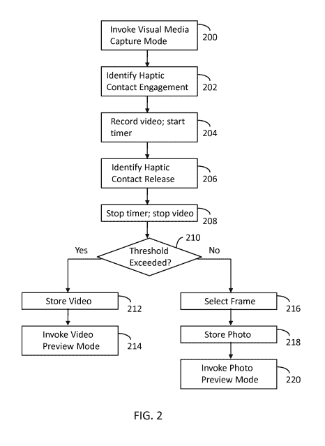

# Snapchat 拥有一项专利，可以帮助它成为事实上的相机应用 

> 原文：<https://web.archive.org/web/https://techcrunch.com/2013/06/21/snapchat-has-a-patent-that-could-help-it-become-the-defacto-camera-app/>

当更大的竞争对手努力通过不同的视频长度来区分自己时，Snapchat 可以使用不同的武器成为第一个开放的相机应用程序:速度。而且不像滤镜，这个会更难复制。

Snapchat 拥有一项名为[“单模式视觉媒体捕捉”](https://web.archive.org/web/20221210042917/https://beta.techcrunch.com/?p=836722&preview=true)的技术专利，用户可以通过点击相机按钮来拍照，按住同一个相机按钮来拍摄视频。只需轻触即可拍照，当您松开相机按钮或 10 秒钟后，视频便会结束。

该应用程序总是直接打开相机屏幕，这种单个相机，单个按钮用于照片和视频，使捕捉瞬间变得简单而快速。Vine 的录制界面最相似，也相当快，但它只做视频。

相比之下，要在 Instagram 中从照片切换到视频，你必须按下视频按钮，等待相机快门几秒钟，移动到新的屏幕，然后按住进行录制。在脸书的 Snapchat 克隆版 Poke 中，你要先选择相机或摄像机，才能看到抓拍画面；同样，在你能捕捉到一些东西之前，相机有时间打开。即使在标准的 iPhone 相机应用程序中，你也必须将转盘从相机滑动到视频，等待相机快门几秒钟，然后拍摄。

该专利的图 2 显示了 Snapchat 照片和视频拍摄设备背后的处理操作。

这可能看起来是一个微不足道的区别，但浪费几秒钟切换到视频或等待你的相机应用程序加载，你希望捕捉的时刻可能已经结束了。

这项专利还可以帮助 Snapchat 解决一场棘手的诉讼。弗兰克·雷金纳德·雷吉·布朗目前正在起诉 Snapchat 以及联合创始人埃文·斯皮格尔和鲍比·墨菲；布朗声称自己是该公司的联合创始人，是被斯皮格尔和墨菲逼出来的。

在 2013 年 2 月提交的[诉讼中，布朗声称:](https://web.archive.org/web/20221210042917/http://www.scribd.com/doc/127601158/frank-reginald-brown-vs-snapchat)

> “此外，在这个时候[2011 年夏天]，布朗承担了起草和提交申请中所用技术的专利申请的责任，该申请将布朗和个别被告列为共同投资人。布朗准备了专利申请，并代表合资企业/合作伙伴向美国专利局提交了申请。

正如我在 3 月写的那样，这项原始专利引发了一场大争论:

> 第一位消息人士告诉我，“专利申请引起了很大的争议。”。“然后发生了一场激烈的争吵，每个人都说对方的坏话，然后斯皮格尔更改了密码，雷吉只是坐着等着提交文件……这与谁的名字最先被列出有关。毫无意义的争论。更重要的是之后发生的事情。我真的不认为专利最终会成为问题。这基本上就是朋友之间的争斗和人们之间的争吵。没有太多的理由来解释他们为什么会大吵大闹。”

将近一年后，2012 年 8 月，斯皮格尔和墨菲申请了这项专利。

直到最近，对 Brown，Spiegel，Murphy，Snapchat，甚至 Picaboo 和 Toyopa Group 等公司早期名称的专利搜索都一无所获。

美国专利局的一位代表告诉我，一个“发明者可以要求在专利实际发布之前，申请根本不被发表。”如果专利从未被颁发，它最终会被放弃。该代表指出，如果一项申请有多名发明人，他们中的任何人都可以提出不公布的请求。

布朗律师事务所 Lee，Tran & Liang 的一名律师在 2013 年 2 月的诉状中证实了这一说法，但由于正在进行的案件的性质，他无法进一步置评。