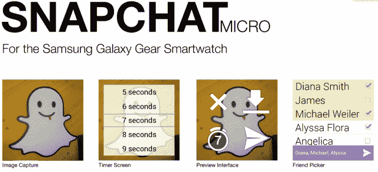

# Snapchat 发布 Snapchat Micro，这是一款适用于 Galaxy Gear 智能手表的应用程序 

> 原文：<https://web.archive.org/web/https://techcrunch.com/2013/09/09/snapchat-releases-snapchat-micro-an-app-for-the-galaxy-gear-smartwatch/>

# Snapchat 发布了 Snapchat Micro，这是一款用于 Galaxy Gear 智能手表的应用程序

还记得一周前发布的[三星 Galaxy Gear 智能手表](https://web.archive.org/web/20221210045036/https://beta.techcrunch.com/2013/09/04/samsung-galaxy-gear-official/)吗？

Snapchat 当然有，这个短暂的消息应用已经发布了一款专门针对腕戴设备的应用。这款名为 Snapchat Micro 的应用可以让用户直接从手腕上发送照片。

用户可以用 Galaxy Gear 的 140 万像素摄像头拍照，该摄像头能够拍摄 10 秒钟的 720p 视频。非常适合 Snapchat 的 10 秒视频限制，AMIRITE？

在 Snapchat Micro 应用程序中，用户可以拍照，选择时间限制，并决定将图像发送给哪些朋友。如果你想添加一幅画或一个标题，快照会自动在你的 Galaxy Note 手机上打开，等待你的创意添加。

Snapchat 创始人埃文·斯皮格尔说:“我们的团队一直在寻找方法，缩短我们体验某个时刻和分享它的时间。”。“Snapchat 微应用是一项实验，我们对此感到非常兴奋。”

Snapchat 是 Galaxy Gear 智能手表发布时将提供的大约 70 个应用[之一。](https://web.archive.org/web/20221210045036/http://www.engadget.com/2013/09/04/samsung-unveils-galaxy-gear/?utm_medium=feed&utm_source=Feed_Classic&utm_campaign=Engadget&ncid=rss_semi)