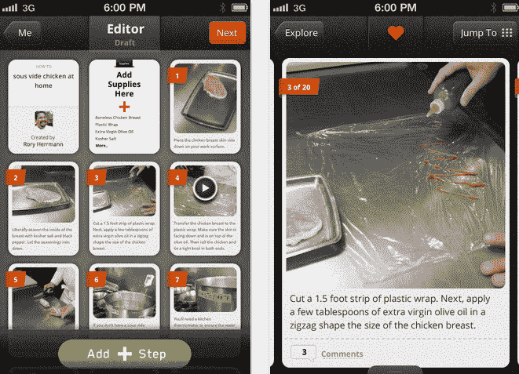
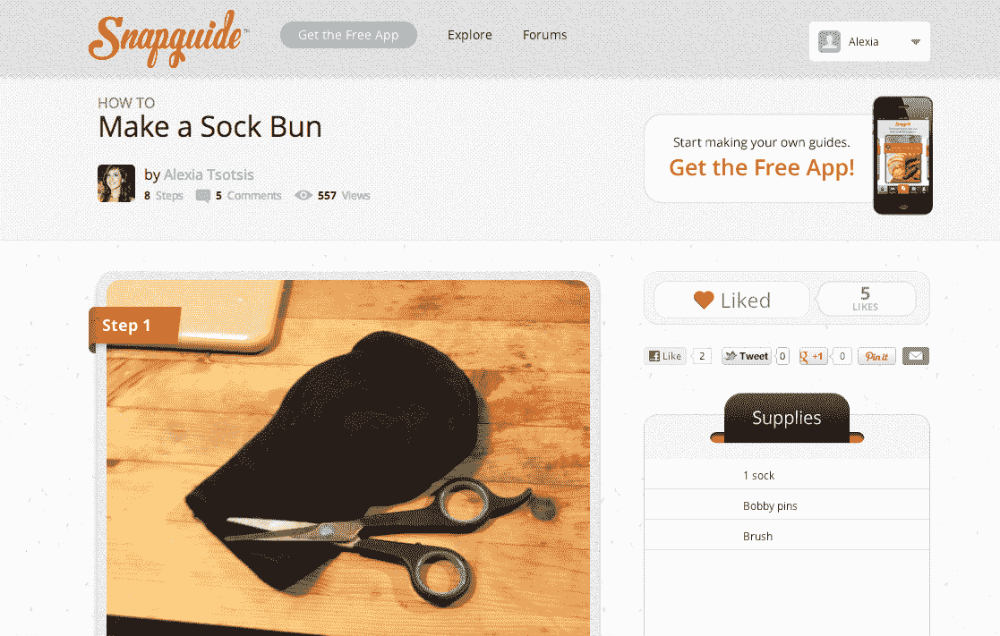

# Snapguide 让在 iOS TechCrunch 上制作和分享操作指南变得非常简单

> 原文：<https://web.archive.org/web/https://techcrunch.com/2012/03/29/snapguide-makes-it-super-easy-to-make-and-share-how-to-guides-via-iphone/>

刚刚在 iOS 上发布的 Snapguide 正在为移动一代重新思考乏味的“如何做”指南。到目前为止，网络上“如何做”指南的消费和创造还没有特别突破性，像 eHow.com 这样的 SEO 优化、付费撰稿人撰写的内容主导了市场。相比之下，Snapguide 的设计超级简单、快速，并且充分利用了你的手机:可以把维基百科想象成脸书，把 Snapguide 想象成 Path。

“eHow 是在线发布内容的先驱，”联合创始人[丹尼尔·拉弗尔](https://web.archive.org/web/20221226054231/http://www.crunchbase.com/person/daniel-raffel)说，“但它是许多‘常青树’(和非个人的)内容。我们想成为一个人们分享他们所热爱的东西的地方……”他解释说，他甚至可以设想最终与 eHow 合作。

事实上，Snapguide 非常适合 realtime mobile，Path 创始人戴夫·莫林(Dave Morin)是其投资者之一也就不足为奇了，投资者中包括 CrunchFund 和 Index Ventures。Snapguide 的联合创始人也是出身名门，除了托马斯·凯勒的门生之外，拉弗尔还是雅虎 Pipes 的创始人之一，史蒂夫·克鲁维茨(Steve Krulewitz)曾是谷歌 Chrome 团队的成员。

这个项目目前拥有数百个指南，从“如何在家做鸡肉”到[“如何以 5 种方式佩戴围巾”](https://web.archive.org/web/20221226054231/http://snapguide.com/guides/wear-a-scarf-5-ways/)，最初是一个礼物的结果；克鲁维兹给了拉斐尔一本[蛋挞面包](https://web.archive.org/web/20221226054231/http://www.tartinebread.com/)的书，拉斐尔把复杂的食谱当成了一个挑战——如何实时地一步一步地把东西分解成最简单的成分？当然，解决办法是用你的手机！

为了制作一个指南，下载 Snapguide 到你的手机上，拍一系列的照片(或者一个长达 60 秒的视频)来描述你的过程中的每一步(比如，“第一步。为我的[“如何做袜子小圆面包”](https://web.archive.org/web/20221226054231/http://snapguide.com/guides/make-a-sock-bun/)指南，在袜子上剪一个洞。然后填写文字说明。因为 Snapguide 是为 iPhone 优化的，所以你也可以在文本中说话，应用程序使用 Nuance 技术来转录它。

“我们想让用照片实时记录过程变得非常简单。拉斐尔说:“实时报道和事后报道是不同的。

完成初始步骤后，您可以删除、编辑或重新排列它们的顺序，然后发布您的指南。Snapguide 对 Twitter 和脸书都有社交分享功能，还有它自己的内部“关注”图，在那里你可以看到你所关注的人创建的指南的时间表，以及哪些指南是受欢迎的。这款应用的搜索功能还没有出现在网络上，但也针对手机进行了优化。“这快得离谱，”拉斐尔说。

Raffel 最终希望让 Snapguiders 能够将他们的指南导出到小工具中，并将其移植到网络上的任何网站。这对于像 Beautylish 和 Refinery29 这样的社区和博客来说非常有用，它们提供“如何做”的内容。这里以 [Beautylish 的袜子包子](https://web.archive.org/web/20221226054231/http://www.beautylish.com/a/vcvzi/how-to-sock-bun)为例。“想象一下用老派的方式来引导？Raffel 说，他指的是单独下载所有图片，并煞费苦心地格式化所有步骤的过程。

Raffel 的 Snapguide 的最终目标是将专家和热情的爱好者联系在一起，并将这些人和他们的经历联系起来，“移动领域的颠覆已经成熟，还有很多部落知识尚未被捕获。”

