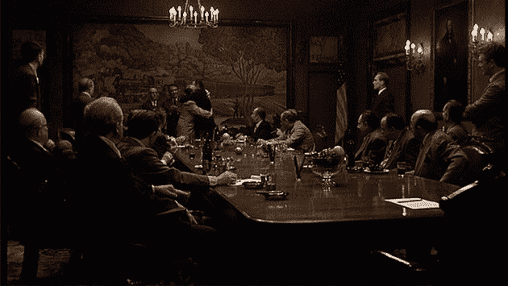

# 一个博客作者走进一家酒吧...TechCrunch

> 原文：<https://web.archive.org/web/https://techcrunch.com/2010/09/21/so-a-blogger-walks-into-a-bar/>

昨天，我得到消息，一群“超级天使”正在旧金山的一家餐馆兼酒吧 Bin 38 举行“秘密会议”。“不要来，你不受欢迎，”我被告知。

所以我做了任何一个有自尊的博客作者都会做的事情——我把车开到垃圾箱 38 号，停好车，走进去。

在餐厅后面的一个包间里，有一张长长的椭圆形桌子。大约 10 位硅谷最知名的天使投资人以教父的方式围坐在桌子旁。这些被称为“超级天使”的投资者都是我的朋友，因为他们大多已经开始创建自己的小型风险基金。我非常非常了解房间里的每个人。

我当然不认为有什么不妥，我期待着一个友好的问候，并邀请坐下来喝一两杯，然后被赶走，而他们谈论他们认为应该保持记录。但是相反，它[是这样的](https://web.archive.org/web/20230328200936/http://twitter.com/#!/arrington/status/25087639876):

我:哎！
说话的人:哦，哦不。
我:嗨。我听说你们在这里，我想过来打个招呼。
他们:死一般的寂静。我:所以……
他们:震耳欲聋的沉默。我:这通常是你们说“坐下，喝一杯”的时候
他们:一声不出
我:这就尴尬了。我想我现在要走了。

我从没见过比这更内疚的一群人。但仅此一点没什么大不了的。当我到达时，活跃的对话往往很快就消失了，我已经学会了不要把它当成个人问题。但后来我确实四处打听了一下，并与参加那次会议的三个人谈过话。这就是事情变得有趣的地方。

这群投资者占硅谷早期创业交易的近 100%,他们定期会面交流意见。早期主要是抱怨各种各样的事情。但是对话已经发展到这些超级天使实际上是在串通(我不会轻易使用这个词)来解决一些问题的地步，来自该团体的多位消息人士说。根据这些来源，正在进行的议程包括:

*   对 Y Combinator 日益增长的权力的抱怨，以及如何在 Y Combinator 交易中抵消竞争
*   对交易估值上升的抱怨，他们可以作为一个团体来降低这些估值
*   该集团如何共同行动，将传统风险资本家完全排除在交易之外
*   该集团如何共同行动，阻止新的天使投资者入侵市场并推高估值。
*   更世俗的事情，比如作为一个团体同意在交易中不接受可转换票据(一种对企业家友好的交易)。
*   一位消息人士还表示，该集团有一个类似维基的网站，明确谈论该集团应如何作为一个整体来保持交易估值较低。

至少有两个与会者对会议感到极度不安，并说他们只是去收集信息，而不是参与。

那么这有什么问题呢？

[串通](https://web.archive.org/web/20230328200936/http://en.wikipedia.org/wiki/Collusion)和[限定价格](https://web.archive.org/web/20230328200936/http://en.wikipedia.org/wiki/Price_fixing)，就是这样。竞争对手一起行动将其他竞争对手挡在市场之外，或者讨论控制价格的方法是绝对非法的。这似乎正是这个小组正在做的。

这不是小联盟的东西。我们在谈论联邦犯罪和民事诉讼，如果事实上他们正在做的话。今天早上我和一位律师通了电话，他确认这些类型的会议正是这些法律旨在阻止的。

我不会说谁参加了会议，因为至少有几个与会者说他们对谈话的方向感到非常不舒服。但就像我说的，它包括了硅谷几乎所有的主要天使投资人。

另外，这是一个很难写的帖子，因为我把房间里的几乎每个人都称为朋友。但是这些行为是如此的不恰当，以至于不得不被大声疾呼。

**几个更新:**