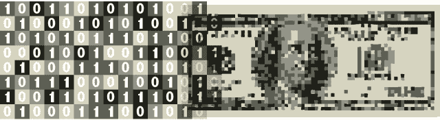

# 有了大数据又如何？没有数据驱动的流程和产品，就没有用 TechCrunch

> 原文：<https://web.archive.org/web/https://techcrunch.com/2012/12/15/so-ive-got-big-data-now-what/>

**编者按:** *约翰·德·高斯(John De Goes)是开发者分析平台 [Precog](https://web.archive.org/web/20221225115838/http://www.precog.com/) 的联合创始人兼首席执行官。在 Twitter 上关注他 [@jdegoes](https://web.archive.org/web/20221225115838/https://twitter.com/jdegoes) 。*

这年头，不用费劲找大数据。即使是一个小小的创业公司，一天也能产生千兆字节，Instagram 这样规模的公司，一天也能轻松产生 500 太字节。如果你和我交谈过的许多公司一样，你正坐在不断增长的数据山上，抓着脑袋想，“好吧，我有大数据了。现在我该怎么办？”

你不会因为有数据就拿金牌。真正的赢家是像亚马逊和网飞这样的公司，他们找到了比竞争对手更好地利用数据的方法。如果没有一个将数据转化为收入的游戏计划，你还不如放弃你的 Hadoop 集群和它所包含的数 Pb 的数据。

另一方面，如果你找到了比竞争对手更好地利用这些数据的方法，你就有可能加入亚马逊和网飞这样的大数据公司的行列。

那么，如何开始将你的数据转化为现金呢？对于大多数公司来说，有两种方式可以利用数据资产创造不公平的竞争优势:数据驱动的流程和数据驱动的产品。

**** 

**数据驱动的流程**

在大数据时代，业务分析师将公式输入 Excel 并在 SQL 数据库中运行即席查询是不够的。新时代需要一种新的无畏的数据探索者，一种能够在小数据和大数据世界中使用工具的人。

这位被称为*数据科学家*的下一代数据极客对传统 BI 工具、查询语言、统计学和机器学习有足够的了解，可以被认为是武装的和危险的。

优秀的数据科学家可以帮助你做任何事情，从找出什么在你的产品中起作用，什么不起作用(正如他们在 Zynga 所使用的那样)，到创建预测模型，让你可以窥视未来，以便你今天可以做出更好的决策(正如他们在@WalmartLabs 所使用的那样)。

以下是数据科学家可以帮助您的一些具体例子:

*   如果你销售一个 SaaS 应用程序，数据科学家可以帮助你识别高收入用户的共同特征。例如，他们在转换到付费账户的过程中采取特定的途径，并且他们可以共享特定的人口统计属性(性别、收入、位置、年龄范围等)。)，并以特定方式使用产品。所有这些见解可以帮助你完善广告、营销和产品，以增加收入。

*   数据科学家可以确定一个定价层或产品从其他定价层或产品蚕食销售的程度，因此您可以优化您的定价策略和产品线。

*   数据科学家可以基于历史数据构建预测模型，让您做出相当准确的预测。例如，您可以识别哪些客户可能是女性和孕妇(Target 已经完成了一些工作)，或者识别销售渠道中的哪些销售线索最有可能转化以及转化的级别。

*   数据科学家可以帮助您找出关于您的数据的正确问题。例如，数据科学家可能会建议将您的营销数据、web 日志数据和交易数据相关联，以确定营销活动背后的 ROI。

**数据驱动产品**

使用数据驱动业务流程的另一面是使用数据来增强产品的功能(这并不适用于所有产品，例如牙刷和枕头！).一些公司通过将数据打包成有用的、有洞察力的产品，然后出售给其他公司来实现这一点。

Twitter 虽然本身不是一个数据产品，但它将其数据许可给 DataSift 等提供商，这些提供商随后创建了一个数据产品，公司会因其提供的洞察力而吞并该产品。一些媒体公司将他们的观众数据打包成产品，然后出售给频道节目制作人和内容创作者。诸如此类。

然而，大多数构建数据驱动产品的公司并不创造和销售纯数据产品。相反，他们使用数据来使他们现有的产品更有效、更智能或更有洞察力，从而直接或间接产生额外的收入。

以下是一些真实的例子，展示了数据如何被用来在现有产品中推动智能和有洞察力的功能:

*   一个广告平台，它根据对广告位置、广告本身和显示广告的用户的了解，选择向哪个人显示哪个广告，以最大限度地提高点击率或其他创收用户行为的可能性。

*   一个电子商务应用程序，它智能地推荐产品，以最大限度地提高消费者购买他们想买的东西和他们不想买的东西的可能性。

*   出版商基于对用户的任何了解，智能地为每个用户个性化每个页面，以最大化用户停留在出版商网站上的机会，从而产生更多的广告收入。

*   一个视频平台，捕捉所有用户交互，并为内容创作者提供详细的分析，帮助他们优化重要指标(参与度、播放量、转化率)。这是间接货币化的一个例子。添加由数据驱动的功能(分析)有助于提高平台对用户的吸引力。

**你也可以是数据驱动的**

如果我对数据驱动的过程和数据驱动的产品的描述让你垂涎三尺，但是你仍然想知道如何从堆积如山的无意义的数据到成堆的冰冷的现金，那么我已经收集了一些具体的建议，应该可以帮助你开始。

**集中捕捉一切。**在这个存储成本直线下降且无处不在的时代(免费！)大数据存储，如果你没有捕捉每一个数据，你就做错了。我经常告诉公司，虽然你可以总是忽略你拥有的数据，但你不能分析你没有的东西。非结构化和半结构化数据存储让您现在可以以原始格式存储数据，并且只需在需要时支付提取结构的成本和*。因此，没有理由不存储交易、交互、行为数据、传感器数据、用户生成的内容、日志文件以及任何您可以得到的东西。*

**给自己找个数据科学家** **。**如果你是一家初创公司，你的团队中至少需要一名数据科学家，或者可以兼任数据科学家的人。如果你是一家更大的公司，你需要一个完整的团队，从内部培训可能比雇佣新的数据科学家更容易。数据科学家有时可以从强大的业务分析师或那些在 BI 和 SQL 方面有出色背景的人那里得到培训。数据科学家需要精心配备适当的工具并访问公司范围的数据，以便他们能够回答特定的问题，执行探索性数据挖掘，支持 BI 团队，并帮助实现数据产品化。一个伟大的数据科学家将帮助你找出你需要问的问题，以便推进你的议程。他或她还会寻找新的方法来利用你的公司可以访问的所有数据。

**将你的数据** **产品化。**任何拥有专有数据的公司都应该认真考虑使用这些数据来构建新产品或在现有产品中驱动数据驱动的功能。任何拥有桌面、移动、web、服务器或基于媒体的应用程序的公司都拥有专有数据(这意味着，在这个数据和时代，大多数公司都拥有专有数据！).公司，特别是广告和零售公司，通过使用数据驱动应用程序中的智能功能，已经获得了数百万甚至数十亿美元的增量收入。

如果你是一个 B2B SaaS 供应商，为你的客户提供自助服务报告是一个简单的方法，你可以将数据转化为产品功能，间接推动额外的收入。如果你是一个电子商务平台，利用你所掌握的所有数据进行推荐和个性化可以带来可观的增量收入。如果你是一个消费者应用程序，使用数据使你的应用程序更智能可以带来更高的可用性和更好的参与度。让员工思考可以从数据资产中创建什么样的功能和产品是数据产品化的第一步，但最终，您将需要能够将数据转化为功能和产品的工程资源。

**数据驱动的你**

大数据本质上与数据无关，它是关于如何使用这些数据来推动公司内部的业务流程和产品功能。数据科学在过去几年的飞速发展证明了数据是 21 世纪的货币。如果你对你的数据不做任何事情，你就会处于严重的竞争劣势。

但是，通过采取一些简单的步骤，例如捕获您可以获得的所有数据，确保您至少有一名数据科学家，并朝着数据产品化的方向努力，您可以确保您有效地“花费”了当前堆积在您的数据仓库中的所有货币。