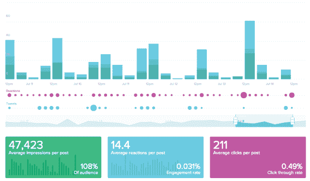

# 社交分析初创公司 Awe.sm 推出专为营销人员设计的仪表盘 

> 原文：<https://web.archive.org/web/https://techcrunch.com/2013/07/16/social-analytics-startup-awe-sm-rolls-out-a-dashboard-just-for-marketers/>

# 社交分析初创公司 Awe.sm 专门为营销人员推出了一个仪表盘

社交媒体分析初创公司 [Awe.sm](https://web.archive.org/web/20221005200604/http://awe.sm/) 正在认真地让不同类型的客户都能使用其产品。该公司提供了一个衡量其社交媒体活动有效性的平台，并改进了其技术，以创建一种针对品牌和营销人员的新产品。

直到最近，Awe.sm 还主要是[关注开发者](https://web.archive.org/web/20221005200604/https://beta.techcrunch.com/2011/12/01/awe-sm-helps-developers-track-all-the-key-details-in-social-sharing-raises-cool-4-million/)，让他们更好地了解他们的产品是如何通过社交媒体分发的。但它一直在逐渐转变商业模式，专注于大品牌和广告商。

但是在改变策略的过程中，它不得不对其产品做了一点调整。首先，Awe.sm 基于 API 的方法通常要求其用户拥有某种技术或工程知识来利用其平台。即使他们这样做了，这些客户通常也不需要 Awe.sm 提供给他们的所有功能。

新的仪表板是根据各大品牌和机构的社交媒体团队的反馈开发的。其中，宝马美国公司和惠普公司为最有利于衡量其社交媒体活动有效性的工具提供了反馈。特别是，它去掉了旧仪表板中的许多功能。

新产品关注各种社交网络的属性和转化率，包括脸书和推特。它允许客户查看哪些频道的覆盖面最大，这意味着统计所有的赞、分享、推文和转发。然而，更重要的是，它跟踪基于社交分享的各种转化和销售指标。

Awe.sm 最近更换了首席执行官，联合创始人 Jonathan Strauss 让位，以便 CBSi 和 AOL 的资深行业高管 Fred McIntyre 能够[接任首席执行官](https://web.archive.org/web/20221005200604/https://beta.techcrunch.com/2013/05/16/social-analytics-startup-awe-sm-hires-former-cbsi-and-aol-exec-fred-mcintyre-as-ceo/)。施特劳斯仍然是产品管理部门的负责人，昨天他给我看了新产品的演示。

Awe.sm 的客户包括 Say Media、Maker Studios、Topspin Media、StockTwits 和 LocalResponse 等公司。该公司已经从投资者那里筹集了超过 650 万美元的资金，这些投资者包括 advanced Ventures、Foundry Group、kbs+ Ventures、Neu Venture Capital、Social Leverage 和杏资本。