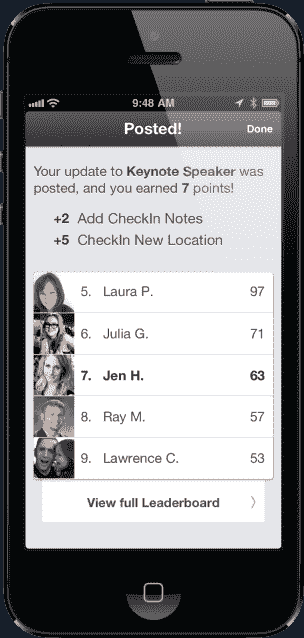

# 社交活动平台 DoubleDutch 融资 1000 万美元 C 轮由 Bessemer TechCrunch 领投

> 原文：<https://web.archive.org/web/https://techcrunch.com/2013/09/25/social-events-platform-doubledutch-raises-10-million-series-c-led-by-bessemer/>

快速增长的移动事件应用平台 DoubleDutch 在 TechCrunch 获悉的 C 轮融资中筹集了 1000 万美元，在很大程度上由 Bessemer Venture Partners 的 [Byron Deeter](https://web.archive.org/web/20230130230119/http://www.crunchbase.com/person/byron-deeter) 牵头的一轮超额认购中，他现在将加入该公司的董事会。DoubleDutch 的 A 轮和 B 轮投资者、Floodgate Fund、Bullpen Capital 和其他投资者也参与了进来。

这笔资金是在 DoubleDutch 转向专注于开发其移动活动技术的同时获得的，同时放弃了其他产品，包括相当受欢迎的[移动 CRM 应用 Hive](https://web.archive.org/web/20230130230119/https://techcrunch.com/2012/04/24/enterprise-mobile-startup-doubledutch-raises-2m-series-a-from-bullpen-floodgate-others/) 。今天早上与首席执行官 Lawrence Coburn 谈论资金时，他将关闭 Hive 的决定描述为他所做过的最艰难的决定之一——特别是考虑到之前的[轮](https://web.archive.org/web/20230130230119/https://techcrunch.com/2012/11/12/mobile-first-enterprise-startup-doubledutch-raises-4-million-series-b-from-floodgate-others/)是基于 Hive 的承诺和潜力而筹集的。然而，最终，科伯恩说这是正确的做法。

今年一月关闭的 Hive 有大约 1000 名免费用户和少量付费用户。与此同时，events 产品每季度增长 40%至 50%，包括部署、用户和收入。

“在 CRM 方面，我们完全在 Salesforce 的关注范围内，”Coburn 解释道。“我想不通的一件事是，我们的移动 CRM 是如何让我们在面对 Salesforce 时占据有利位置的？真的，Salesforce 的用户界面非常漂亮，”他说。"这是他们技术的表示层."

人们担心的是，如果 Salesforce 决定专注于此，DoubleDutch 可能会在一年内死亡。因此，Hive 关闭了，正如 Deeter 所说的那样，业务增长、收入和“具有更好特征的类似规模的市场”仍然存在。

##### 一款社交、数据驱动的活动应用

DoubleDutch Events 应用程序作为一种带有联合品牌的白色标签产品出售给活动组织者(“由 DoubleDutch 提供支持”)，客户不仅可以从纸质活动指南过渡到移动技术平台，还可以利用移动技术平台中收集的数据做更多事情。从产品的角度来看，该应用的架构是从零开始构建的，专注于社交和网络，这使 DoubleDutch 有别于一些竞争对手。

“每个活动都有专门的活动源。我们在应用程序中内置了游戏机制。“我们有用户档案和联系的概念——所有这些你会在社交网络平台上看到的东西——是我们应用的基础，”科伯恩说。"该类别中的所有其他玩家，他们的灵感都来自纸质活动指南."

通过以这种方式建立一个活动平台，DoubleDutch 的应用程序还可以利用手头的数据做其他事情。例如，由于用户拥有个人资料，并使用应用程序建立联系，DoubleDutch 能够推荐关注的人。它还围绕线索数据开发了一种商业模式，将参展商从笨重的基于硬件的徽章或名片扫描仪转移到移动设备上。

到目前为止，该公司的线索包已经在六个活动中使用，让参展商使用应用程序中的扫描功能，该功能还可以使用各种信号对线索的价值进行实时评分。举例来说，这可以立即告诉展位代表他们正在与谁交谈，以及他们是否应该找一位高级主管。但更有趣的是，DoubleDutch 还能让那些没有真正来到展台的人的线索浮出水面。为了做到这一点，它会根据你在应用程序中与谁交换了联系信息、你参加了什么会议以及近十几个其他信号来判断谁可能是好的线索。

虽然一个应用程序中的销售线索包的价格各不相同，但这种基于数据的追加销售的收入是该应用程序许可所产生的数据的数倍。例如，在最近一次有 50，000 人和 500 家参展商参加的活动中，200 家参展商以每套 300 美元的价格购买了铅包。这意味着客户(组织者)仅从数据中就获得了 60，000 美元的收入。DoubleDutch 从这些数据中获得了一部分收入，但没有披露。

##### SAAS 平台，而不是一次性应用

 线索也仅仅是 DoubleDutch 计划的开始。Coburn 说，目标是让 DoubleDutch 更像一个平台，它的 API 和 SDK 允许开发者构建其他定制功能。Deeter 补充说，该公司也有巨大的机会来监控和管理其他与活动相关的销售和营销活动，并与活动以外的社区联系，以保持他们的参与。“在这两大类别中，有一个十年的产品路线图，”他指出。

虽然该公司没有透露收入细节，但 DoubleDutch 报告称，季度环比增长 40%，迄今为止，近 50 万名活动参与者在 1000 多场活动中使用了其应用程序。它的客户包括许多知名品牌，包括思科、美国运通、Box、IDG、SAP、普华永道和其他。收入“数以百万计”，年增长率超过 100%。

活动业务是一个竞争激烈的领域，有 QuickMobile 这样的现任者，CVENT [这样的公司上市](https://web.archive.org/web/20230130230119/http://www.forbes.com/sites/tomiogeron/2013/08/09/cvent-shares-soar-after-ipo-for-event-planning/)，大量的收购包括 [EventBrite 对 Lanyrd](https://web.archive.org/web/20230130230119/http://lanyrd.com/blog/2013/eventbrite/) 的收购，围绕体验构建网络工具的应用程序(例如 [Bizzabo](https://web.archive.org/web/20230130230119/http://www.bizzabo.com/) ， [Bloodhound](https://web.archive.org/web/20230130230119/https://bloodhound.com/) 等)。)和几个免费增值服务。

但是 Deeter 认为 DoubleDutch 特别有潜力。“在那个行业，纸张将会消失。他表示:“未来几年的转变将是巨大的……没有理由走回头路。”。“这是一个巨大的市场，转型的时机已经成熟，DoubleDutch 有机会一开始就处于领先地位。”

有了新的资金，该公司计划继续上述产品开发，通过今年在香港开设的办事处向亚洲扩张，过渡到以 SaaS 为基地的业务模式，并将 62 人的团队扩大到约 90 人。