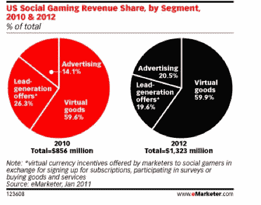

# 2011 年，社交游戏将成为价值 100 亿美元的 1B 市场；虚拟商品将带来 6.53 亿美元的收入 TechCrunch

> 原文：<https://web.archive.org/web/https://techcrunch.com/2011/01/12/social-gaming-to-be-a-1b-market-in-2011-virtual-goods-to-bring-in-653m/>

# 2011 年，社交游戏将成为价值 100 亿美元的 1B 市场；虚拟商品将带来 6 . 53 亿美元的收入

根据今天发布的一份 eMarketer 报告,今年社交游戏有望成为十亿美元的产业。当然，考虑到社交游戏平台 Zynga 和脸书的大规模增长，这个惊人的数字并不令人惊讶。

eMarketer 表示，今年近 6200 万美国互联网用户，即 27%的在线用户，将每月至少玩一次社交网络游戏，高于 2010 年的 5300 万。在美国，2011 年消费者将在社交游戏中的虚拟商品上花费 6.53 亿美元，而 2010 年为 5.1 亿美元。

这些来自虚拟商品的收入将继续占据过去社交游戏收入的大部分，但该业务的其他领域预计也会增长。2011 年，社交游戏广告支出预计将增长至 1.92 亿美元，比 2010 年增长 60%。潜在客户报价将从 2010 年的 2.25 亿美元增加到 2011 年的 2.48 亿美元。eMarketer 表示，广告收入实际上有望在 2012 年超过潜在客户，成为开发者收入的来源。

报告的作者、eMarketer 的保罗·武诗源表示，随着社交游戏在未来两年的成熟，未来将带来“更多品牌虚拟商品”，虚拟商品将更多地成为公司的广告载体。

