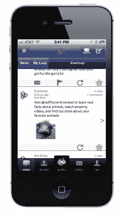

# 社交网络 Everloop 通过新的 Goobit 应用程序(没错，是为孩子设计的)登陆手机

> 原文：<https://web.archive.org/web/https://techcrunch.com/2012/10/25/social-network-everloop-hits-mobile-with-new-goobit-app-yes-its-for-kids/>

# 社交网络 Everloop 通过新的 Goobit 应用程序(是的，它是为孩子们设计的)登陆移动设备

由 310 万美元种子资金支持的儿童社交网络[ever loop](https://web.archive.org/web/20230217044039/https://techcrunch.com/2011/06/12/social-network-for-kids-everloop-lands-3-1-million-in-new-funding/)今天推出了它的第一款移动应用。这款名为“ [Goobit](https://web.archive.org/web/20230217044039/https://itunes.apple.com/us/app/everloop-goobit/id556166326?mt=8) ”(请记住，这是一款面向儿童的应用)的新应用将 Everloop 界面移动化，并包括该网络更受欢迎的功能之一——“goobs”，这是一种愚蠢的恶作剧，让孩子们做一些事情，比如在彼此的屏幕上飞溅虚拟虫子或卫生纸。

有人告诉我这很有趣，这让我觉得自己很老。

无论如何，Everloop 的应用程序为孩子们的社交网络提供了一个更安全的选择，而不是像许多不幸的人那样，允许他们谎报年龄以在脸书上注册账户。app 是 COPPA 兼容的，当然是家长会喜欢的。Everloop 上还有一种庆祝童年的精神，这在一个孩子们成长太快的世界里令人耳目一新([字面意思](https://web.archive.org/web/20230217044039/http://www.cnn.com/2012/10/20/health/boys-early-puberty/index.html))。Everloop 面向 13 岁及以下的儿童，希望至少能阻止儿童在掌握社交技能处理虚拟存在的意义之前进入成人社交网络空间。它让他们在人生的关键时刻练习在线技能——当他们还没有完全掌握虚拟行为对他人的影响时。

更重要的是，Everloop 为孩子们提供了各种各样的社交活动，没有妈妈评论孩子帖子的尴尬。父母通过通知得到信息，但这是*而不是*他们的网络——这是给孩子们的。该公司的一个审核团队防止孩子们做得太过火，并防止发布带有脏话、网络欺凌或其他不当内容的帖子。当它被发现时，孩子们会被告知为什么这条信息不能被发布。(更多关于 Everloop 网络的信息，请看我们早先的帖子[这里](https://web.archive.org/web/20230217044039/https://techcrunch.com/2012/06/06/kid-friendly-social-network-everloop-is-coming-to-iphone-raising-series-a/)。)

在新的移动应用程序中，孩子们可以上传和分享照片，发布状态更新，评论和喜欢他们自己和朋友的循环(循环是基于兴趣的社区，主题包括足球、小猫或贾斯汀比伯)，互相发送直接消息，分享网络上的照片和视频，以及如上所述，使用“goobs”互相恶作剧

作为启动，Everloop 还包括一个 Goobit 万圣节装饰比赛，让孩子们上传古怪的万圣节装饰图片，以赢得积分。这些信用允许孩子们在 Everloop 购买虚拟商品。

Goobit 应用程序现在可以在 iTunes 应用商店买到，可以在 iPhone 和 iPod Touch 上使用。

【YouTube http://www.youtube.com/watch?v=EC1qcgAwsE4？feature=player_detailpage]