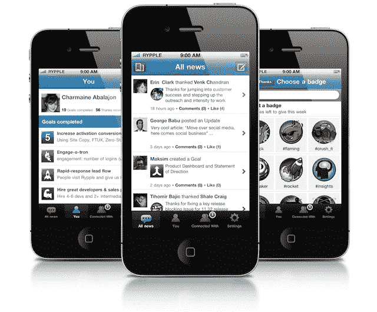

# 社交表现平台 Rypple 来到 iPhone TechCrunch

> 原文：<https://web.archive.org/web/https://techcrunch.com/2011/09/21/social-performance-platform-rypple-comes-to-iphone/>

# 社交表现平台 Rypple 来 iPhone

该公司今天宣布，基于网络的社交表演平台 Rypple T1 现在可以在 T2 的 iPhone T3 上使用。与桌面大小的网站一样，新的移动应用程序将允许经理向员工提供实时反馈，提供辅导，跟踪目标，并公开表彰工作出色的同事。

将自己视为“企业的 Zynga”的 [Rypple](https://web.archive.org/web/20230203052253/http://rypple.com/) 背后的想法是在企业环境中使用社交软件来建立一种伟大的工作文化。它允许管理者跟踪项目，指导他们的团队，并对值得称赞的员工给予表扬，让其他人在它的在线应用程序中看到。

该软件还采用了各种游戏机制，如徽章，可以定制以反映公司自己的价值观。此外，就像在游戏中一样，员工可以积累“获得的技能”，这种方法让人想起在虚拟世界或 [MMORPG](https://web.archive.org/web/20230203052253/http://en.wikipedia.org/wiki/Massively_multiplayer_online_role-playing_game) 中建立一个角色。

使用新的 iPhone 应用程序，用户可以跟踪公司的新闻，更新团队的项目状态，发布“感谢”并分发徽章。

该应用将作为免费增值服务提供。有一个有限的免费版本，每个用户每月 5 美元的版本，提供目标访问、实时同行反馈、一对一辅导和认可，以及每个用户每月 9 美元的版本，包括 Rypple 的快速绩效评估应用程序、循环、支持、推广和集成到现有的公司工作系统中。这款应用现在已经在 iTunes 中[可用。](https://web.archive.org/web/20230203052253/http://itunes.apple.com/app/rypple-for-iphone/id457922903)

