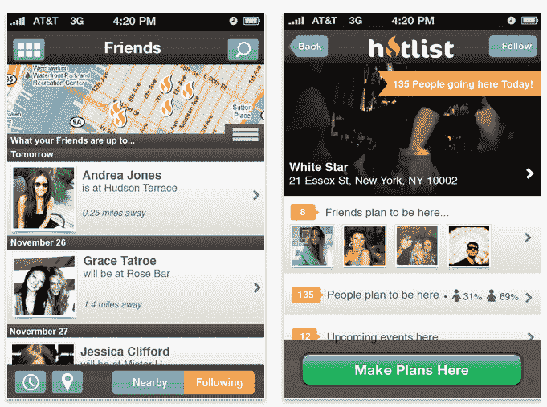

# 社交规划服务 Hotlist 推出新网站和 iPhone 应用 

> 原文：<https://web.archive.org/web/http://techcrunch.com/2011/11/09/social-planning-service-hotlist-launches-new-site-and-iphone-app/>

# 社会规划服务热线推出新网站和 iPhone 应用程序

基于位置的社交规划平台 [Hotlist](https://web.archive.org/web/20230203073003/http://www.hotlist.com/) (以前称为“The Hotlist”)今天推出了一个改版的网站和 iPhone 应用程序，更加注重易用性，改进了对即将举行的活动和事件的发现，以及与朋友协调计划的更好工具。

据联合创始人兼首席执行官克里斯·米拉比尔(Chris Mirabile)称，该公司也接近完成其下一轮约 100 万美元的融资，主要来自天使投资者(通过 AngelList)和之前的投资者 Centurion Holdings 等。

“当你想到其他基于位置的服务，如脸书和 Foursquare，这是关于过去已经发生的事情，这是一个更具历史性的观点，”Mirabile 解释说。相反，Hotlist 想帮你找出*未来会发生什么。它通过访问用户在脸书的个人资料来查看用户的朋友计划参加什么活动。它还汇总公共数据，以显示哪些地方将成为附近的趋势。然后，根据多种因素向热门用户提供推荐:他们的朋友、地点、活动和他们关注的品牌。*

随着更新，Hotlist 增加了在实际活动开始前几小时或几天进入场馆进行“虚拟窥视”的能力，以便查看活动细节、计划参加活动的人的照片以及他们在脸书的朋友中有谁计划参加。

另一个值得注意的新功能是“规划”，它可以帮助用户确定与朋友见面的最佳地点和时间。用户可以指定多达 5 个地点和时间，朋友们选择哪一个效果最好。

然而，Hotlist 更新最好的部分可能是重新设计。如果你还记得[的应用和网站曾经是什么样子的](https://web.archive.org/web/20230203073003/https://techcrunch.com/2010/05/13/the-hotlist/)，你可能会惊喜地发现，这些变化让这项服务变得更加容易使用。

Hotlist 表示，现在它的系统中有超过 1 亿个计划，用于 40，000 多个城市的 270 多万个场馆。Mirabile 表示，自推出以来，这项服务的用户已经增长到了 50 万。

新的应用程序现在在 iTunes 中，但是更新的版本会在几个小时内到达，并会有额外的错误修正。

