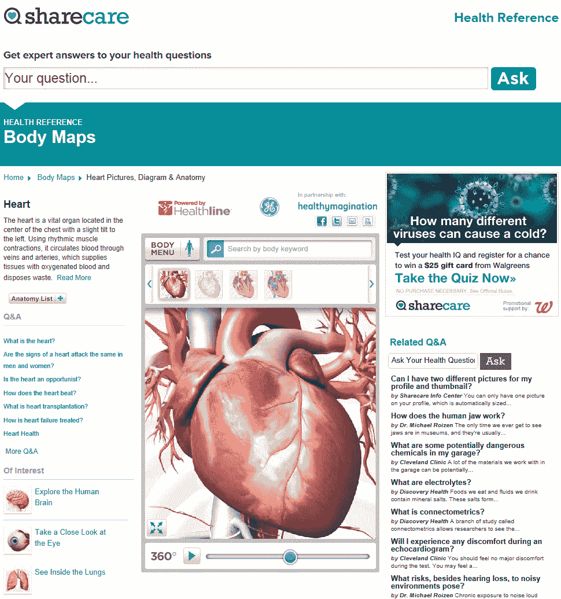

# 社交问答网站 Sharecare 和 Healthline 宣布在健康搜索服务上合作 

> 原文：<https://web.archive.org/web/http://techcrunch.com/2011/09/27/social-qa-site-sharecare-and-healthline-announce-partnership-on-health-search-services/>

由 WebMD 创始人杰夫·阿诺德和电视台的穆罕默德·奥兹博士创建的网站【Sharecare.com 与智能健康信息服务提供商 [Healthline Networks](https://web.archive.org/web/20230203152200/http://www.healthline.com/) 合作。Healthline 目前为 Yahoo Health、AARP、Aetna、United Health Group 和其他公司的健康平台提供支持。展望未来，它也将推动 Sharecare 的搜索服务。

合作带来的更有趣的产品之一是集成了 Healthline 的 3D [BodyMaps](https://web.archive.org/web/20230203152200/http://www.healthline.com/human-body-maps) ，这是一种视觉搜索产品，允许用户浏览人体，以了解疾病和其他医疗条件如何影响它。鉴于谷歌最近宣布将关闭其自己的谷歌身体浏览器项目，该项目将被关闭，代码将被开源，此次发布非常及时。

Sharecare 还将在未来几个月推出额外的内容、导航功能和应用，包括 Healthline 的症状搜索、治疗搜索和药物搜索

如果你对 Sharecare 不熟悉的话，这个网站是更老的 WebMD(T3)的社交版[，两者都是由杰夫·阿诺德创建(或联合创建)。如果 WebMD 今天推出，它可能会是什么样子。](https://web.archive.org/web/20230203152200/http://www.webmd.com/)

Sharecare 用户不像 WebMD 那样简单地提供包含健康信息的信息页面，而是可以使用该网站的搜索界面提出问题，以连接到约 3000 名医疗专业人员的网络。

网站上的医生(包括奥兹医生)当然不会提供诊断，但他们会回答更多基于事实的健康相关问题，比如“胶原蛋白有什么作用？”或者“激光牙齿美白是怎么做到的？”也有在线社区，用户可以跟踪自己的话题和兴趣，并与其他人联系。

Healthline Networks 已经筹集了 5000 万美元的资金，主要来自战略投资者，包括 Aetna、GE/NBC Peacock Fund、Investor Growth Capital、Kaiser Permanente、Reed Elsevier、U.S. News & World Report 和 VantagePoint Venture Partners。

与此同时，Sharecare 与奥普拉的 Harpo 工作室、HSW 国际、索尼影视和探索传播公司合作。该网站受益于在奥兹医生电视节目中播出的提及，预计随着新产品的推出，这一提及将会增加。