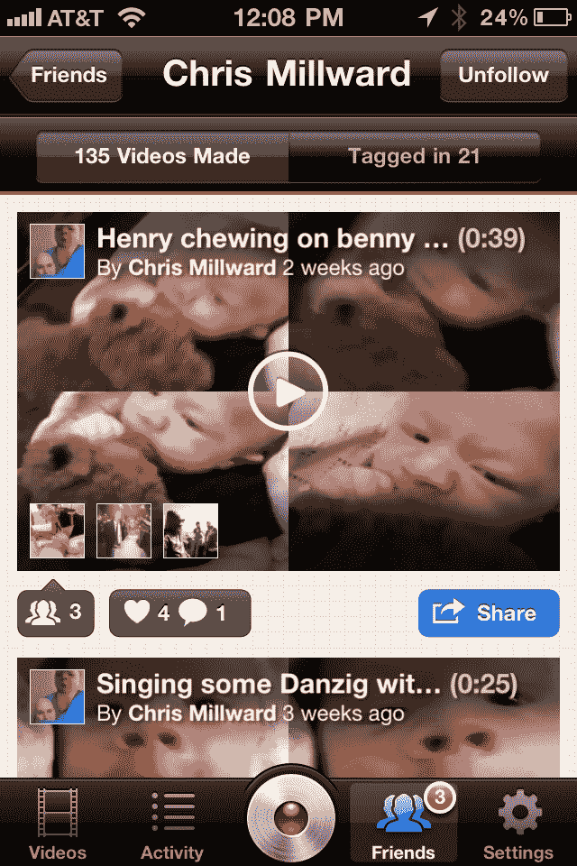

# Socialcam 穿越 2M 下载，添加(等等...)视频滤镜！

> 原文：<https://web.archive.org/web/http://techcrunch.com/2011/10/05/socialcam-crosses-2m-downloads-adds-wait-for-it-video-filters/>

# Socialcam 穿越 2M 下载，添加(等等…)视频过滤器！

在今年 SXSW 之前不久推出的“视频 insta gram”Socialcam 本周跨越了一个重要的里程碑:自六个月前推出以来，它已经在 iOS 和 Android 设备上被下载了 200 万次。

它还推出了应用程序的 3.0 版本，增加了一个功能，使与 Instagram 的比较更加贴切:现在你可以添加视频过滤器。你可以在 app store [这里](https://web.archive.org/web/20230204111709/http://itunes.apple.com/us/app/socialcam-video-camera/id421228047?mt=8)找到它。

是的，从 Socialcam 3.0 开始，你可以选择给你的视频一个“70 年代”或“波希米亚”或 vibe，或者你可以使用像“电子”这样的实验过滤器。在开始录制之前，您可以在取景器中看到渲染的效果，因此您可以预先了解每个效果的样子。

自从我们上次撰文以来，这项服务已经增加了几个其他功能。首先，现在可以创建私人账户，你可以指定谁可以访问你的视频(在此之前，一切技术上都是公开的，尽管很难找到你不认识的人的视频)。现在，你可以将应用程序设置为直接启动相机，而不是 Socialcam UI，如果你打算将它用作默认相机，这是关键。

Socialcam 最初是作为 Justin.tv 的一个附带项目创建的——它于 8 月剥离为一家独立的初创公司[(Justin.tv 当时的首席执行官 Michael Seibel 成为 Socialcam 的首席执行官，Justin . TV 的联合创始人 Emmett Shear 接替了他的位置)。](https://web.archive.org/web/20230204111709/https://techcrunch.com/2011/08/29/after-a-hot-start-justin-tv-spins-off-socialcam-its-instagram-for-video/)

