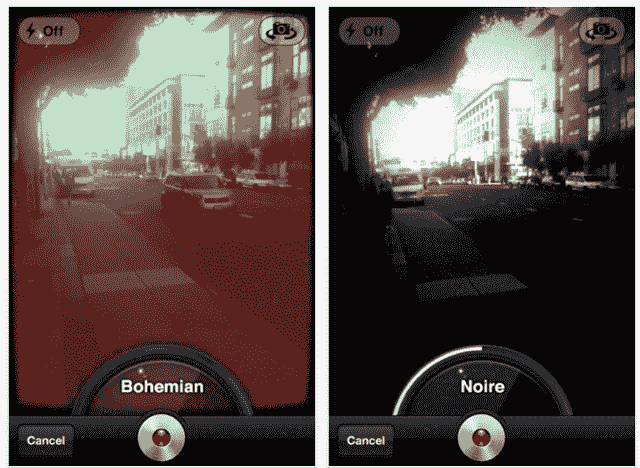

# Socialcam:进一步证明你们真的喜欢你们的过滤器 

> 原文：<https://web.archive.org/web/http://techcrunch.com/2011/10/28/socialcam-further-proof-that-you-folks-really-like-your-filters/>

# Socialcam:进一步证明你们真的喜欢你们的过滤器

自去年春天以来，我们一直在跟踪从 Justin.tv 剥离出来的“视频 Instagram”social cam 的进展。这款应用可用于 iOS 和 Android，本月初达到了[200 万次](https://web.archive.org/web/20230203092048/https://techcrunch.com/2011/10/05/socialcam-crosses-2m-downloads-adds-wait-for-it-video-filters/)下载的里程碑，为了纪念这一时刻，它推出了一个新功能，使“insta gram”的比较更加贴切:过滤器。是的，你现在可以用一系列的效果覆盖你的视频(前两个是 70 年代和电子乐)。

事实证明，人们真的很喜欢视频中的滤镜。*很多。* Socialcam 首席执行官 Michael Seibel 告诉我，在推出过滤器的两周内，Socialcam 的下载量达到了 35 万次，应用程序的日打开量增加了 84%，日视频观看人数增加了 69%，视频创作量增加了 50%(这是一个巨大的数字)。毫无疑问，过滤器是一个巨大的驱动力:目前在 Socialcam 上分享的 45%的视频都在使用过滤器。

Seibel 说，过滤器对 Socialcam 来说是一个巨大的成功，因为它让用户更容易感觉到他们拍摄了值得分享的东西。照片滤镜(例如 Instagram 上的)完成了同样的事情，滤镜将平凡的事物变成了模糊的艺术，甚至是酷。而高顺认为这种趋势被视频放大了。

哦，他还提到了 Socialcam 最大的新用例:占领华尔街的人们。

