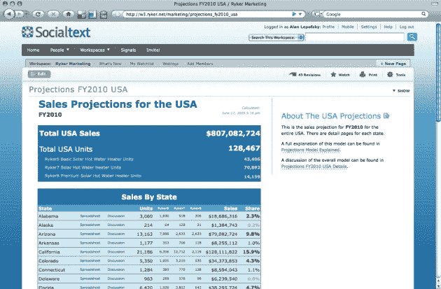
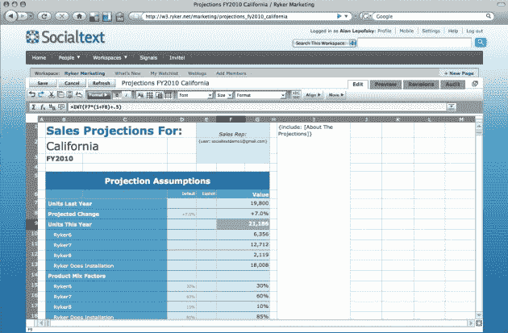

# Socialtext 免费增值 Socialtext 免费 50 

> 原文：<https://web.archive.org/web/https://techcrunch.com/2009/06/23/socialtext-goes-freemium-with-socialtext-free-50/>

Socialtext 提供了一个引人注目的企业 2.0 服务包，但它有一个问题。虽然它可以大谈特谈自己的产品有多棒，但真正的卖点是让客户自己使用它们。虽然免费试用有些效果，但时间是有限的。这就是为什么 Socialtext 正在通过其新的 SocialText Free 50 产品进入免费增值市场。

基本上，Socialtext Free 50 允许公司注册并免费获得 Socialtext 的许多服务，最多 50 个用户。这包括该服务的社交网络、维基、网站建设和信息工具。唯一的限制是你只能使用一个维基工作空间(付费账户可以无限制使用)，除了基本的在线种类之外，没有其他支持。Socialtext 的联合创始人罗斯·梅菲尔德(Ross Mayfield)告诉我们:“我们认为我们选择了正确的路线，我们可以放弃什么。

所以，你可以非常自由地开放 50 个账户，让用户随心所欲地漫游。如果你决定你需要更多的帐户，或者只是更多的选项，显然有一个简单的升级途径。对于托管计划，付费服务的起价为每个用户每月 6 美元，或者较大的公司可以选择每月支付 1000 美元，外加每个用户 1 美元或 5 美元，具体取决于他们是想要托管还是现场服务。完整的价格细分是[这里](https://web.archive.org/web/20221006021505/http://www.socialtext.com/products/pricing.php)。

在推出 Socialtext Free 50 的同时，该公司还开放了其新的电子表格服务的测试版。SocialCalc 的开发是由 Dan Bricklin 领导的，他是 VisiCalc 的共同创始人，visi calc 是第一个为个人电脑设计的电子表格程序。梅菲尔德说，现在它已经进行了一段时间的私人测试，但已经准备好进行公开测试。预计将于第三季度末正式发布。

正如你所想象的，SocialCalc 是一个社交电子表格服务。但梅菲尔德认为它胜过谷歌电子表格和 EditGrid 等竞争对手，因为他们不仅仅是对主流电子表格客户端 Excel 进行逆向工程。SocialCalc 旨在简化群组编辑，并在多人编辑文档时消除潜在的冲突问题。正如梅菲尔德所说，它提供了一种“以非结构化的方式处理结构化数据”的方式。而且，与谷歌电子表格不同，SocialCalc 可以部署在防火墙后面。

或许更重要的是，SocialCalc 与 Socialtext 的所有其他产品都有关联(不过，不幸的是，目前还不包括在 Socialtext Free 50 产品中)。

最近几个月，我们已经看到免费增值模式的复苏。对于一些面向消费者的产品，比如几个月前提供了一个不错的产品的 Pandora，它似乎工作得很好。看看它在企业领域是如何工作的将会很有趣。[另一家社会企业产品 CubeTree 上个月也推出了这种模式的](https://web.archive.org/web/20221006021505/http://www.beta.techcrunch.com/2009/05/10/cubetree-launches-as-a-facebook-friendfeed-twitter-for-enterprise/)。

