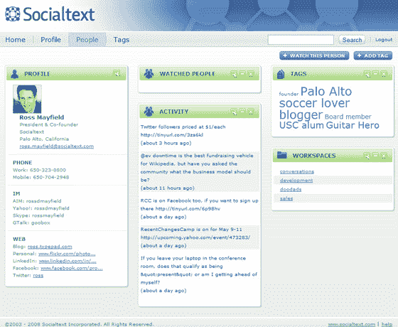

# 社交文本加入一点社交元素...企业维基 TechCrunch

> 原文：<https://web.archive.org/web/https://techcrunch.com/2008/04/17/socialtext-putting-a-little-social-intoenterprise-wikis/>

总部位于帕洛阿尔托的维基初创公司 [SocialText](https://web.archive.org/web/20221007185751/http://www.socialtext.com/) ，成立于 2002 年，今天早上宣布了其软件的 3.0 版本。升级旨在给企业注入一点“社交”元素(并尽可能避开最近重新推出的谷歌网站，它是谷歌的直接竞争对手)。

大部分情况下，SocialText 向公司出售维基，尽管他们也提供他们产品的开源版本。它们为客户提供了 SaaS 版本和更高端设备之间的选择，尽管唯一真正的区别是服务器位于何处(您的位置或他们的位置)。创始人罗斯·梅菲尔德说，他们的 4000 名顾客中，80%使用 SaaS 的产品，但是他们 80%的收入来自这个设备。

梅菲尔德说，新产品 Socialtext Dashboard 和 Socialtext People 现在正在演示，将在 60 天内向所有客户提供。这些产品实际上是普通维基产品的延伸。

如上图所示，SocialText Dashboard 是一个类似于 Netvibes 的可定制主页。用户可以添加 SocialText 小部件，显示来自公司 wiki 的信息——编辑总数、工作区列表、变更摘要等。其他小部件是为了提高工作效率，比如日历，或者只是为了好玩，比如 YouTube 小部件。

所有 Dashboard widgets 都与 Google Widget [兼容](https://web.archive.org/web/20221007185751/http://code.google.com/apis/gadgets/docs/spec.html)，这意味着，根据安全设置，它们也可以添加到 iGoogle 等网站。但更重要的是，所有的 iGoogle 小部件都可以添加到仪表板页面。例如，你可以将 Gmail 直接放入你的 SocialText 仪表盘。

用户还可以创建个人资料(见下文)并在组织内添加“朋友”。你也可以监控共同好友的活动流，包括 Twitter 等外部服务。

对于许多企业员工来说，拥有一个包含安全公司信息的单一仪表板以及一个有趣或有用的外部服务正是他们所需要的。它还使 SocialText 成为员工一天的中心，这意味着他们失去客户的可能性大大降低。

很明显，SocialText 正在稳步前进，试图找到一条不会让他们与谷歌网站竞争的道路，至少目前是这样。希望等到这些企业客户开始考虑整合谷歌的部分或全部[生产力套件](https://web.archive.org/web/20221007185751/http://www.google.com/a/help/intl/en/index.html)时，SocialText 已经成为员工日常生活的一部分。然后他们可以继续收取那些有吸引力的用户费用。

在三轮融资中，SocialText 已经筹集了将近 1200 万美元的资金[。](https://web.archive.org/web/20221007185751/http://www.crunchbase.com/company/socialtext)[去年 11 月](https://web.archive.org/web/20221007185751/http://www.beta.techcrunch.com/2007/11/04/money-and-a-new-ceo-for-socialtext/)，梅菲尔德开始担任董事长兼总裁，为新 CEO[李侑珍](https://web.archive.org/web/20221007185751/http://www.crunchbase.com/person/eugene-lee)腾出位置。这家公司有 50 名员工。